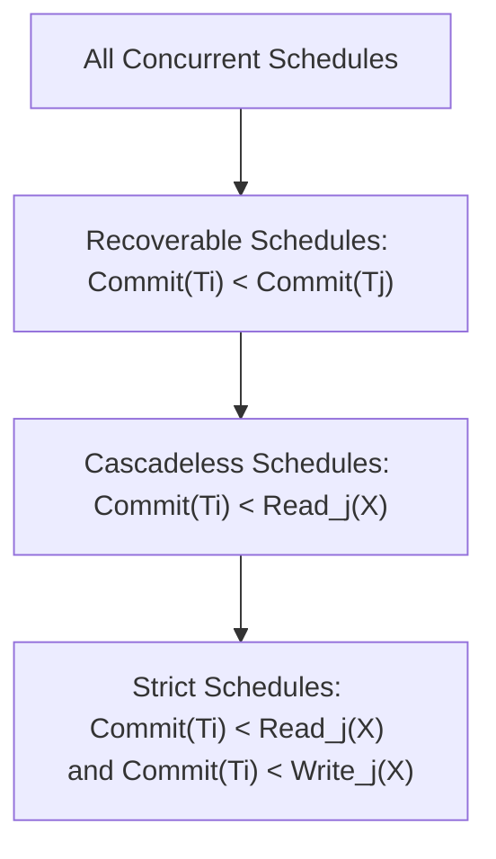

> [!definition]
> * **Dirty Read ($W_i(X) \dots R_j(X)$):** Occurs when transaction $T_j$ reads uncommitted updates written by $T_i$[cite: 2].
> * **Recoverable Schedule:** If transaction $T_j$ reads a data item previously written by $T_i$, then $T_i$ must commit before $T_j$ commits:
>   $$W_i(X) < R_j(X) \implies C_i < C_j$$[cite: 2]
> * **Cascadeless Schedule:** Every transaction reads only committed data values[cite: 2]:
>   $$W_i(X) < R_j(X) \implies C_i < R_j(X)$$[cite: 2]
> * **Strict Schedule:** A transaction can neither read nor write a data item until the previous transaction that wrote it has committed or aborted[cite: 2]:
>   $$W_i(X) < (R_j(X) \lor W_j(X)) \implies (C_i \lor A_i) < (R_j(X) \lor W_j(X))$$[cite: 2]

> [!theorem]
> **Schedule Hierarchy Invariant:**
> $$\text{Strict} \subset \text{Cascadeless} \subset \text{Recoverable} \subset \text{All Concurrent Schedules}$$[cite: 2]

> [!trap]
> **Serializability vs Recoverability Independence:**
> A schedule can be Conflict Serializable but completely **Irrecoverable**[cite: 1, 2].
> Example: $W_1(X); R_2(X); C_2; C_1$[cite: 2].
> * Precedence graph: $T_1 \rightarrow T_2$ (acyclic $\implies$ Conflict Serializable)[cite: 2].
> * Commit ordering: $T_2$ commits before $T_1$ after reading $X$ from $T_1$ ($\implies$ **Irrecoverable**)[cite: 1, 2].

> [!question]
> **PSU CBT Practice Drill:**
> Consider schedule $S$:
> $$S: R_1(X); W_1(X); R_1(Y); R_2(X); W_2(X); C_2; C_1$$[cite: 1]
> Evaluate the recoverability of $S$[cite: 1].
>
> **Step-by-Step Resolution:**
> 1. Trace dirty reads:
>    * $T_1$ writes $X$ at step 2 ($W_1(X)$)[cite: 1].
>    * $T_2$ reads $X$ at step 4 ($R_2(X)$) before $T_1$ has committed[cite: 1].
>    * Hence, $T_2$ reads uncommitted dirty data from $T_1$[cite: 1, 2].
> 2. Check commit points:
>    * $T_2$ commits at step 6 ($C_2$)[cite: 1].
>    * $T_1$ commits at step 7 ($C_1$)[cite: 1].
> 3. Apply Recoverability Criterion:
>    * Since $T_2$ read uncommitted data from $T_1$, $C_1$ must precede $C_2$ ($C_1 < C_2$)[cite: 1, 2].
>    * Here, $C_2 < C_1$[cite: 1]. If $T_1$ aborts, $T_2$ cannot be rolled back because it has already committed[cite: 1, 2].
>
> **Conclusion:** Schedule $S$ is **Irrecoverable**[cite: 1, 2].
