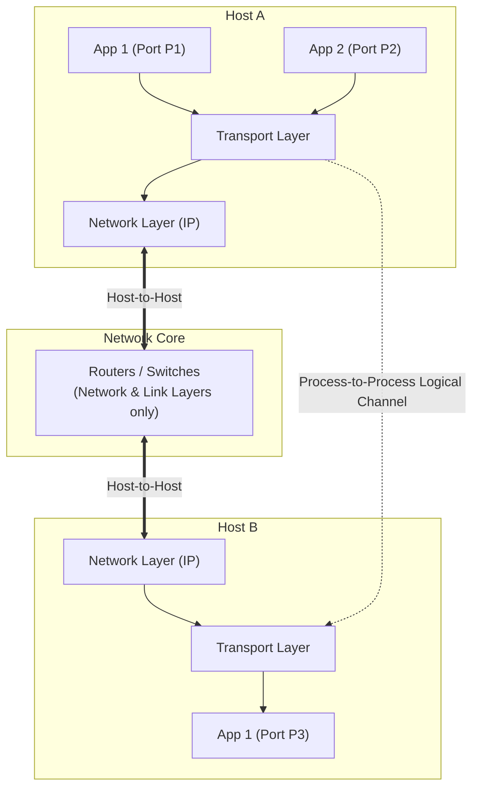

The Transport Layer (Layer 4) sits directly between the Application Layer and the Network Layer, providing an end-to-end logical communication service[cite: 1].

> [!definition] Process-to-Process Logical Communication
> While the Network Layer provides **Host-to-Host** delivery (routing IP datagrams between machines using IP addresses) and the Data Link Layer provides **Hop-to-Hop / Node-to-Node** delivery (framing across physical links using MAC addresses), the Transport Layer provides **Process-to-Process (Application-to-Application)** logical delivery using **Port Numbers**[cite: 1].

### The Communication Abstraction
* **Terminal Implementation**: The Transport Layer is implemented strictly at end systems (terminal nodes/hosts), never inside intermediate network routers or switches[cite: 1].
* **Application Abstraction**: It hides all complexities and unreliability of the underlying network from application programs[cite: 1].
* **Data Unit Naming Hierarchy**:
  * Transport Layer: **Segment** (or User Datagram in UDP)[cite: 1]
  * Network Layer: **Packet** / **IP Datagram**[cite: 1]
  * Data Link Layer: **Frame**[cite: 1]

### Port Numbers and Socket Addresses
Processes on an operating system are assigned port numbers to identify their communication endpoints[cite: 1].

> [!definition] Port Number and Socket Address
> * **Port Number**: An unsigned $16$-bit integer (ranging from $0$ to $65535$, i.e., $2^{16} - 1$) allocated to communicating processes[cite: 1].
> * **Socket Address**: The unique combination of an IP address and a Port Number:
>   $$\text{Socket Address} = \text{IP Address} : \text{Port Number}$$[cite: 1]
> * An application process creates one or more **Sockets**, which act as the sole software gateway/portal through which it sends and receives network data[cite: 1].

| Port Range | Category | Purpose and Allocation |
| :--- | :--- | :--- |
| $0$ to $1023$ | **Well-Known Ports** | Reserved for standard system/server daemons (e.g., HTTP 80, DNS 53, SMTP 25, FTP 20/21) so clients know where to connect[cite: 1]. |
| $1024$ to $49151$ | **Registered Ports** | Registered by organizations/vendors for specific proprietary services[cite: 1]. |
| $49152$ to $65535$ | **Dynamic / Ephemeral Ports** | Temporary ports automatically assigned by the client OS, released when the client process terminates[cite: 1]. |
