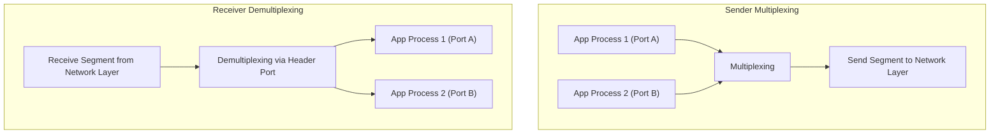

> [!definition] Multiplexing and Demultiplexing
> * **Multiplexing (at Sender)**: Gathering data chunks from multiple application sockets, encapsulating each chunk with transport headers (including source and destination port numbers), and passing the resulting segments down to the Network Layer[cite: 1].
> * **Demultiplexing (at Receiver)**: Examining the destination port number (and IP address/source port depending on protocol) in incoming transport segments to direct each segment's payload to the correct corresponding application socket[cite: 1].

### Connectionless vs. Connection-Oriented Service
* **Connectionless Service (UDP)**: Data is transmitted directly without prior negotiation or handshaking[cite: 1]. Analogy: hand out a chocolate to anyone who stops by without asking for names or counting in advance[cite: 1].
* **Connection-Oriented Service (TCP)**: A formal logical connection is established through preliminary parameter negotiation (agreeing on sequence numbers, window sizes, maximum segment size) before transferring user data[cite: 1]. Analogy: establishing a mutual agreement detailing time, identity, and quantity before delivering chocolates[cite: 1].
