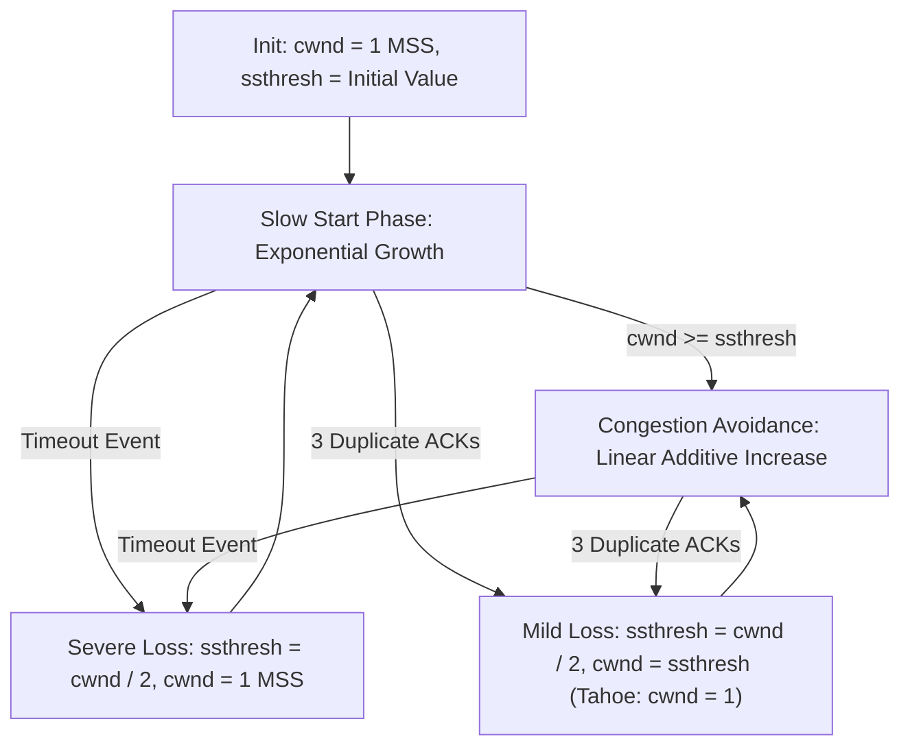

> [!definition]
> **TCP Congestion Control** uses dynamic window management to prevent network collapse: **Slow Start**, **Congestion Avoidance**, and **Fast Recovery / Retransmission**[cite: 2].

| Congestion Phase | Window Behavior per Successive RTT | Transition Event |
| :--- | :--- | :--- |
| **Slow Start** | **Exponential Growth:**   $\text{cwnd} = \text{cwnd} \times 2$ (per RTT)[cite: 2] | Transitions to Avoidance when $\text{cwnd} \ge \text{ssthresh}$ |
| **Congestion Avoidance** | **Additive Increase:**   $\text{cwnd} = \text{cwnd} + 1\text{ MSS}$ (per RTT)[cite: 2] | Transitions upon packet loss |
| **Loss Detection: Timeout** | Severe Congestion:  $\text{ssthresh} = \frac{\text{cwnd}}{2}, \quad \text{cwnd} = 1\text{ MSS}$[cite: 2] | Re-enters Slow Start |
| **Loss: 3 Duplicate ACKs** | Mild Congestion (Fast Recovery in Reno):  $\text{ssthresh} = \frac{\text{cwnd}}{2}, \quad \text{cwnd} = \text{ssthresh} + 3$[cite: 2] | Skips Slow Start, enters Avoidance |

> [!formula]
> Effective Sender Window:
> $$W_{\text{effective}} = \min(W_{\text{congestion}}, W_{\text{receiver}})$$[cite: 2]

> [!trap]
> In TCP Slow Start, the congestion window increases by **1 MSS for every received ACK**, which produces a doubling effect ($2\times$) across each full RTT[cite: 2]. In Congestion Avoidance, the window increases by $\frac{1}{\text{cwnd}}$ per ACK, producing an increase of **1 MSS per RTT**[cite: 2].

> [!question]
> **Q:** A TCP connection with an initial slow start threshold ($\text{ssthresh}$) of $32\text{ MSS}$ experiences a timeout during transmission when its congestion window reaches $16\text{ MSS}$. What are the values of $\text{ssthresh}$ and $\text{cwnd}$ immediately after this timeout event is handled?  
> (A) $\text{ssthresh} = 8\text{ MSS}, \text{cwnd} = 8\text{ MSS}$  
> (B) $\text{ssthresh} = 8\text{ MSS}, \text{cwnd} = 1\text{ MSS}$  
> (C) $\text{ssthresh} = 16\text{ MSS}, \text{cwnd} = 1\text{ MSS}$  
> (D) $\text{ssthresh} = 8\text{ MSS}, \text{cwnd} = 2\text{ MSS}$  
>
> **Answer:** **(B)**  
> **Explanation:**  
> Upon a **Timeout**:  
> 1. $\text{ssthresh} = \left\lfloor \frac{\text{cwnd}}{2} \right\rfloor = \frac{16}{2} = 8\text{ MSS}$[cite: 2].  
> 2. The congestion window is reset to $\text{cwnd} = 1\text{ MSS}$[cite: 2].
