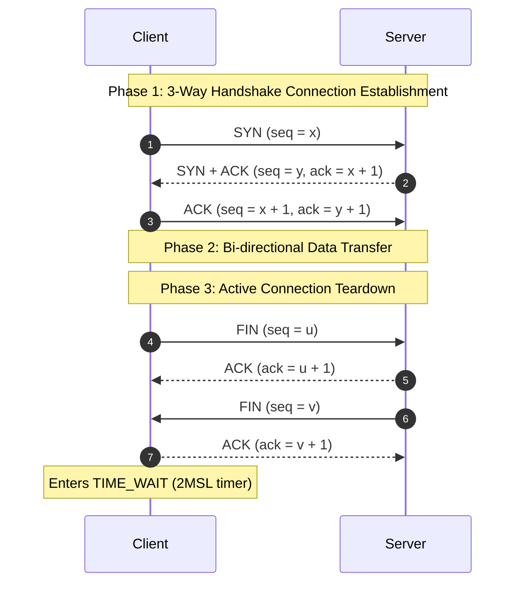

> [!definition]
> **Transmission Control Protocol (TCP)** is a byte-stream, connection-oriented, full-duplex protocol providing reliable end-to-end delivery using adaptive sliding window flow control and sequence numbers[cite: 2].

| Timer Name | Operational Function & Trigger Mechanism |
| :--- | :--- |
| **Retransmission Timer (RTO)** | Dynamic timer set per unacknowledged segment; retransmits upon expiration[cite: 1]. Computed via Jacobson's algorithm ($4 \cdot \text{Deviation} + \text{SRTT}$)[cite: 2]. |
| **Persistent Timer** | Resolves **Zero Window Deadlock**: sends 1-byte probe segments to query receiver buffer recovery[cite: 1]. |
| **Keep-Alive Timer** | Prevents dangling idle connections by sending probes every 2 hours when no traffic flows[cite: 1]. |
| **TIME_WAIT Timer** | Holds the client socket open for $2\text{MSL}$ (Maximum Segment Lifetime) after final ACK to drain old packets[cite: 1]. |

> [!formula]
> 1. **Sequence Number Consumption:**
>    - `SYN` flag $= 1 \implies$ consumes **1 sequence number**[cite: 2]
>    - `FIN` flag $= 1 \implies$ consumes **1 sequence number**[cite: 2]
>    - Pure `ACK` without data $\implies$ consumes **0 sequence numbers**[cite: 2]
>    - Each Payload Byte $\implies$ consumes **1 sequence number**[cite: 2]
> 2. **Sequence Number Wrap-Around Time (WAT):**
>    $$\text{WAT} = \frac{2^{32}\text{ sequence numbers}}{\text{Bandwidth in Bytes/second}}$$

> [!trap]
> In TCP, the sequence number in a transmitted segment identifies the sequence number of the **first data byte** in that segment, while the Acknowledgement number specifies the **next expected byte** ($N+1$)[cite: 2].

> [!question]
> **Q:** During a standard TCP connection tear-down initiated via active close by the client, which state does the client enter immediately after dispatching its final ACK to the server's FIN segment?  
> (A) CLOSE_WAIT  
> (B) LAST_ACK  
> (C) TIME_WAIT  
> (D) CLOSING  
>
> **Answer:** **(C)**[cite: 1]  
> **Explanation:**  
> In an active close, the client sends `FIN` $\to$ receives `ACK` (enters `FIN_WAIT_2`) $\to$ receives server's `FIN` $\to$ dispatches final `ACK` and immediately transitions into `TIME_WAIT` for a duration of $2\text{MSL}$ before closing[cite: 1].
