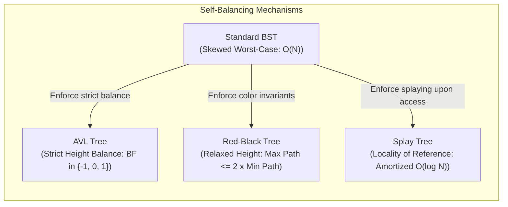

## 1. Structural Tree Classifications

| Tree Variant                   | Structural Definition                                                                                       | Key Mathematical Constraint           |
| :----------------------------- | :---------------------------------------------------------------------------------------------------------- | :------------------------------------ |
| **Strict (Full) Binary Tree**  | Every node has either $0$ or $2$ children; no degree-$1$ nodes exist.                                       | $L = I + 1$                           |
| **Complete Binary Tree (CBT)** | All levels are filled except possibly the last, which fills strictly left-to-right.                         | Height $h = \lfloor \log_2 N \rfloor$ |
| **Perfect Binary Tree**        | All internal nodes have $2$ children and all leaves reside at the identical depth.                          | $N = 2^{h+1} - 1$, where $L = 2^h$    |
| **Degenerate (Skewed) Tree**   | Every internal node has exactly $1$ child; morphs into a linear linked list.                                | Height $h = N - 1$                    |
| **Binary Search Tree (BST)**   | For every node $X$: $\text{keys}(\text{Left Subtree}) < \text{Key}(X) < \text{keys}(\text{Right Subtree})$. | Inorder traversal yields sorted order |

---

## 2. Mathematical Invariants of Strict Binary Trees
Every single time you introduce an internal node, you consume 1 existing branch and create 2 new branches. The net gain is **always exactly $+1$ leaf**.

- You started with **$1$** leaf (a single root node).
- You added **$I$** forks (internal nodes).
- Therefore, your total leaves must be
$$L = I + 1$$

Once you have $L = I + 1$, everything else is just simple substitution:

- Total nodes: $N = I + L = I + (I + 1) = \mathbf{2I + 1}$
    
- In terms of leaves: $I = L - 1 \implies N = (L - 1) + L = \mathbf{2L - 1}$
    
- Edges in _any_ tree: $E = N - 1 = (2I + 1) - 1 = \mathbf{2I}$
---

## 3. Structural Counting via Catalan Numbers

The number of structurally distinct binary trees with $n$ unlabelled nodes (or distinct BSTs formed using $n$ distinct labelled keys) is given by the $n^{\text{th}}$ Catalan number $C_n$:

$$\mathbf{\binom{2n}{n} - \binom{2n}{n+1} = \frac{1}{n+1}\binom{2n}{n} = \frac{(2n)!}{(n + 1)! \, n!} = C_n}$$
* **For labelled binary trees:**
  $$\text{Total Labelled Binary Trees} = C_n \times n! = \frac{(2n)!}{(n + 1)!}$$

| Keys ($n$) | Unlabelled Trees / Distinct BSTs ($C_n$) | Labelled General Binary Trees ($C_n \times n!$) |
| :---: | :--- | :--- |
| **1** | $C_1 = 1$ | $1$ |
| **2** | $C_2 = 2$ | $4$ |
| **3** | $C_3 = 5$ | $30$ |
| **4** | $C_4 = \frac{1}{5}\binom{8}{4} = 14$ | $336$ |
| **5** | $C_5 = \frac{1}{6}\binom{10}{5} = 42$ | $5040$ |

---

## 4. Advanced Binary Search Tree (BST) Variants

To overcome the worst-case $O(N)$ degeneration of standard BSTs during skewed insertions, self-balancing and specialized search trees maintain logarithmic balance criteria.

### Balanced BST Structural Matrix

| Variant | Invariant / Balance Factor Condition | Search Time | Insert / Delete Time | Auxiliary Space per Node |
| :--- | :--- | :---: | :---: | :---: |
| **Standard BST** | No balance guarantee (skew-prone) | $O(N)$ worst, $O(\log N)$ avg | $O(N)$ worst, $O(\log N)$ avg | None |
| **AVL Tree** | Height-balanced: $\Vert{}h_L - h_R\Vert{} \le 1$ | $O(\log N)$ strict | $O(\log N)$ via rotations | Height / Balance Factor |
| **Red-Black Tree** | Black-height balance (max path $\le 2 \times$ min path) | $O(\log N)$ | $O(\log N)$ (at most 2-3 rotations) | 1-bit color tag |
| **Splay Tree** | Self-adjusting heuristic (moves accessed node to root) | $O(\log N)$ amortized | $O(\log N)$ amortized | None |
| **Treap** | BST key order + Max/Min Heap random priority | $O(\log N)$ expected | $O(\log N)$ expected | Numeric priority |

### Invariant Breakdown by Variant

1. **AVL Tree:**
   * **Balance Factor:** $\text{BF}(X) = \text{Height}(\text{Left Subtree}) - \text{Height}(\text{Right Subtree}) \in \{-1, 0, +1\}$.
   * Rebalanced via single rotations ($LL$, $RR$) or double rotations ($LR$, $RL$).
   * Best suited for search-intensive applications due to more rigid height limits compared to Red-Black trees.

2. **Red-Black Tree:**
   * **Node Color:** Every node is either **Red** or **Black**; the root and all null leaves (`NIL`) are strictly **Black**.
   * **Red Invariant:** Red nodes cannot have Red children (no two consecutive red nodes along any root-to-leaf path).
   * **Black Invariant:** Every simple path from a node to descendant leaves contains an identical count of black nodes ($\text{Black-Height}$).
   * Rebalances with $O(1)$ rotations on insertions/deletions; optimal for write-heavy workloads (used in C++ `std::map`, Java `TreeMap`, Linux CFS scheduler).

3. **Splay Tree:**
   * Contains no balance bits or height counters.
   * Every access (search, insert, delete) performs tree rotations (*zig*, *zig-zig*, *zig-zag*) to bring the target node to the root.
   * Delivers excellent performance under **temporal locality of reference**.

---

## 5. Traversal & Unique Reconstruction Invariants

| Provided Traversals | General Binary Tree | Strict Binary Tree | Binary Search Tree (BST) |
| :--- | :---: | :---: | :---: |
| **Preorder + Inorder** | **Unique** | **Unique** | **Unique** |
| **Postorder + Inorder** | **Unique** | **Unique** | **Unique** |
| **Preorder + Postorder** | Ambiguous | **Unique** | Ambiguous |
| **Preorder Only** | Ambiguous | Ambiguous | **Unique** (Inorder obtained via sort) |
| **Postorder Only** | Ambiguous | Ambiguous | **Unique** (Inorder obtained via sort) |

> [!trap] Reconstruction Edge Cases
> * A general binary tree **cannot** be reconstructed from Preorder and Postorder alone because parent-child relationships cannot resolve whether a solitary child is a left or right branch. 
> * For any **BST**, a single traversal (Preorder or Postorder) is sufficient because its Inorder traversal is implicitly defined by sorting the unique key sequence in ascending order.

---

## 6. Practice Drill: Node Invariants

> [!question] PSU CBT Practice Drill
> A full (strict) binary tree contains $15$ internal nodes. What is the total number of nodes in the tree?
> * (A) $29$
> * (B) $30$
> * (C) $31$
> * (D) $32$

### Step-by-Step Resolution

1. **Identify Given Data:**
   $$\text{Internal Nodes } I = 15$$

2. **Determine Leaf Count ($L$):**
   $$L = I + 1 = 15 + 1 = 16$$

3. **Calculate Total Nodes ($N$):**
   $$N = I + L = 15 + 16 = 31$$
   $$\text{Direct Verification: } N = 2I + 1 = 2(15) + 1 = 30 + 1 = 31$$

**Correct Answer:** **(C) 31**