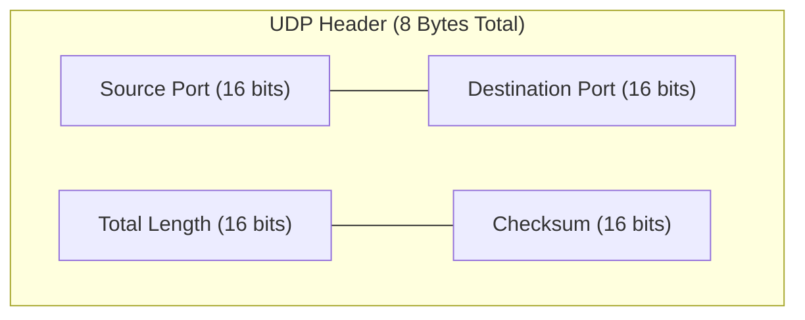

> [!definition] User Datagram Protocol (UDP)
> UDP is a lightweight, connectionless, unreliable transport protocol that provides minimal process-to-process communication directly over IP, offering no guarantees against loss, duplication, or out-of-order delivery[cite: 1].

### UDP Design Advantages
1. **Low Overhead**: Fixed, minimal header size of only $8\text{ Bytes}$[cite: 1].
2. **No Connection State**: The sender maintains no connection state (no sequence numbers, timers, or receive windows), allowing a server to support significantly more active concurrent clients[cite: 1].
3. **No Connection Delay**: Transmits data immediately when an application writes to the socket without requiring a 3-way handshake[cite: 1].
4. **No Rate Throttling**: Blasts packets out at whatever rate the application generates them, uninhibited by congestion control mechanisms[cite: 1].

### UDP Header Format
The UDP header is strictly $8\text{ Bytes}$ long, divided into four $16$-bit fields:

| Field                | Width            | Description                                                                                                              |
| :------------------- | :--------------- | :----------------------------------------------------------------------------------------------------------------------- |
| **Source Port**      | $16\text{ bits}$ | Port number of the sending process (optional/ephemeral)[cite: 1].                                                        |
| **Destination Port** | $16\text{ bits}$ | Port number of the destination application process[cite: 1].                                                             |
| **Total Length**     | $16\text{ bits}$ | Total length of the UDP segment in bytes ($\text{Header} + \text{Payload}$). Minimum value is $8\text{ Bytes}$[cite: 1]. |
| **Checksum**         | $16\text{ bits}$ | Error detection field covering header, data, and pseudo-IP header. Optional in IPv4, mandatory in IPv6[cite: 1].         |

> [!formula] UDP Minimum and Maximum Sizes
> $$\text{Minimum UDP Size} = 8\text{ Bytes (Payload} = 0\text{)}$$
> $$\text{Maximum UDP Datagram Size} = 2^{16} - 1 = 65{,}535\text{ Bytes}$$
