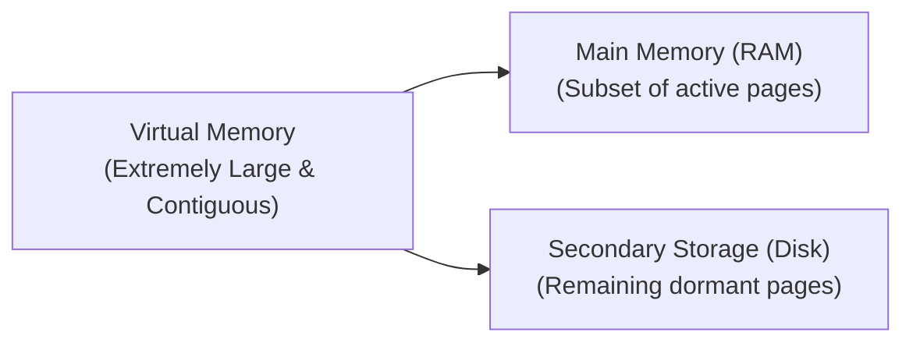

> [!definition] Virtual Memory
> Virtual memory is a memory management technique that allows the execution of processes that are not completely loaded in main memory[cite: 1].
> * It abstracts physical main memory into an extremely large, uniform, contiguous storage space visible to the CPU and compiler[cite: 1, 2].
> * **Primary Advantage**: The logical address space of a program can exceed the size of physical memory ($\text{VAS} > \text{PAS}$)[cite: 1, 2].

> [!theorem] Multiprogramming and System Performance Invariants
> 1. **Degree of Multiprogramming**: Because only portions of a process's pages need to reside in physical RAM, more processes can be kept active concurrently, increasing CPU utilization and system throughput[cite: 2].
> 2. **Turnaround & Response Time**: While throughput increases, response time and turnaround time for a given process do not decrease (and may increase under page swapping latency)[cite: 2].
> 3. **Programmer Convenience**: Programmers are freed from worrying about physical memory constraints[cite: 2].
> 4. **Implementation Mechanisms**: Virtual memory is primarily implemented via **Demand Paging** or **Demand Segmentation**[cite: 2].

