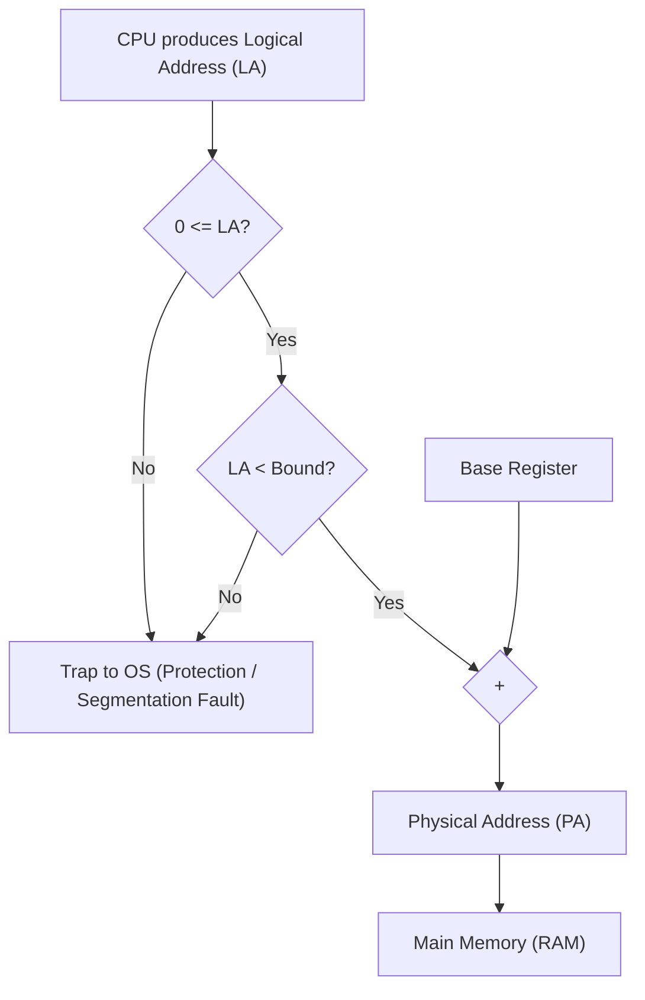

## Vulnerability: Lack of Memory Protection

In the pure base register approach, there is no boundary check. A process can supply an arbitrarily large logical address.

| Parameter | Example Value | Note |
|---|---|---|
| Process $P_1$ Base | $100$ | Physical start of $P_1$ |
| Process $P_1$ Expected Size | $300$ | Valid physical span: $[100,\; 400)$ |
| Process $P_2$ Base | $400$ | Physical start of $P_2$ |
| Faulty Instruction | `Load 450` | Generated Logical Address $LA = 450$ |
| Computed Target PA | $100 + 450 = 550$ | Maps directly into $P_2$'s allocated space ($550 \in [400,\; 700)$) |

> [!trap] Wild Pointer & Rogue Process Exploit
> Without bound checks, a buggy or malicious process can generate an out-of-range logical address, causing the adder hardware to compute a physical address that overwrites the operating system or other processes residing further up in RAM.

---

## Base & Bound (Limit) Register Architecture

To resolve illegal inter-process memory access, a second hardware register called the **Bound Register** (or **Limit Register**) is introduced.

> [!definition] Bound / Limit Register
> The Bound register specifies the logical size of the process's address space. 
> * Valid logical address range: $[0,\; \text{Bound} - 1]$ (or $[0,\; \text{Bound})$).
> * Valid physical address range: $[\text{Base},\; \text{Base} + \text{Bound} - 1]$ (or $[\text{Base},\; \text{Base} + \text{Bound})$).

### Complete Hardware Translation Flow (MMU)

1. CPU produces a Logical Address ($LA$).
2. The hardware verifies that $0 \le LA < \text{Bound}$.
   * If $LA < 0$ or $LA \ge \text{Bound}$, the hardware raises an internal interrupt: a **Trap to OS** (Protection Exception / Segmentation Fault), terminating or suspending the offending process.
3. If the address is within bounds, the hardware computes:
   $$\text{Physical Address (PA)} = \text{Base} + LA$$
4. The PA is sent directly down the physical address bus to RAM.

> [!definition] Memory Management Unit (MMU)
> The dedicated hardware block between the CPU core and the physical memory bus responsible for real-time address translation and bounds verification. Because translation occurs on every single memory access (instruction fetch, load, store), it must be implemented strictly in fast hardware logic.
