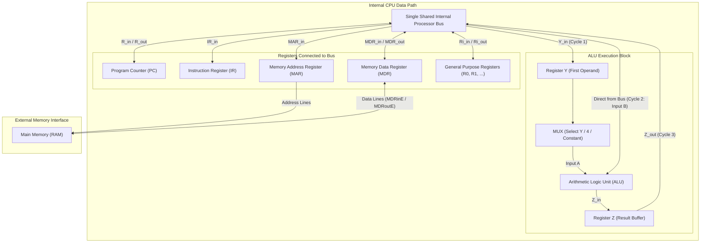

[](https://mermaid.live/edit#pako:eNplkmFvmzAQhv-K5Q9TKoUEQoDApEoEpmqaom2o06SJLy5cKSrY2dl0baP8951DaNeVL8f5nrv3PcyBV6oGnnANvweQFeStaFD0pWT0iMEoOfQ3gOe8MgpZDg9tBUxo9nn59ZyN9b1A01btXkjD8l2aWYYiy5Q0qLpumvMvl337YTEK72tFurM1G2Y76BU-XZRyxEZZ5_LS6iQnlcKuoA2b5cWn7xdnjKoE0fSEbQf9ymyLM0ElZyKusXW0EQY0E3WNoPWyFkawm0GDfsUnUTvwCq3R2fbqreBob_SVVvdS_emgboC8pdmXtyhtRxy2D6SajqrsAyvy5c-C6baRotP_rTx2tAiVYSd_hkzoW0C6IFTUnttDcvf-G-So9ppti4-Mz3mDbc0TgwPMeQ_YC5vyg-0qubmDHkqe0CtCPTw6tcB7p1KdwpKX8kj9dEe_lOqnEaiG5o4nt2SYsmFP1qbf6QUBWQNmapCGJ2vXO83gyYE_8sQL4kXkBrG_Cr3I20TBnD_RqbdZUCXwN6swdterODrO-fNJ1V2E69DzN7HnxnEU-H54_AtDfdyE)

[](https://mermaid.live/edit#pako:eNp9VQ2L2jAY_ishcFDBc62fZxkDv-4QTiZ1wuk6jqyNNaxNJE2Z7u7--96ktdZZFlDS5nne5_1M33AgQopdvIvF72BPpELfpj5HsNLsZyTJYY_mXFHJSYwmyzWaEkXQkqh9DtJrvF599_GK8SimaAU2aHjhLKUIaJoKicZZ6uMfPr8QSwWPRiwFQoomgnMaKLCghGGUYL2WExACi8BKAJppEWQtJw1juIqce4Cc81TJLFBM8FICWXPvFr4YafyCJkKe0CgMJbhcocBxDWda4Zi0VAjTGsLTUhOeKKdSJyaTB5HSSuyWZzeR5zRRq9W6ZlMe1uZt9LxGsyMNMhPiOBbBr2vJDQiWXm2Q9chkqtDXA3jAw5qQ1i86pPULslY0hjoA5xPqwg_qkirC1S0HfADOSDK1T6hiAXoWEfyvOVPIgsNbxrbq1BbCpmkWK6j2bkflfwO_u9M9oVtjpYQkUSV7V-2IPt_ff3kHlVfGwXnvVWTKx-_QP9ewHDXXMH089-qOofjFOexqZaDauZDeFFKwrXeJFT6xMxLa4p8YdVlXikQwUegR5rLOq402Y01OAcyc09B2NhfYRoN0NS-vdFGLcPkhU2ikKSBUZ3vKpK79TorE5LuQabso544bN2Ttck7eFsnaXg635RGEfLbWMUZANMdVKl229-xYXCLFkJlLZUcCWglrttAdSyAZBcjyRovrJoKyFQ6cJ_uZcZqaKs0WFdzUO1fJjLNBmVlmfJZXF_yfNa6I4Ddu4kiyELs7Eqe0iRMqE6Kf8ZvG-FjtaUJ97MIW7sbseB-IWEgf-_wDuAfCt0Ik2IW7CthSZNH-_JAdQqLolBF945UI0KTSXH_YbQ86xgR23_ARu13HafUG3a5tdzr2sD94aOITdgfdVr83cOB1u233hoPuRxP_MZp2a_gwHNr9juPYnZ7T67ebmIYMpmuRfxfM5-HjL7lJwwc)
