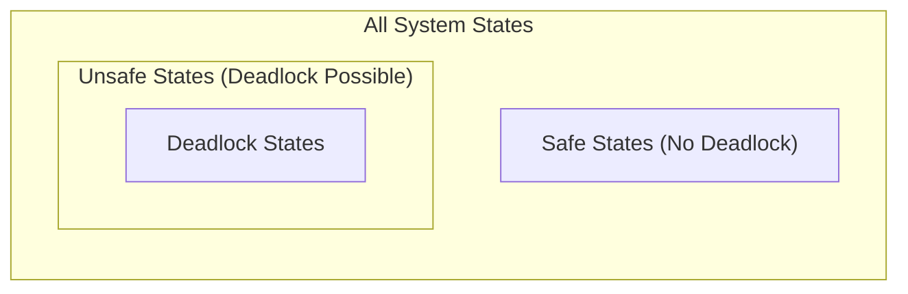

# file system — Map of Content

## 📌 Concept
- [[Deadlock - Definition and Core Principles|Deadlock - Definition and Core Principles]]
- [[Deadlock - Coffman Necessary Conditions|Deadlock - Coffman Necessary Conditions]]
- [[Deadlock - Resource Allocation Graphs|Deadlock - Resource Allocation Graphs]]
- [[Deadlock - Minimum Resources Derivation|Deadlock - Minimum Resources Derivation]]
- [[Deadlock - Instantaneous Deadlock vs Future|Deadlock - Instantaneous Deadlock vs Future]]
- [[Deadlock - Four Handling Strategies|Deadlock - Four Handling Strategies]]
- [[Deadlock - Prevention via Coffman Negation|Deadlock - Prevention via Coffman Negation]]
- [[Deadlock - Safe States and Safe Sequences|Deadlock - Safe States and Safe Sequences]]
- [[Deadlock - Safety Algorithm Formulation|Deadlock - Safety Algorithm Formulation]]
- [[Deadlock - Bankers Algorithm Mechanics|Deadlock - Bankers Algorithm Mechanics]]
- [[Deadlock - Safe Sequence Properties and Fallacies|Deadlock - Safe Sequence Properties and Fallacies]]
- [[Deadlock - Detection and Recovery|Deadlock - Detection and Recovery]]
- [[Deadlock - Strategy Trade-Offs Matrix|Deadlock - Strategy Trade-Offs Matrix]]
https://student.cs.uwaterloo.ca/~cs350/common/old-exams/W10-midterm-sol.pdf
--atom--
file_name: Deadlock - Safe and Unsafe States
> [!definition] Safe State vs. Unsafe State
> * **Safe State**: A state where the system can allocate resources to each process (up to its maximum demand) in some order without leading to deadlock[cite: 2].
> * **Unsafe State**: A state where no safe execution sequence exists[cite: 2]. An unsafe state is not necessarily a deadlock, but it introduces the potential to enter deadlock if processes request their maximum peak demands[cite: 2].

> [!theorem] Core Invariants of System States
> * $\text{Safe State} \implies \text{No Deadlock}$[cite: 2].
>   * In a safe state, whatever the processes request (up to their declared maximum), the system can satisfy them in some order[cite: 2].
> * $\text{Unsafe State} \implies \text{Possibility of Deadlock}$[cite: 2].
>   * The processes may ask for less than their maximum demand in the future, avoiding deadlock despite being in an unsafe state[cite: 2].
> * $\text{Deadlock State} \implies \text{Unsafe State}$ (Deadlock is a strict subset of unsafe states)[cite: 2].
> * **Deadlock Avoidance Goal**: Ensure that the system dynamically never transitions into an unsafe state[cite: 2].