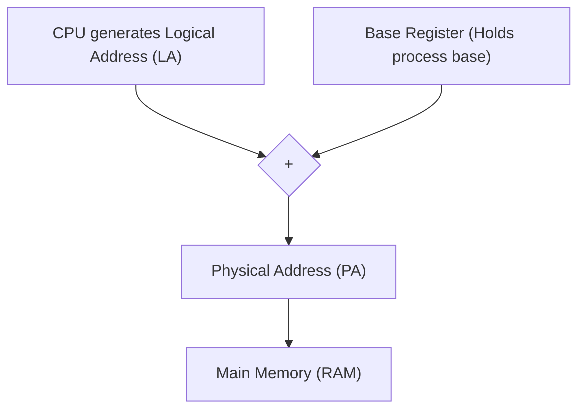

## The Need for Dynamic Relocation

During the compilation and linking phases, a program has zero knowledge of the actual physical memory (RAM) layout or where it will ultimately reside at runtime. The compiler operates under the abstraction that the program owns the entire address space starting contiguously from address $0$ up to $N - 1$ bytes.

| Perspective | Memory Model | Address Space Scope |
|---|---|---|
| **Program / Compiler View** | Virtual / Logical contiguous block | Assumes sole ownership of range $[0,\; N - 1]$ |
| **Actual Physical Memory (RAM)** | Partitioned shared physical space | Split among OS Kernel, Process 1 ($P_1$), Process 2 ($P_2$), and free holes |

If processes were loaded directly into physical memory using hardcoded addresses generated at compile time (starting at $0$), multiprogramming would be completely impossible:
* Two programs could not reside simultaneously in main memory because their address references would clash at physical address $0$.
* The compiler cannot generate static physical addresses because it cannot predict *when* (after minutes, days, or decades) or *where* in available physical memory the OS loader will place the process.

To achieve multiprogramming, programs must be dynamically relocatable to arbitrary memory locations.

---

## Contiguous Allocation with a Base Register

The simplest hardware relocation mechanism allocates each process as a single, contiguous block in main memory.

> [!property] Assumptions of the Pure Base Register Scheme
> 1. **Contiguous Allocation:** Each process must occupy a single contiguous range of physical addresses.
> 2. **Base Offset:** The process starts at a physical address given by a `Base Register`.
> 3. **Unique Base per Process:** Each process has its own unique base address.
> 4. **Hardware Storage:** The base address of the currently running process is held in a dedicated hardware CPU register (`Base Register`). When a process is descheduled, its base value is preserved in its Process Control Block (PCB) and restored during a context switch.

### Address Translation with Base Register
The CPU executes instructions referencing a **Logical Address (LA)** (or Virtual Address). The memory controller requires a **Physical Address (PA)** to place on the system address bus.

> [!formula] Base Register Address Translation
> $$\text{Physical Address (PA)} = \text{Base Register} + \text{Logical Address (LA)}$$

### Example Trace
Let Process $P_1$ have $\text{Base}(P_1) = 10\text{k} = 10240$, and Process $P_2$ have $\text{Base}(P_2) = 100\text{k} = 102400$.
* If $P_1$ executes an instruction accessing its logical address $0$, it maps to physical address:
  $$\text{PA} = 10\text{k} + 0 = 10\text{k}$$
* If $P_2$ executes an instruction accessing its $1024^{\text{th}}$ byte (logical address $1024$):
  $$\text{PA} = 100\text{k} + 1024$$

---

## Logical Address vs. Physical Address

| Attribute | Logical Address (LA) | Physical Address (PA) |
|---|---|---|
| **Generator** | Generated by the CPU (Programmer / Compiler view). | Generated by hardware translation units (MMU). |
| **Visibility** | Visible to user programs (e.g., printed pointer values in C via `printf("%p", ptr)`). | Inaccessible and invisible to user-level code. |
| **Destination** | Internal to the CPU/instruction pipeline. | Transmitted onto the memory bus (MAR / RAM address pins). |
| **Multiprogramming Invariant** | Multiple processes can have identical logical addresses simultaneously (e.g., both $P_1$ and $P_2$ have a logical address $0x1000$). | All active locations in RAM map to strictly unique, non-overlapping physical addresses. |
