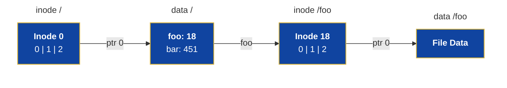

```mermaid
flowchart LR
    subgraph S1["inode /"]
        direction TB
        B1["<b>Inode 0</b><br/>0 | 1 | 2"]
    end

    subgraph S2["data /"]
        direction TB
        B2["<b>foo: 18</b><br/>bar: 451"]
    end

    subgraph S3["inode /foo"]
        direction TB
        B3["<b>Inode 18</b><br/>0 | 1 | 2"]
    end

    subgraph S4["data /foo"]
        direction TB
        B4["<b>File Data</b>"]
    end

    B1 -->|ptr 0| B2
    B2 -->|foo| B3
    B3 -->|ptr 0| B4

    style S1 fill:transparent,stroke:none
    style S2 fill:transparent,stroke:none
    style S3 fill:transparent,stroke:none
    style S4 fill:transparent,stroke:none

    classDef miniBox fill:#1044A0,stroke:#D4AF37,stroke-width:1.5px,color:#FFFFFF,rx:0,ry:0;
    class B1,B2,B3,B4 miniBox;
```