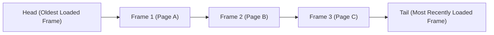
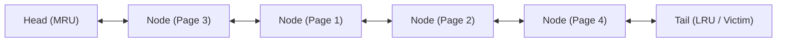

--atom--
file_name: Page Replacement - Data Structures Overview
> [!definition] Page Replacement Data Structure Requirements
> A page replacement algorithm maintains bookkeeping records over currently resident frames in main memory to identify a victim frame when a page fault occurs on full memory[cite: 3].
> * **Tracking Access History**: Algorithms differ primarily in the access metric tracked:
>   * Time of arrival (FIFO)[cite: 4]
>   * Time of last reference (LRU)[cite: 4]
>   * Total reference count (LFU)[cite: 4]
>   * Future access distance (OPT)[cite: 3]
> * **Primary Design Trade-Off**: Maintaining access structures in pure software incurs CPU overhead on every memory reference, whereas hardware-assisted approximation structures reduce instruction path latency[cite: 4].

| Algorithm         | Primary Data Structure                                         | Hardware vs Software Tracking                          | Lookup / Update Complexity            |
| :---------------- | :------------------------------------------------------------- | :----------------------------------------------------- | :------------------------------------ |
| **FIFO**          | Circular Queue / Linear Queue[cite: 4]                         | Software queue on page fault only[cite: 4]             | Eviction: $O(1)$; Hit: $O(1)$         |
| **LRU**           | Doubly-Linked List + Hash Map / Hardware Stack[cite: 4, 9, 10] | Updated on **every** reference[cite: 4, 9]             | Eviction: $O(1)$; Hit: $O(1)$         |
| **LRU (Counter)** | System Clock Counter / Matrix Registers                        | Hardware clock latch per page table entry[cite: 4]     | Eviction: $O(N)$ search; Hit: $O(1)$  |
| **LFU**           | Min-Heap or Frequency Buckets (Hash Map + DLLs)[cite: 4]       | Counter incremented on every memory reference[cite: 4] | Eviction: $O(1)$ to $O(\log N)$       |
| **OPT**           | Forward String Scanner (Offline Oracle)[cite: 3]               | Theoretical / Offline trace only[cite: 3]              | Eviction: $O(N \cdot L)$ forward scan |

--atom--
file_name: Page Replacement - FIFO Queue Implementation
> [!definition] FIFO Queue Architecture
> First-In First-Out (FIFO) replaces the frame that has been resident in main memory for the longest duration[cite: 4].
> * **Data Structure**: A standard FIFO Queue (implemented via a static circular array or a singly-linked list of frame indices)[cite: 4].
> * **Operation Invariant**: Frames are enqueued strictly when a page fault occurs and a page is loaded into memory[cite: 4]. Memory hits do not alter queue positions[cite: 4].



> [!theorem] FIFO Queue Transition Rules
> 1. **On Memory Hit**: The requested page is already resident in memory[cite: 3, 4]. The queue state remains completely untouched; no node updates or pointer movements occur[cite: 4].
> 2. **On Page Fault (Free Frame Available)**:
>    * Allocate free frame $f$[cite: 3].
>    * Load page into frame $f$[cite: 3].
>    * Enqueue frame $f$ at the tail: `enqueue(f)`[cite: 4].
> 3. **On Page Fault (Physical Memory Saturated)**:
>    * Evict the frame at the head of the queue: `victim = dequeue()`[cite: 4].
>    * Check dirty bit of victim: if modified, write back to disk[cite: 3].
>    * Invalidate victim's Page Table Entry (PTE) and TLB entry[cite: 3].
>    * Load requested page from disk into `victim` frame[cite: 3].
>    * Enqueue `victim` at the tail: `enqueue(victim)`[cite: 4].

--atom--
file_name: Page Replacement - LRU Stack and Linked List
> [!definition] LRU Doubly-Linked List Implementation
> Least Recently Used (LRU) evicts the frame that has not been accessed for the longest duration of time[cite: 4].
> * **Hardware/Software Stack Mechanism**: Maintained as a doubly-linked list (DLL) representing a priority stack[cite: 4, 10]:
>   * **Head**: Most Recently Used (MRU) page[cite: 9, 10].
>   * **Tail / Bottom**: Least Recently Used (LRU) page (candidate for eviction)[cite: 4, 9].
> * **Fast Indexing**: A Hash Map or the direct Page Table points directly to the corresponding DLL node, enabling $O(1)$ node splicing on hits[cite: 9, 10].



> [!theorem] Doubly-Linked List Update Invariants
> To maintain the order of recency without traversing the list[cite: 9, 10]:
> 1. **Hit on Existing Page (Mid-list Splice)**:
>    * When an existing page $x$ is referenced, its node is detached from its current position in the list by updating its predecessor and successor pointers:
>      $$\text{node.prev.next} \leftarrow \text{node.next}, \quad \text{node.next.prev} \leftarrow \text{node.prev}$$
>    * The detached node is re-inserted at the **Head** (MRU position)[cite: 9, 10]:
>      $$\text{node.next} \leftarrow \text{head}, \quad \text{head.prev} \leftarrow \text{node}, \quad \text{head} \leftarrow \text{node}$$
> 2. **Eviction on Page Fault**:
>    * The victim is taken from the **Tail** (or bottom of stack): $\text{victim} \leftarrow \text{tail}$[cite: 4, 9, 10].
>    * Detach tail node: $\text{tail} \leftarrow \text{tail.prev}$; $\text{tail.next} \leftarrow \text{NULL}$[cite: 9].
>    * If dirty, write victim to disk; invalidate its PTE and TLB entries[cite: 3].
>    * Allocate new page node, link it to the **Head** (MRU), and update its entry in the Page Table/Hash Map[cite: 3, 9, 10].

> [!question] Step-by-Step Linked List Trace
> Given reference string: $1,\; 2,\; 3,\; 4,\; 3$ with capacity for $4$ frames[cite: 4, 10]:
> 1. Ref $1 \implies [1]$ (Head: 1, Tail: 1)[cite: 4, 10]
> 2. Ref $2 \implies [2] \leftrightarrow [1]$ (Head: 2, Tail: 1)[cite: 4, 10]
> 3. Ref $3 \implies [3] \leftrightarrow [2] \leftrightarrow [1]$ (Head: 3, Tail: 1)[cite: 4, 10]
> 4. Ref $4 \implies [4] \leftrightarrow [3] \leftrightarrow [2] \leftrightarrow [1]$ (Head: 4, Tail: 1)[cite: 4, 10]
> 5. Ref $3$ (Memory Hit):
>    * Locate Node $3$[cite: 10].
>    * Splice out Node $3$ from between Node $4$ and Node $2$[cite: 9, 10].
>    * Prepend Node $3$ to the Head[cite: 9, 10].
>    * New State: $[3] \leftrightarrow [4] \leftrightarrow [2] \leftrightarrow [1]$ (Head: 3, Tail: 1)[cite: 10].
>    * Victim on next fault: Node $1$ (Tail)[cite: 4, 10].

--atom--
file_name: Page Replacement - LRU Counter and Matrix Registers
> [!definition] Hardware Counter Implementation of LRU
> Each Page Table Entry (PTE) is equipped with a hardware **Time-of-Use** register[cite: 4]:
> * A global CPU logical clock or reference counter increments on every memory access[cite: 4].
> * Whenever a page is referenced, hardware automatically copies the current clock value into that page's PTE register:
>   $$\text{PTE}[p].\text{time\_of\_use} \leftarrow \text{Clock}$$[cite: 4]
> * **Victim Selection**: On a page fault, the OS scans all resident frame PTEs to find the entry with the **minimum counter value** (the least recently accessed)[cite: 4]:
>   $$\text{Victim} = \arg\min_{f} (\text{Frame}[f].\text{time\_of\_use})$$[cite: 4]
> * **Overhead**: Requires an $O(N)$ scan over all memory frames upon every page fault, plus counter overflow handling[cite: 4].

> [!theorem] Hardware Reference Matrix (Matrix Method)
> For a system with $n$ physical frames, an $n \times n$ bit matrix is maintained entirely in hardware logic:
> 1. All bits are initialized to $0$.
> 2. When frame $k$ is accessed:
>    * Set all bits in **Row $k$** to $1$:
>      $$\text{Matrix}[k][j] \leftarrow 1 \quad \forall j \in \{0, 1, \dots, n-1\}$$
>    * Set all bits in **Column $k$** to $0$:
>      $$\text{Matrix}[i][k] \leftarrow 0 \quad \forall i \in \{0, 1, \dots, n-1\}$$
> 3. **Victim Identification**: At any instant, the row with the **lowest binary value** (or lowest count of $1\text{s}$) corresponds to the Least Recently Used frame[cite: 4].

--atom--
file_name: Page Replacement - LFU Frequency Counter Schemes
> [!definition] LFU Counter Architecture
> Least Frequently Used (LFU) evicts the frame that has registered the fewest cumulative memory references[cite: 4].
> * **Mechanism**: Associates an integer reference counter with each resident page frame[cite: 4].
> * **Increment Operation**: On every memory reference to page $p$, the counter is incremented[cite: 4]:
>   $$\text{Counter}[p] \leftarrow \text{Counter}[p] + 1$$[cite: 4]
> * **Victim Selection**: On a page fault, select the frame with the smallest counter value[cite: 4]:
>   $$\text{Victim} = \arg\min_{f} (\text{Counter}[f])$$[cite: 4]

> [!theorem] Dual Hash Map and Frequency List Architecture
> To achieve $O(1)$ time complexity for both access updates and victim eviction, LFU is implemented using two hash maps and doubly-linked frequency buckets:
> 1. **Key-Node Map**: Maps $\text{Page} \to \text{Node}(\text{Key}, \text{Val}, \text{Frequency})$.
> 2. **Frequency-Bucket Map**: Maps $\text{Frequency} \to \text{Doubly-Linked List of Nodes with that Frequency}$.
> 3. **`min_frequency` Pointer**: Tracks the current global lowest frequency bucket.
> 
> * **On Access (Hit)**: Node is removed from its current frequency list $\text{freq}$ and spliced into the tail of list $\text{freq} + 1$. If list $\text{freq}$ becomes empty and $\text{min\_frequency} == \text{freq}$, increment $\text{min\_frequency}$.
> * **On Eviction (Fault)**: Evict the node at the head of list $\text{min\_frequency}$ in $O(1)$ time.

```mermaid
flowchart TD
    MinPtr["min_frequency = 1"] --> B1["Bucket Freq 1"]
    B1 --> N1["Node (Page D)"]
    N1 --> N2["Node (Page A)"]
    
    B2["Bucket Freq 2"] --> N3["Node (Page C)"]
    
    B5["Bucket Freq 5"] --> N4["Node (Page B)"]