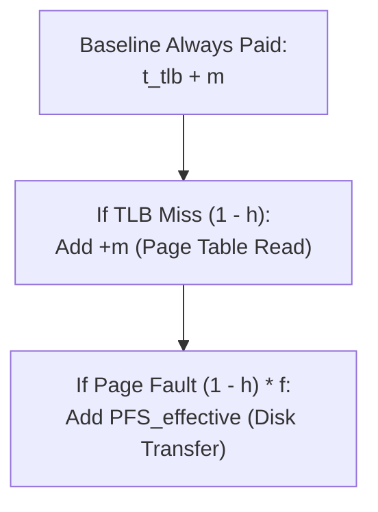

--atom--
file_name: Demand Paging - Simplified Multi-Tier EMAT
> [!definition] The Additive Overhead Method
> Instead of memorizing deep, branching, conditional probability formulas with nested parentheses, every Effective Memory Access Time ($\text{EMAT}$) problem can be solved in a single step using **Baseline Access Time plus Expected Penalties**[cite: 8]:
> $$\text{EMAT} = \text{Baseline Incurred Time} + \sum (\text{Probability of Event} \times \text{Extra Penalty of Event})$$[cite: 8]
> * **Zero Memorization**: Follow the hardware path sequentially from CPU to physical memory[cite: 8].
> * **No Complex Algebra**: Avoids multiplying massive millisecond constants across multiple expanded terms[cite: 3, 7].

> [!formula] Two-Step Additive Strategy for TLB and Page Faults
> 1. **Step 1: Calculate Effective Page Fault Penalty ($\text{PFS}_{\text{effective}}$)**:
>    * Every page fault must read the requested page from disk into RAM ($T_{\text{read}}$)[cite: 7, 8].
>    * Only a dirty victim incurs an additional write-back to disk ($T_{\text{write}}$)[cite: 7, 8]:
>      $$\text{PFS}_{\text{effective}} = T_{\text{read}} + P(\text{dirty}) \times T_{\text{write}}$$[cite: 7, 8]
> 2. **Step 2: Trace the Access Tree Additively**:
>    * **Unavoidable Baseline**: Every single translation attempts a TLB lookup ($t_{\text{tlb}}$) and ultimately accesses the target operand in physical memory ($m$)[cite: 6, 8]:
>      $$\text{Baseline} = t_{\text{tlb}} + m$$[cite: 6, 8]
>    * **Penalty 1: TLB Miss**: Occurs with probability $(1 - h_{\text{tlb}})$[cite: 6, 8]. It incurs an extra memory access to read the Page Table from RAM ($+m$)[cite: 6, 8]:
>      $$\text{Extra Time} = m$$[cite: 6, 8]
>    * **Penalty 2: Page Fault**: Occurs conditionally when a TLB miss experiences an invalid PTE ($P(\text{miss}) \times P(\text{fault} \mid \text{miss})$)[cite: 7, 8]. It incurs the disk transfer overhead ($\text{PFS}_{\text{effective}}$)[cite: 7, 8]:
>      $$\text{Extra Time} = \text{PFS}_{\text{effective}}$$[cite: 7, 8]
> 
> $$\mathbf{\text{EMAT} = (t_{\text{tlb}} + m) + (1 - h_{\text{tlb}}) \cdot m + \left[ (1 - h_{\text{tlb}}) \cdot f \right] \cdot \text{PFS}_{\text{effective}}}$$[cite: 6, 7, 8]

> [!question] Minimal Calculation Walkthrough: GATE CSE 2020 Multi-Tier Problem
> Given parameters[cite: 7]:
> * Physical memory access time ($m$) $= 100\text{ ns}$[cite: 7]
> * TLB search time ($t_{\text{tlb}}$) $= 20\text{ ns}$[cite: 7]
> * TLB hit ratio ($h$) $= 95\% \implies \text{Miss Ratio } (1 - h) = 0.05$[cite: 7, 8]
> * Page fault rate on miss ($f$) $= 10\% = 0.10$[cite: 7, 8]
> * Disk transfer time per page $= 5000\text{ ns}$[cite: 7]
> * $20\%$ of replaced pages are dirty ($P(\text{dirty}) = 0.20$)[cite: 7]
> 
> **Clean 3-Line Execution**:
> 1. **Compute Disk Service Penalty**:
>    $$\text{PFS}_{\text{effective}} = 5000 + 0.20 \times 5000 = 5000 + 1000 = 6000\text{ ns}$$[cite: 7]
> 2. **Compute Unavoidable Baseline**:
>    $$\text{Baseline} = t_{\text{tlb}} + m = 20 + 100 = 120\text{ ns}$$[cite: 8]
> 3. **Add the Conditional Penalties**:
>    * Extra RAM access for TLB miss:
>      $$0.05 \times 100\text{ ns} = 5\text{ ns}$$[cite: 8]
>    * Extra Disk I/O for Page Fault:
>      $$\underbrace{(0.05 \times 0.10)}_{\text{Net Fault Prob } = 0.005} \times 6000\text{ ns} = 30\text{ ns}$$[cite: 8]
>    $$\mathbf{\text{EMAT} = 120 + 5 + 30 = 155\text{ ns}}$$[cite: 8]

> [!trap] The Fault Scope Trap in GATE Questions
> Pay strict attention to how the question phrases the page fault rate $f$[cite: 7, 8]:
> * **Case A: "A page fault occurs with rate $f$ on a TLB miss"**:
>   $$\text{Global Page Fault Probability} = (1 - h_{\text{tlb}}) \times f$$[cite: 7, 8]
>   *(Used in the GATE 2020 question where fault rate was given within the context of a TLB miss)*[cite: 7, 8].
> * **Case B: "Overall page fault rate across all memory accesses is $p$"**:
>   $$\text{Global Page Fault Probability} = p$$[cite: 3]
>   *(Direct multiplication: simply add $p \times \text{PFS}_{\text{effective}}$ to the EMAT equation)*[cite: 3].