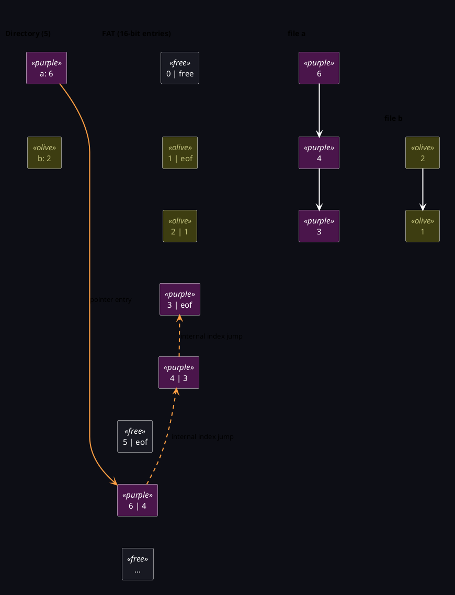

---
tags:
  - os
  - memory-management
  - emat
  - gate-cse
aliases:
  - Effective Memory Access Time
  - Unified EMAT
date_created: 2026-09-25
---

```plantuml
@startuml
skinparam BackgroundColor #0d0e15
skinparam ArrowColor #ff9f43
skinparam ArrowThickness 2
skinparam RectangleFontColor #ffffff
skinparam RectangleBorderColor #ffffff
skinparam RectangleFontSize 15
skinparam FrameBackgroundColor #transparent
skinparam FrameBorderColor #transparent

' Custom styling for elements
<style>
.purple {
    BackgroundColor #4a154b
    FontColor #ffffff
}
.olive {
    BackgroundColor #3d3d11
    FontColor #c1c17d
}
.free {
    BackgroundColor #181922
    FontColor #ffffff
}
</style>

' --- DIRECTORY ---
frame "Directory (5)" as Dir {
    rectangle "a: 6" as dir_a <<purple>>
    rectangle "b: 2" as dir_b <<olive>>
    dir_a -[hidden]- dir_b
}

' --- FAT TABLE ---
frame "FAT (16-bit entries)" as FAT {
    rectangle "0 | free" as f0 <<free>>
    rectangle "1 | eof"  as f1 <<olive>>
    rectangle "2 | 1"    as f2 <<olive>>
    rectangle "3 | eof"  as f3 <<purple>>
    rectangle "4 | 3"    as f4 <<purple>>
    rectangle "5 | eof"  as f5 <<free>>
    rectangle "6 | 4"    as f6 <<purple>>
    rectangle "..."      as f_dots <<free>>
    
    f0 -[hidden]- f1
    f1 -[hidden]- f2
    f2 -[hidden]- f3
    f3 -[hidden]- f4
    f4 -[hidden]- f5
    f5 -[hidden]- f6
    f6 -[hidden]- f_dots
}

' --- FILE CHAINS ---
frame "file a" as file_a {
    rectangle "6" as fa6 <<purple>>
    rectangle "4" as fa4 <<purple>>
    rectangle "3" as fa3 <<purple>>
    fa6 -[#white]-> fa4
    fa4 -[#white]-> fa3
}

frame "file b" as file_b {
    rectangle "2" as fb2 <<olive>>
    rectangle "1" as fb1 <<olive>>
    fb2 -[#white]-> fb1
}

' --- RELATIONSHIP TRACKS & POINTERS ---
dir_a ----> f6 : pointer entry
f6 .[#ff9f43].> f4 : internal index jump
f4 .[#ff9f43].> f3 : internal index jump

' Layout configuration help to arrange items left-to-right properly
Dir -[hidden]right- FAT
FAT -[hidden]right- file_a
file_a -[hidden]down- file_b

@endum


```