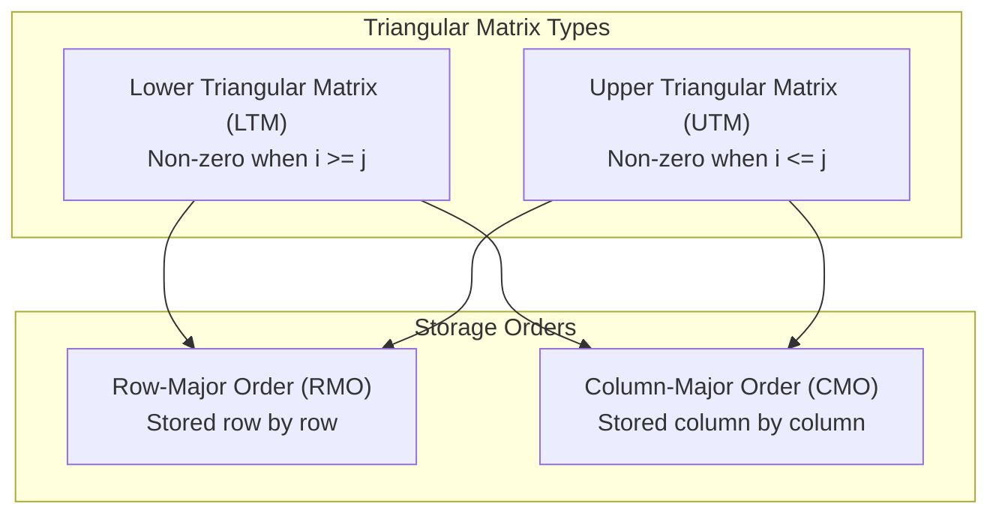

--atom--
file_name: Triangular Matrix - Address Mapping Formulas

> [!definition]
> A **Triangular Matrix** of dimension $N \times N$ contains non-zero entries on one side of the principal diagonal, while the opposite side consists strictly of zeros. To conserve memory, only the $\frac{N(N + 1)}{2}$ non-zero elements are mapped contiguously into a 1D linear array $B[0 \dots K-1]$ or $B[1 \dots K]$ (where $K = \frac{N(N + 1)}{2}$).
> * **Lower Triangular Matrix (LTM):** $A[i][j] = 0$ whenever $i < j$. Valid non-zero range: $i \ge j$.
> * **Upper Triangular Matrix (UTM):** $A[i][j] = 0$ whenever $i > j$. Valid non-zero range: $i \le j$.

---

### Lower Triangular Matrix (LTM) Address Formulas

Assume 1-based indexing for matrix coordinates $A[1 \dots N][1 \dots N]$, base address $BA$, and element size $c$. Non-zero condition: $i \ge j$.

#### 1. Row-Major Order (RMO)
In RMO, rows are stored sequentially. Row $1$ has $1$ element, row $2$ has $2$ elements, $\dots$, row $(i-1)$ has $(i-1)$ elements.
* **Elements before row $i$:** $\sum_{k=1}^{i-1} k = \frac{(i - 1)i}{2}$
* **Elements in current row $i$ before column $j$:** $(j - 1)$

> [!formula]
> **LTM in Row-Major Order (1-based index):**
> $$\text{Address}(A[i][j]) = BA + \left[ \frac{(i - 1)i}{2} + (j - 1) \right] \times c$$
> For 0-based indexing ($A[0 \dots N-1][0 \dots N-1]$):
> $$\text{Address}(A[i][j]) = BA + \left[ \frac{i(i + 1)}{2} + j \right] \times c$$

#### 2. Column-Major Order (CMO)
In CMO, columns are stored sequentially. Column $1$ has $N$ elements, column $2$ has $N - 1$ elements, $\dots$, column $(j-1)$ has $N - (j - 2)$ elements.
* **Elements before column $j$:** Sum of an AP with first term $N$ and $(j-1)$ terms:
  $$\sum_{k=1}^{j-1} (N - k + 1) = (j - 1)N - \frac{(j - 1)(j - 2)}{2}$$
* **Elements in current column $j$ before row $i$:** $(i - j)$

> [!formula]
> **LTM in Column-Major Order (1-based index):**
> $$\text{Address}(A[i][j]) = BA + \left[ \left( (j - 1)N - \frac{(j - 1)(j - 2)}{2} \right) + (i - j) \right] \times c$$

---

### Upper Triangular Matrix (UTM) Address Formulas

Assume 1-based indexing for matrix coordinates $A[1 \dots N][1 \dots N]$, base address $BA$, and element size $c$. Non-zero condition: $i \le j$.

#### 1. Row-Major Order (RMO)
In RMO, row $1$ has $N$ elements, row $2$ has $N - 1$ elements, $\dots$, row $(i-1)$ has $N - (i - 2)$ elements.
* **Elements before row $i$:** $(i - 1)N - \frac{(i - 1)(i - 2)}{2}$
* **Elements in current row $i$ before column $j$:** $(j - i)$

> [!formula]
> **UTM in Row-Major Order (1-based index):**
> $$\text{Address}(A[i][j]) = BA + \left[ \left( (i - 1)N - \frac{(i - 1)(i - 2)}{2} \right) + (j - i) \right] \times c$$
> For 0-based indexing ($A[0 \dots N-1][0 \dots N-1]$):
> $$\text{Address}(A[i][j]) = BA + \left[ \left( i \cdot N - \frac{i(i - 1)}{2} \right) + (j - i) \right] \times c$$

#### 2. Column-Major Order (CMO)
In CMO, column $1$ has $1$ element, column $2$ has $2$ elements, $\dots$, column $(j-1)$ has $(j-1)$ elements.
* **Elements before column $j$:** $\sum_{k=1}^{j-1} k = \frac{(j - 1)j}{2}$
* **Elements in current column $j$ before row $i$:** $(i - 1)$

> [!formula]
> **UTM in Column-Major Order (1-based index):**
> $$\text{Address}(A[i][j]) = BA + \left[ \frac{(j - 1)j}{2} + (i - 1) \right] \times c$$
> For 0-based indexing ($A[0 \dots N-1][0 \dots N-1]$):
> $$\text{Address}(A[i][j]) = BA + \left[ \frac{j(j + 1)}{2} + i \right] \times c$$

---

### Master Formula Lookup Table (1-Based Indexing)

| Matrix Type | Mapping Scheme         | Number of Prior Elements (Offset Index)         |
| :---------- | :--------------------- | :---------------------------------------------- |
| **LTM**     | **Row-Major (RMO)**    | $\frac{(i - 1)i}{2} + (j - 1)$                  |
| **LTM**     | **Column-Major (CMO)** | $(j - 1)N - \frac{(j - 1)(j - 2)}{2} + (i - j)$ |
| **UTM**     | **Row-Major (RMO)**    | $(i - 1)N - \frac{(i - 1)(i - 2)}{2} + (j - i)$ |
| **UTM**     | **Column-Major (CMO)** | $\frac{(j - 1)j}{2} + (i - 1)$                  |
|             |                        |                                                 |

> [!theorem]
> **Duality Invariant:**
> The offset formula of an **LTM in Row-Major Order** is mathematically identical to that of a **UTM in Column-Major Order** under transposed coordinates $(i \leftrightarrow j)$.
> Similarly, **LTM in CMO** maps identically to **UTM in RMO** when dimensions and index directions are inverted.

> [!trap]
> Never memorize these formulas without checking whether the question uses **0-based** or **1-based** indexing.
> * If 0-based: replace $i \to i + 1$ and $j \to j + 1$ before plugging into 1-based formulas, or derive directly by counting the completed rows/columns.
> * If a zero-element index is queried (e.g., querying $A[2][5]$ in an LTM where $i < j$), its address is not in the compressed 1D array—it returns the default value $0$.

---

> [!question]
> **GATE Practice Problem:** An upper triangular matrix $A[1 \dots 10][1 \dots 10]$ is stored in linear memory using **Row-Major Order**. The base address is $2000$, and each element occupies $4\text{ bytes}$. Calculate the address of element $A[4][7]$.
>
> **Step-by-Step Resolution:**
> 1. Identify parameters: $N = 10$, $i = 4$, $j = 7$, $BA = 2000$, $c = 4$.
> 2. Verify validity: $i \le j \implies 4 \le 7$ (Valid non-zero element).
> 3. Compute completed elements in rows $1$ through $3$:
>    * Row 1: $10$ elements
>    * Row 2: $9$ elements
>    * Row 3: $8$ elements
>    $$\text{Prior Row Elements} = 10 + 9 + 8 = 27$$
>    Using formula: $(i - 1)N - \frac{(i - 1)(i - 2)}{2} = (3)(10) - \frac{(3)(2)}{2} = 30 - 3 = 27$
> 4. Compute elements in current row $4$ before column $7$:
>    $$\text{Elements in Row 4} = j - i = 7 - 4 = 3 \quad (\text{columns } 4, 5, 6)$$
> 5. Total offset in elements:
>    $$\text{Offset} = 27 + 3 = 30$$
> 6. Calculate physical memory address:
>    $$\text{Address}(A[4][7]) = 2000 + (30 \times 4) = 2000 + 120 = 2120$$