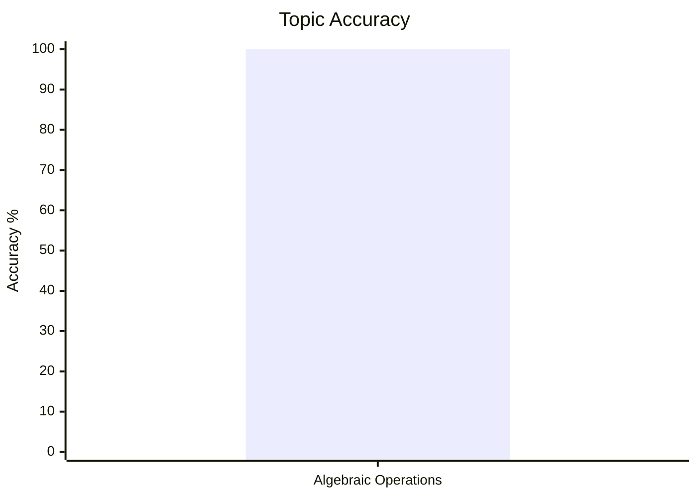
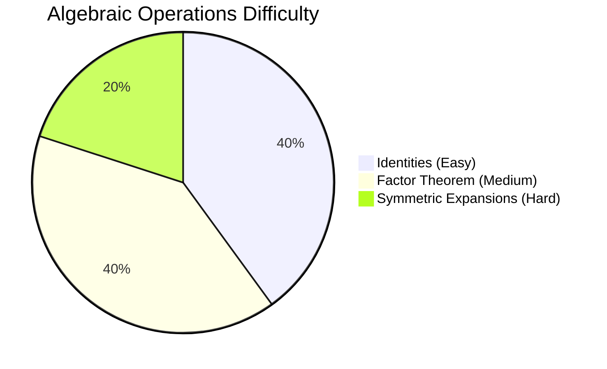
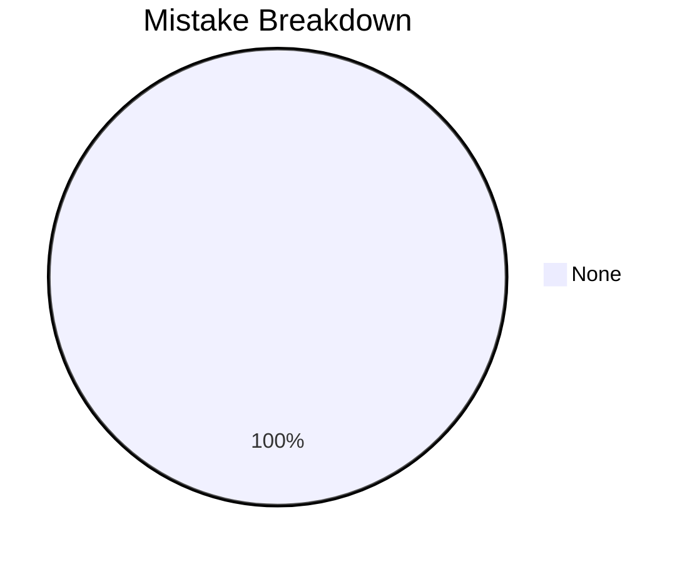

# Algebraic Operations

## Theory, Intuition & Formulas

### 1. Fundamental Definitions & Classifications
- **Algebraic Expression**: A mathematical expression connecting constants and variables via fundamental operations ($+, -, \times, \div$).
- **Polynomial**: An algebraic expression $P(x) = a_n x^n + a_{n-1} x^{n-1} + \dots + a_1 x + a_0$ consisting of variables and coefficients where all exponents of $x$ are non-negative integers ($n \in \mathbb{N}_0$).
  - *Non-Polynomial Examples*: $3x^2 + 9x - 1 + \frac{7}{x}$ (contains $7x^{-1}$ with negative exponent), $5x^{3/2} - 7\sqrt{x} + 12$ (contains fractional exponent $x^{1/2}$).
- **Degree of a Polynomial**: The highest exponent of the variable term in a single-variable polynomial (or highest total degree of combined terms in multi-variable polynomials).
  - *Constant Polynomial*: Degree $0$ (e.g. $f(x) = 8$). Zero polynomial $f(x) = 0$ has **undefined degree**.
  - *Linear Polynomial*: Degree $1$ ($a x + b$).
  - *Quadratic Polynomial*: Degree $2$ ($a x^2 + b x + c, a \neq 0$).
  - *Cubic Polynomial*: Degree $3$ ($a x^3 + b x^2 + c x + d, a \neq 0$).
  - *Biquadratic Polynomial*: Degree $4$ ($a x^4 + b x^3 + c x^2 + d x + e, a \neq 0$).

---

### 2. Universal Algebraic Identities

#### Quadratic & Bilinear Expansion Identities:
1. Difference of Two Squares:
   $$a^2 - b^2 = (a - b)(a + b)$$
2. Square of Sum & Difference:
   $$(a + b)^2 = a^2 + 2ab + b^2$$
   $$(a - b)^2 = a^2 - 2ab + b^2$$
3. Difference of Squares of Sum and Difference:
   $$(a + b)^2 - (a - b)^2 = 4ab$$
4. Sum of Squares of Sum and Difference:
   $$(a + b)^2 + (a - b)^2 = 2(a^2 + b^2)$$
5. Square of Trinomial:
   $$(a + b + c)^2 = a^2 + b^2 + c^2 + 2(ab + bc + ca)$$

#### Cubic Identities:
6. Cube of Sum & Difference:
   $$(a + b)^3 = a^3 + b^3 + 3ab(a + b)$$
   $$(a - b)^3 = a^3 - b^3 - 3ab(a - b)$$
7. Sum & Difference of Cubes:
   $$a^3 + b^3 = (a + b)(a^2 - ab + b^2)$$
   $$a^3 - b^3 = (a - b)(a^2 + ab + b^2)$$

#### Special High-Degree & Symmetric Identities:
8. Master Symmetric Identity:
   $$a^3 + b^3 + c^3 - 3abc = (a + b + c)(a^2 + b^2 + c^2 - ab - bc - ca)$$
   Alternatively written as:
   $$a^3 + b^3 + c^3 - 3abc = \frac{1}{2}(a + b + c)\left[(a - b)^2 + (b - c)^2 + (c - a)^2\right]$$
   - **Conditional Corollary**: If $a + b + c = 0$, then:
     $$a^3 + b^3 + c^3 = 3abc$$
9. Quartic Biquadratic Identity (Sophie Germain Form):
   $$a^4 + a^2 b^2 + b^4 = (a^2 + ab + b^2)(a^2 - ab + b^2)$$

---

### 3. Core Theorems & Polynomial Algorithms

#### Remainder Theorem:
Let $P(x)$ be a polynomial of degree $n \ge 1$ and $a \in \mathbb{R}$. When $P(x)$ is divided by the linear divisor $(x - a)$, the remainder is given directly by:
$$R = P(a)$$

#### Factor Theorem:
1. If $P(a) = 0$, then $(x - a)$ is a factor of $P(x)$.
2. Conversely, if $(x - a)$ is a factor of $P(x)$, then $P(a) = 0$.

#### Polynomial Division Algorithm:
For dividend $P(x)$ and non-zero divisor $g(x)$, there exist unique quotient $q(x)$ and remainder $r(x)$ such that:
$$P(x) = g(x) \cdot q(x) + r(x)$$
where either $r(x) = 0$ or $\deg(r(x)) < \deg(g(x))$.

---

## Core Methods & Subtopic Index

1. [Algebraic Identity Transformations & Symmetric Expansions](/cds/math/notes/subtopics/poly_identities)
   - Multi-variable reciprocal substitutions ($x + 1/x$, $x^2 + 1/x^2$, $x^3 + 1/x^3$).
   - Conditional cubic identity evaluations when $a + b + c = 0$.

2. [Remainder and Factor Theorem Applications](/cds/math/notes/subtopics/remainder_factor_theorem)
   - Solving unknown coefficient parameters ($k$) via $P(a) = 0$.
   - Synthetic division and multi-step root factoring.

3. [Quartic & Higher Order Polynomial Factorization](/cds/math/notes/subtopics/biquadratic_factorization)
   - Splitting middle terms, perfect square grouping, and biquadratic factoring.

---

## Linked Practice Questions

- [Q48: Remainder Evaluation via Linear Divisor](/cds/math/notes/questions/q48)
- [Q49: Unknown Parameter $k$ via Factor Theorem](/cds/math/notes/questions/q49)
- [Q50: Reciprocal Polynomial Powers ($x + 1/x = 5$)](/cds/math/notes/questions/q50)
- [Q51: Conditional Cubic Sum ($a+b+c=0 \implies a^3+b^3+c^3 = 3abc$)](/cds/math/notes/questions/q51)
- [Q52: Quartic Factorization via Difference of Squares](/cds/math/notes/questions/q52)

---

## Variations

- [Variation 25: Symmetric Reciprocal High Power Sums ($x^5 + 1/x^5$)](/cds/math/notes/variations/var25)
- [Variation 26: Generalized Dual Parameter Factor Theorem System](/cds/math/notes/variations/var26)
- [Variation 27: Cyclically Shifted Fractional Symmetric Identity](/cds/math/notes/variations/var27)

---

## Performance Overview

---

## Navigation

- [Elementary Mathematics Overview](/cds/math/math_overview)
- [Question Database](/cds/math/question_db)
