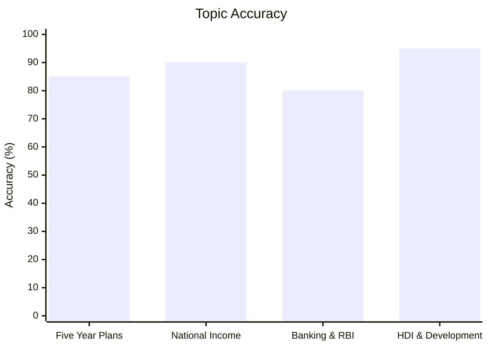
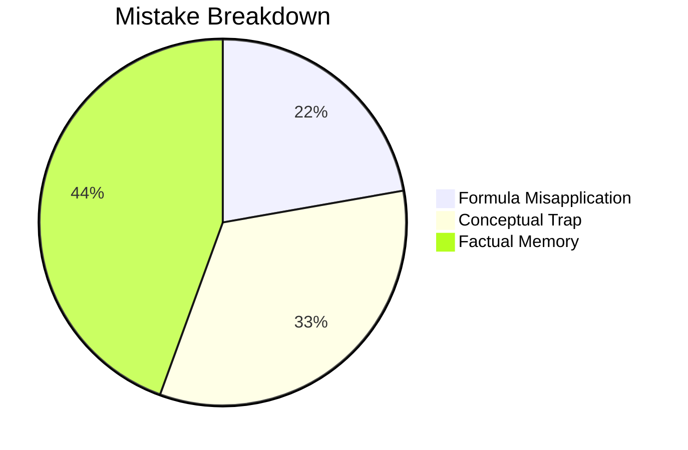

# Indian Economy

## Topics & Notes
- [Indian Economy Cheat Sheet (Names, Events, Plans & Institutions)](/cds/economy/notes/economy_cheatsheet)

## Performance Overview

## Navigation
- [CDS Overview Dashboard](/cds/cds_overview)
