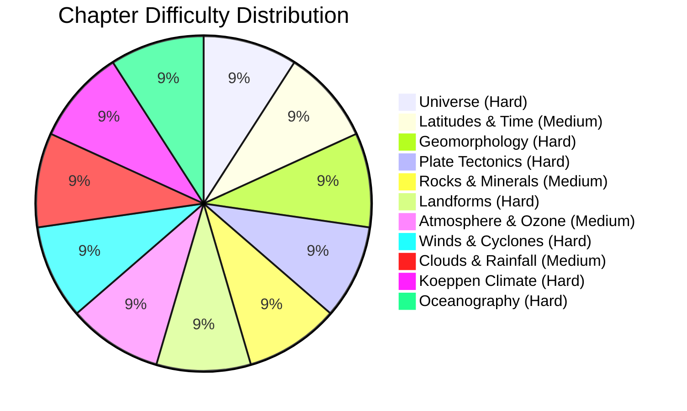

# Physical Geography

Welcome to the **Physical Geography Vault Index**. This master course covers all 11 core chapters extracted from the 251-page Physical Geography Master Class.

---

## Master Chapter Index

1. [Ch 1. Universe and Solar System](/cds/geography/notes/universe)
2. [Ch 2. Latitudes, Longitudes and Time Systems](/cds/geography/notes/latitudes-longitudes)
3. [Ch 3. Geomorphology and Earth Interior](/cds/geography/notes/geomorphology)
4. [Ch 4. Plate Tectonics, Mountains and Volcanism](/cds/geography/notes/plate-tectonics)
5. [Ch 5. Rocks, Minerals and Rock Cycle](/cds/geography/notes/rocks-minerals)
6. [Ch 6. Geomorphic Processes and Landforms](/cds/geography/notes/landforms)
7. [Ch 7. Atmosphere, Ozone Layer and Greenhouse Effect](/cds/geography/notes/atmosphere-ozone)
8. [Ch 8. Pressure Belts, Local Winds and Cyclones](/cds/geography/notes/winds-cyclones)
9. [Ch 9. Condensation, Clouds and World Rainfall](/cds/geography/notes/clouds-rainfall)
10. [Ch 10. Koeppen Climate Classification and Indian Climate](/cds/geography/notes/koeppen-climate)
11. [Ch 11. Oceanography, Ocean Currents and Coral Reefs](/cds/geography/notes/oceanography)

---

## Question Taxonomy Database

- [Physical Geography Central Question Database](/cds/geography/question_db)

---

## Performance Overview

---

## Navigation

- [CDS Exam Master Dashboard](/cds/cds_overview)
