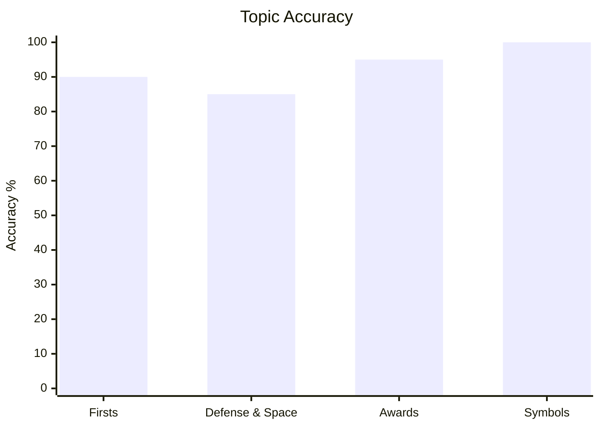
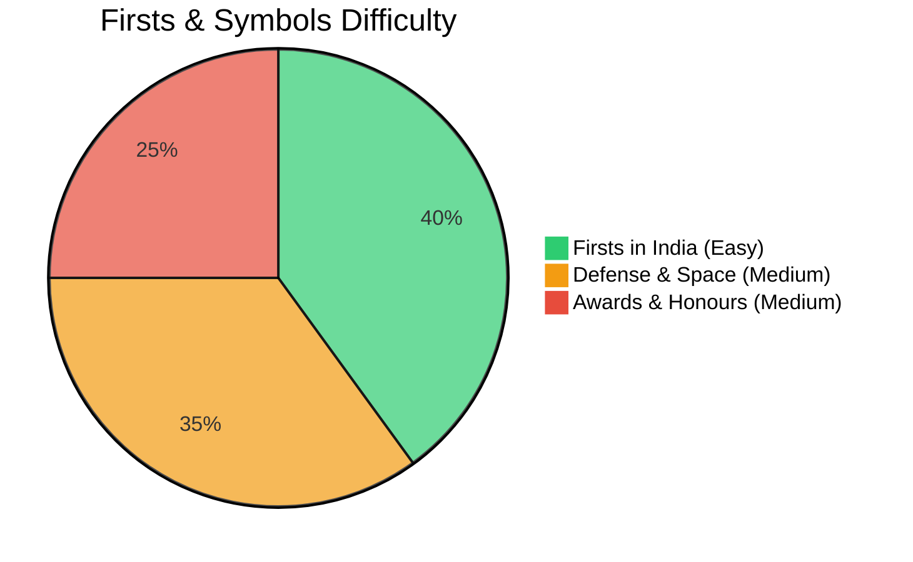
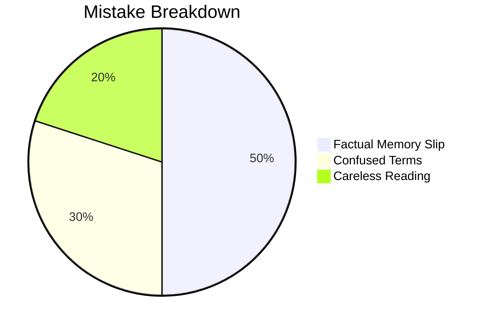

# General Knowledge

## Topics & Notes

- [Indian General Knowledge Cheatsheet](/cds/gk/notes/gk)

---

## Variations

- [Variation 1: Missile Classification & Launch Platforms](/cds/gk/notes/variations/vars#variation-1-missile-classification-traps)
- [Variation 2: Award Hierarchy: Wartime vs. Peacetime](/cds/gk/notes/variations/vars#variation-2-award-hierarchy-wartime-vs-peacetime)
- [Variation 3: Governor-General & Constitutional Transitions](/cds/gk/notes/variations/vars#variation-3-governor-general-constitutional-transitions)

---

## Performance Overview

---

## Navigation

- [CDS Master Dashboard](/cds/cds_overview)
- [Question Database](/cds/gk/question_db)
