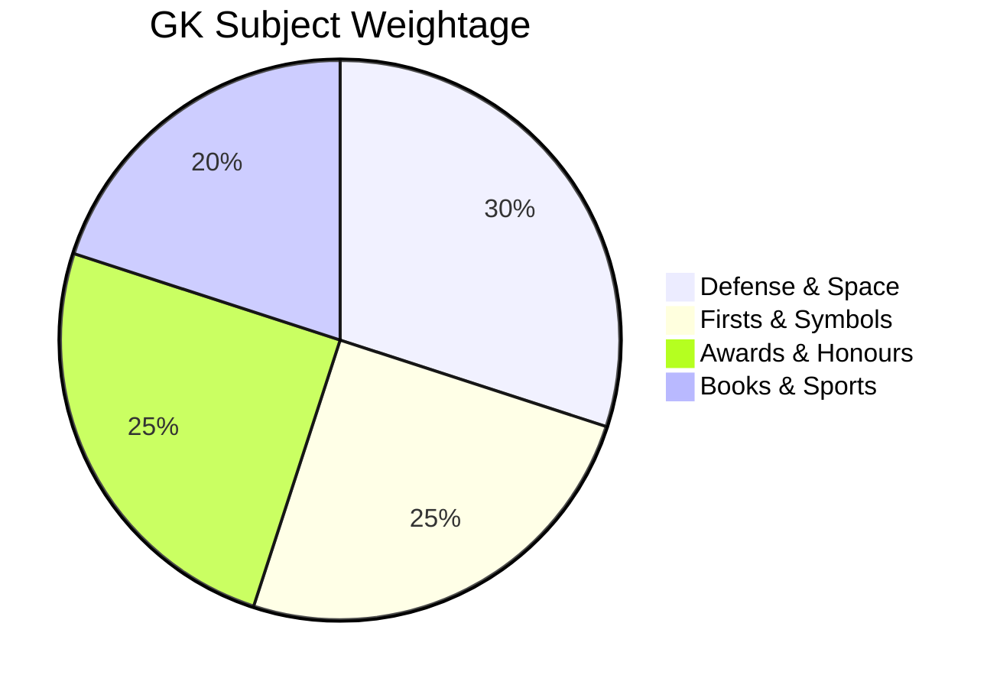

# Indian General Knowledge

Welcome to the comprehensive, high-density study guide and cheatsheet for **Indian General Knowledge** (covering key historical/national firsts, national symbols, military & defense structures, missile & space technology, civilian/gallantry awards, sports, books & authors, and international organizations).

---

## Theory, Intuition & Key Reference Data

### 1. Firsts in India (Male & Female) & National Milestones

#### Key Male Firsts in India
* **First Governor-General of Bengal**: Warren Hastings (1773).
* **First Governor-General of Free India**: Lord Mountbatten.
* **First & Last Indian Governor-General of Free India**: C. Rajagopalachari.
* **First President of Independent India**: Dr. Rajendra Prasad.
* **First Vice-President of India**: Dr. S. Radhakrishnan.
* **First Prime Minister of Free India**: Pt. Jawaharlal Nehru.
* **First Field Marshal of India**: S.H.F.J. Manekshaw.
* **First Commander-in-Chief of Free India**: General K.M. Cariappa.
* **First Chief of Air Staff**: Air Marshal Sir Thomas Elmhirst (First Indian Chief: Air Marshal Subroto Mukherjee).
* **First Chief of Naval Staff**: Vice Admiral R.D. Katari.
* **First Indian in Space**: Rakesh Sharma (1984, Salyut 7).
* **First Indian Nobel Laureate**: Rabindranath Tagore (1913, Literature - *Gitanjali*).
* **First Indian to win Nobel Prize in Physics**: C.V. Raman (1930, Raman Effect).
* **First Indian to cross the English Channel**: Mihir Sen.
* **First Chief Justice of Supreme Court**: Justice H.J. Kania.

#### Key Female Firsts in India
* **First Woman President of India**: Pratibha Devisingh Patil.
* **First Woman Prime Minister**: Indira Gandhi.
* **First Woman Governor of a State**: Sarojini Naidu (Uttar Pradesh).
* **First Woman Chief Minister**: Sucheta Kripalani (Uttar Pradesh).
* **First Woman Speaker of Lok Sabha**: Meira Kumar.
* **First Woman Judge/Justice of Supreme Court**: M. Fathima Beevi.
* **First Woman IPS Officer**: Kiran Bedi.
* **First Indian Woman to scale Mount Everest**: Bachendri Pal (1984).
* **First Indian Woman to scale Mount Everest twice**: Santosh Yadav.
* **First Indian Woman to win Nobel Peace Prize**: Mother Teresa (1979).
* **First Indian Woman to win Miss World**: Reita Faria (1966).
* **First Indian Woman to win Miss Universe**: Sushmita Sen (1994).
* **First Woman President of Indian National Congress**: Annie Besant (First *Indian* Woman President: Sarojini Naidu, 1925).

---

### 2. Indian National Symbols

* **National Flag (Tiranga)**: Designed by Pingali Venkayya. Width-to-length ratio is **2:3**. Adopted on **22nd July, 1947**. Features 24-spoke Ashoka Chakra in Navy Blue.
* **National Emblem**: Adapted from the Lion Capital of Ashoka at Sarnath. Adopted on **26th January, 1950**. Motto: *"Satyameva Jayate"* (Truth Alone Triumphs) taken from **Mundaka Upanishad** written in Devanagari script.
* **National Anthem ("Jana Gana Mana")**: Composed by Rabindranath Tagore. First sung on **27th December, 1911** at Kolkata session of INC. Full playing time is **52 seconds** (short version: 20 seconds).
* **National Song ("Vande Mataram")**: Written by Bankim Chandra Chatterji in Bengali/Sanskrit in his novel *Anandamath* (1882). First sung at 1896 INC session.
* **National Calendar**: Based on the **Saka Era**, with *Chaitra* as its first month. Adopted on **22nd March, 1957** (Normal year: 365 days; Chaitra 1 falls on March 22 / March 21 in leap year).
* **National Aquatic Animal**: Ganges River Dolphin (*Platanista gangetica*).
* **National Heritage Animal**: Elephant.

---

### 3. Indian Defense, Armed Forces & Space Technology

#### Armed Forces Command Structure
* **Supreme Commander**: President of India.
* **Army Commands (7)**: Northern (Udhampur), Southern (Pune), Eastern (Kolkata), Western (Chandimandir), Central (Lucknow), Training (Shimla), South-Western (Jaipur).
* **Navy Commands (3)**: Western (Mumbai), Eastern (Visakhapatnam), Southern (Kochi). Motto: *Sham no Varunah*.
* **Air Force Commands (7)**: Western (New Delhi), Eastern (Shillong), Central (Prayagraj), Southern (Thiruvananthapuram), South-Western (Gandhinagar), Maintenance (Nagpur), Training (Bengaluru). Motto: *Nabhas Sprisam Deeptam*.

#### Indian Missile Systems (IGMDP)
* **Prithvi**: Short-range surface-to-surface ballistic missile.
* **Agni**: Medium-to-intercontinental ballistic missiles (Agni-I to Agni-V; Agni-V range $> 5000\text{ km}$).
* **Trishul**: Short-range surface-to-air missile (12 km range).
* **Akash**: Medium-range surface-to-air missile (25 km range).
* **Nag**: 3rd-generation "Fire and Forget" anti-tank guided missile. Helina is its air-launched version.
* **BrahMos**: Supersonic cruise missile developed jointly by India (DRDO) and Russia (NPOM). Mach 2.8 speed.

#### Space & Nuclear Infrastructure
* **BARC**: Bhabha Atomic Research Centre (Trombay, Mumbai, 1954).
* **IGCAR**: Indira Gandhi Centre for Atomic Research (Kalpakkam, Tamil Nadu).
* **ISRO**: Indian Space Research Organisation (HQs: Bengaluru, Estd: 15th August 1969).
* **Spaceports**: Satish Dhawan Space Centre (SDSC - SHAR), Sriharikota, Andhra Pradesh.
* **First Satellite**: Aryabhata (Launched 19th April, 1975 via Soviet launch vehicle).

---

### 4. Major Indian & International Civilian / Gallantry Awards

#### Highest Civilian Awards
1. **Bharat Ratna**: Highest civilian award (Instituted 1954). First recipients: C. Rajagopalachari, Dr. S. Radhakrishnan, Dr. C.V. Raman.
2. **Padma Vibhushan**, **Padma Bhushan**, **Padma Shri**.

#### Military Gallantry Awards
* **Wartime Gallantry Awards**:
  1. **Param Vir Chakra (PVC)**: Highest wartime bravery award. First recipient: Major Somnath Sharma (Posthumous, 1947).
  2. **Maha Vir Chakra (MVC)**.
  3. **Vir Chakra (VrC)**.
* **Peacetime Gallantry Awards**: Ashoka Chakra (Highest peacetime), Kirti Chakra, Shaurya Chakra.

#### High-Yield Literature & Science Awards
* **Jnanpith Award**: Highest literary award in India (First recipient: G. Sankara Kurup, Malayalam, 1965).
* **Sahitya Akademi Award**: Given for 24 languages (22 Scheduled + English & Rajasthani).
* **Shanti Swarup Bhatnagar Prize**: Awarded by CSIR for outstanding scientific research.
* **Dadasaheb Phalke Award**: Highest award in Indian cinema (First recipient: Devika Rani, 1969).

---

### 5. Important National Days & Observances

* **January 9**: Pravasi Bharatiya Divas (NRI Day - Gandhi's return from South Africa in 1915).
* **January 15**: Indian Army Day.
* **January 24**: National Girl Child Day.
* **January 25**: National Voters' Day.
* **February 28**: National Science Day (Discovery of Raman Effect by Sir C.V. Raman).
* **August 29**: National Sports Day (Birthday of Major Dhyan Chand).
* **October 8**: Indian Air Force Day.
* **December 4**: Indian Navy Day (Operation Trident, 1971 War).
* **December 25**: Good Governance Day (Birthday of Atal Bihari Vajpayee).

---

## Subtopics & Specialized Questions

- [Firsts in India & National Milestones](/cds/gk/notes/subtopics/firsts_in_india)
- [Defense, Armed Forces & Space Technology](/cds/gk/notes/subtopics/defense_and_space)
- [Civilian, Gallantry & Literary Awards](/cds/gk/notes/subtopics/awards_and_honours)

---

## Variations

- [Variation 1: IGMDP Missile Classifications & Launch Platforms](/cds/gk/notes/variations/vars#variation-1-missile-classification-traps)
- [Variation 2: Wartime vs. Peacetime Gallantry Award Hierarchy](/cds/gk/notes/variations/vars#variation-2-award-hierarchy-wartime-vs-peacetime)

---

## Performance Overview

---

## Navigation

- [CDS Master Dashboard](/cds/cds_overview)
- [Question Database](/cds/gk/question_db)
