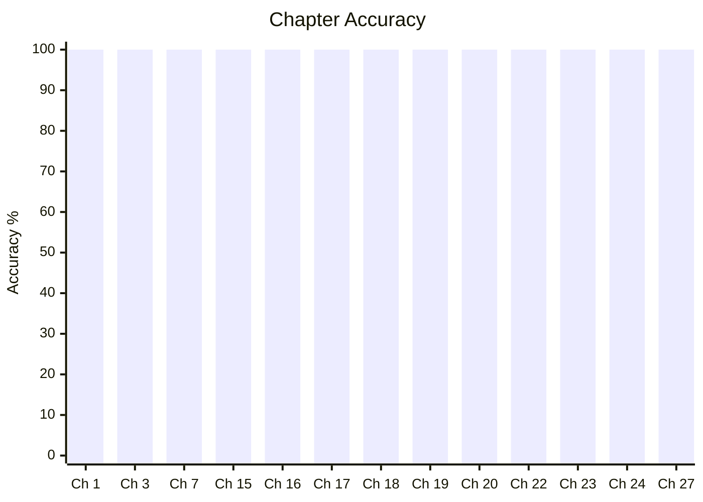
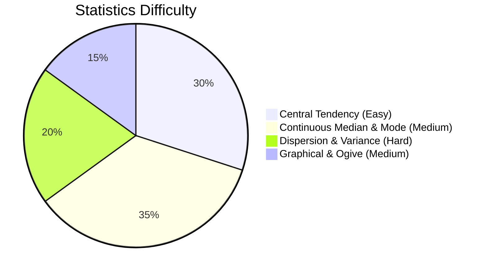

# Elementary Mathematics

## Topics & Notes

- [ ] [Ch 1. Number System](/cds/math/notes/numbers)
- [x] [Ch 2. Sequence and Series](/cds/math/notes/sequence_series)
- [x] [Ch 3. HCF and LCM of Numbers](/cds/math/notes/hcf_lcm)
- [x] [Ch 3. Modular Arithmetic & Remainders](/cds/math/notes/modular)
- [x] [Ch 4. Decimal Fractions](/cds/math/notes/decimals)
- [x] [Ch 5. Square Roots and Cube Roots](/cds/math/notes/roots)
- [ ] [Ch 6. Time and Distance](/cds/math/notes/time_distance)
- [ ] [Ch 7. Time and Work](/cds/math/notes/work)
- [ ] [Ch 8. Percentage](/cds/math/notes/percentage)
- [ ] [Ch 9. Simple Interest](/cds/math/notes/simple_interest)
- [ ] [Ch 11. Profit and Loss](/cds/math/notes/profit_loss)
- [ ] [Ch 12. Ratio and Proportion](/cds/math/notes/ratio_proportion)
- [x] [Ch 15. HCF and LCM of Polynomials](/cds/math/notes/polynomial_hcf_lcm)
- [x] [Ch 16. Rational Expressions](/cds/math/notes/rational_expressions)
- [ ] [Ch 17. Linear Equations](/cds/math/notes/linear_equations)
- [ ] [Ch 18. Quadratic Equations & Inequalities](/cds/math/notes/quadratic_equations)
- [x] [Ch 19. Set Theory](/cds/math/notes/set_theory)
- [ ] [Ch 20. Measurements of Angles and Trigonometric Ratios](/cds/math/notes/trigonometry)
- [ ] [Ch 21. Height and Distance](/cds/math/notes/heights)
- [ ] [Ch 22. Heights and Distances](/cds/math/notes/heights_distances)
- [ ] [Ch 23. Triangles](/cds/math/notes/triangles)
- [ ] [Ch 24. Quadrilateral and Polygon](/cds/math/notes/quadrilateral)
- [ ] [Ch 25. Circle](/cds/math/notes/circle)
- [ ] [Ch 12. Ratio and Proportion](/cds/math/notes/ratio_proportion)
- [ ] [Ch 27. Surface Area and Volume of Solids](/cds/math/notes/solids)
- [ ] [Ch 28. Statistics](/cds/math/notes/statistics)

## Variations

- [Set Theory & General Variations](/cds/math/notes/variations/vars)
- [Ch 2 Sequence and Series Variations](/cds/math/notes/variations/vars)
- [Ch 6 Variations (Transitive Race Deficit, Boat Navigation Invariant)](/cds/math/notes/variations/var32)
- [Ch 7 Variations (Dynamic Fatigue, Staggered Wages, Torricelli Leak)](/cds/math/notes/variations/var24)
- [Ch 9 Simple Interest Variations](/cds/math/notes/variations/var30)
- [Ch 14 Variations (Symmetric Reciprocal High Power Sums)](/cds/math/notes/variations/var25)
- [Trigonometry Variations](/cds/math/notes/variations/var19)
- [Generalised Multi-Point Complementary Elevation](/cds/math/notes/variations/var20)
- [Elliptic Cloud Reflection in Spherical Lake](/cds/math/notes/variations/var21)
- [Moving Aircraft Angular Acceleration & Speed](/cds/math/notes/variations/var22)
- [Ch 23 Variations (Median, Thales, Apollonius)](/cds/math/notes/variations/var17)
- [Ch 24 Variations (Trapezium Diagonals, Midpoint Quads, n-gon Intersections)](/cds/math/notes/variations/var23)
- [Ch 25 Variations (Common Tangents, Annulus Chords, Ptolemy's Theorem)](/cds/math/notes/variations/var24)
- [Ch 27 Variations (Water Flow, Submersion, Cone Inscribed Sphere)](/cds/math/notes/variations/var27)
- [Ch 28 Variations (Ogives Intersection, Weighted Power Means, Subgroup Variance)](/cds/math/notes/variations/var28)

## Performance Overview

---

## Navigation
- [CDS Dashboard](/cds/cds_overview)
