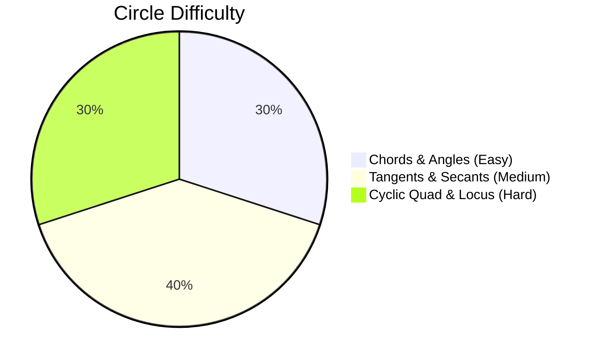

# Circle

## 1. Overview & Core Definitions

A circle is a closed plane figure formed by all points that are equidistant from a fixed point called the **centre** ($O$). The fixed distance is the **radius** ($r$).

### Fundamental Definitions & Components
- **Radius ($r$)**: Segment from centre to any point on the circle.
- **Diameter ($D$)**: Longest chord passing through the centre; $D = 2r$.
- **Chord**: Line segment connecting any two points on the circle.
- **Secant**: Line intersecting the circle at two distinct points.
- **Tangent**: Line touching the circle at exactly one point (point of contact).
- **Arc**: Part of the circumference (Minor Arc vs Major Arc).
- **Segment**: Area bounded by a chord and its corresponding arc (Minor vs Major Segment).
- **Sector**: Area bounded by two radii and their intercepted arc ($\text{Area} = \frac{\theta}{360^\circ} \times \pi r^2$).
- **Cyclic Quadrilateral**: Quadrilateral whose all four vertices lie on a circle.

---

## 2. Subtopics

- [Chords, Angles & Perpendicular Theorems](/cds/math/notes/subtopics/chords_theorems)
- [Tangents, Secants & Power of a Point](/cds/math/notes/subtopics/tangents_secants)
- [Cyclic Quadrilaterals & Ptolemy's Theorem](/cds/math/notes/subtopics/cyclic_quadrilateral)
- [Locus & Concentric Circles](/cds/math/notes/subtopics/circle_locus)

---

## 3. Key Theorems & Formula Summary

| Theorem / Formula | Mathematical Relation | Description / Property |
| :--- | :--- | :--- |
| **Chord Bisector** | $OM \perp AB \implies AM = MB$ | Perpendicular from centre bisects the chord |
| **Angle at Centre** | $\angle AOB = 2 \angle APB$ | Centre angle is double the angle at circumference |
| **Semi-circle Angle** | $\angle APB = 90^\circ$ | Angle in a semi-circle is a right angle |
| **Same Segment Angles** | $\angle APB = \angle AQB$ | Angles subtended by same arc in same segment are equal |
| **Cyclic Quadrilateral Sum** | $\angle A + \angle C = 180^\circ, \quad \angle B + \angle D = 180^\circ$ | Opposite angles are supplementary |
| **Cyclic Exterior Angle** | $\angle \text{ext} = \text{Opposite Interior Angle}$ | Exterior angle equals interior opposite angle |
| **Tangent Radius Perpendicular** | $OP \perp PT$ | Tangent is perpendicular to radius at point of contact |
| **Equal Tangents** | $PA = PB$ | Tangents from external point $P$ are equal in length |
| **Alternate Segment Theorem** | $\angle BAT = \angle BCA$ | Angle between tangent and chord equals angle in alternate segment |
| **Intersecting Chords Theorem** | $PA \cdot PB = PC \cdot PD$ | Chords $AB$ and $CD$ intersecting at interior/exterior point $P$ |
| **Secant-Tangent Theorem** | $PT^2 = PA \cdot PB$ | Tangent $PT$ and secant $P-A-B$ from external point $P$ |
| **Direct Common Tangent (DCT)** | $L_{\text{DCT}} = \sqrt{d^2 - (r_1 - r_2)^2}$ | Distance between centres $d$, radii $r_1, r_2$ |
| **Transverse Common Tangent (TCT)**| $L_{\text{TCT}} = \sqrt{d^2 - (r_1 + r_2)^2}$ | Distance between centres $d$, radii $r_1, r_2$ |

---

## 4. Linked Practice & PYQ Questions

- [Q1: Perpendicular Distance from Centre to Chord](/cds/math/notes/questions/q1_circle)
- [Q2: Tangent Length & Secant Power of a Point](/cds/math/notes/questions/q2_circle)
- [Q3: Alternate Segment Theorem & Angle Calculation](/cds/math/notes/questions/q3_circle)
- [Q4: Cyclic Quadrilateral Exterior & Opposite Angles](/cds/math/notes/questions/q4_circle)

---

## 5. Variations

- [Variation 24: Direct and Transverse Common Tangent Length Ratios](/cds/math/notes/variations/var24)
- [Variation 25: Intersecting Chords & Concentric Annulus Segment Bounds](/cds/math/notes/variations/var25)
- [Variation 26: Ptolemy's Theorem in Cyclic Quadrilaterals](/cds/math/notes/variations/var26)

---

## 6. Performance Overview

---

## 7. Navigation
- [Elementary Mathematics Overview](/cds/math/math_overview)
