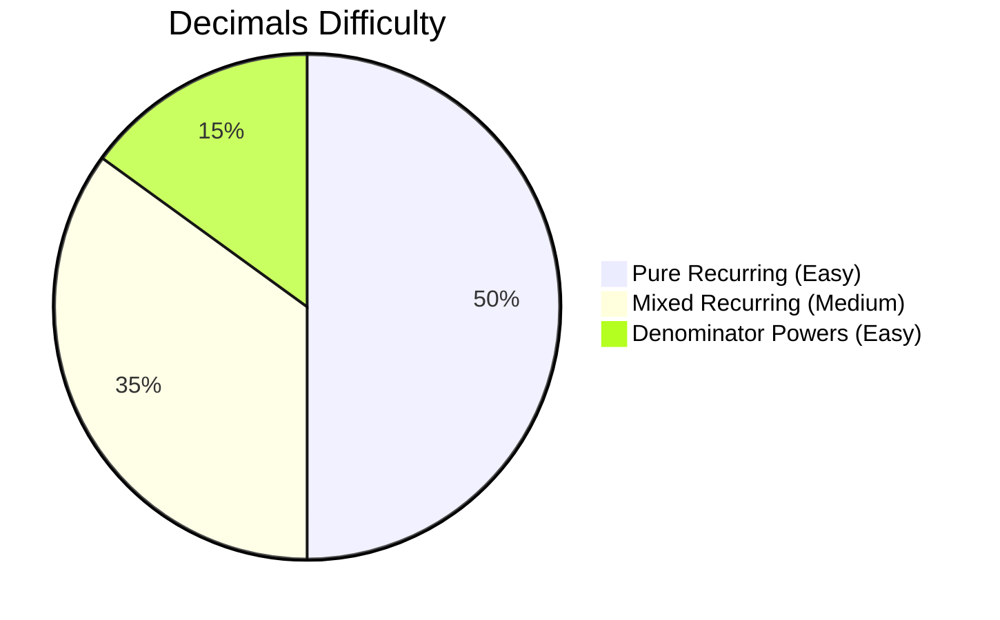

# Decimal Fractions

## Theory, Intuition & Formulas

Decimal fractions are fractions whose denominators can be expressed as powers of 10 ($10^1, 10^2, 10^3, \dots$). Understanding recurring decimals and standard fraction operations is critical for fast CDS arithmetic calculations.

### Core Concepts Summary
1. **Terminating Decimals**: Denominator $q = 2^a \cdot 5^b$.
2. **Pure Recurring Decimals**: $0.\overline{a_1 a_2 \dots a_n} = \frac{a_1 a_2 \dots a_n}{99\dots9}$.
3. **Mixed Recurring Decimals**: $0.b_1 \dots b_m \overline{a_1 \dots a_n} = \frac{(\text{Full}) - (\text{Non-repeating})}{99\dots900\dots0}$.

---

## Subtopics & Specialized Questions

- [Decimal Fractions & Recurring Decimals](/cds/math/notes/subtopics/recurring_decimals)

---

## Variations

- [Variation: Algebraic Operations on Repeating Periods](/cds/math/notes/variations/vars#variation-recurring-decimal-algebra)

---

## Performance Overview

---

## Navigation

- [Elementary Mathematics Overview](/cds/math/math_overview)
