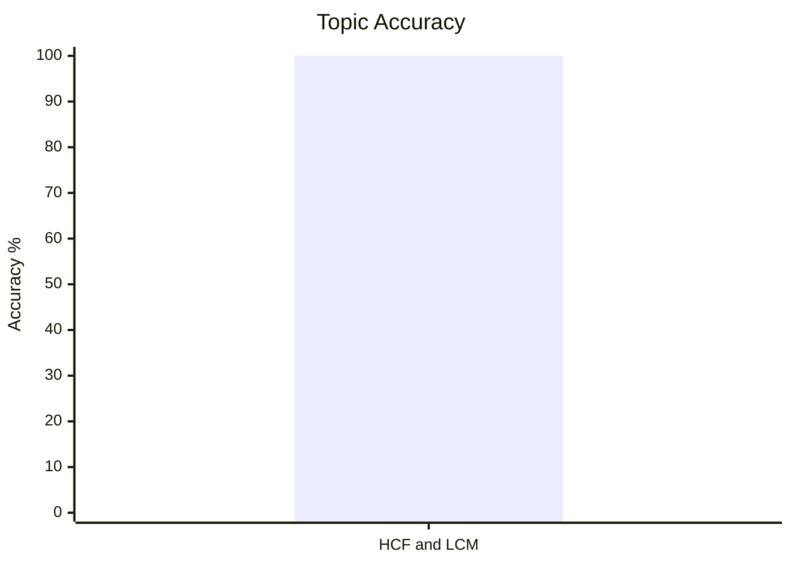
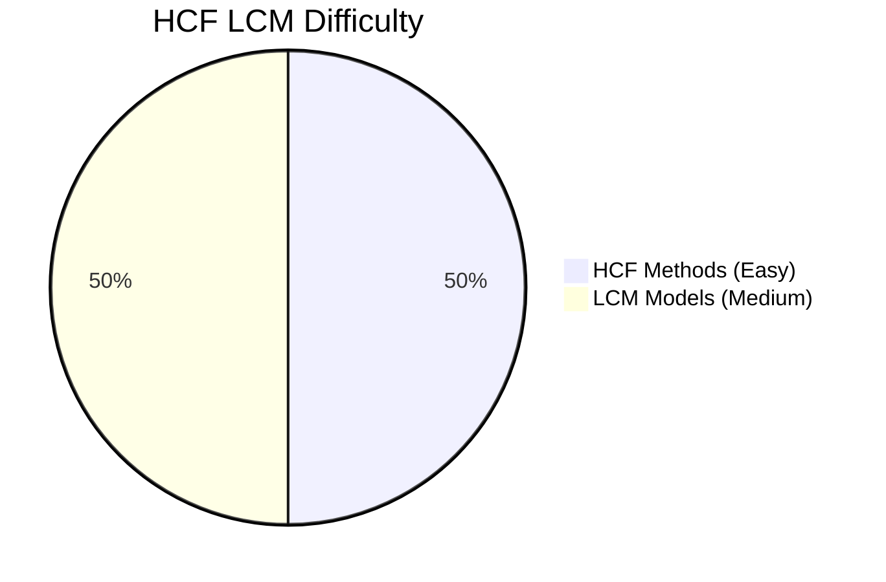
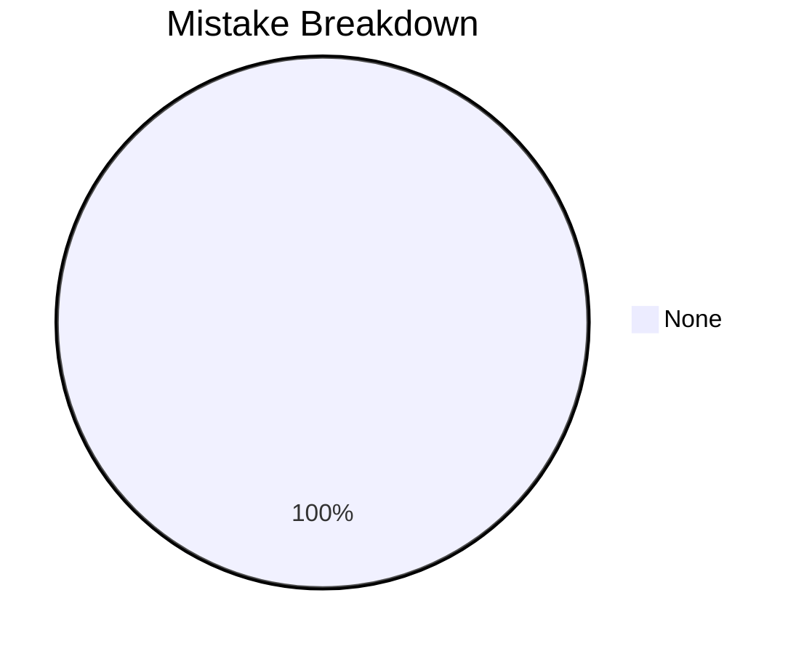

# HCF and LCM

## Theory, Intuition & Formulas

### 1. Fundamental Definitions & Canonical Prime Factorization
- **Highest Common Factor (HCF / GCD)**: The greatest positive integer that divides each of the given numbers without leaving a remainder.
  - For canonical factorizations $A = p_1^{a_1} p_2^{a_2} \cdots p_k^{a_k}$ and $B = p_1^{b_1} p_2^{b_2} \cdots p_k^{b_k}$:
    $$\operatorname{HCF}(A, B) = p_1^{\min(a_1, b_1)} \cdot p_2^{\min(a_2, b_2)} \cdots p_k^{\min(a_k, b_k)}$$
- **Least Common Multiple (LCM)**: The smallest positive integer that is divisible by each of the given numbers.
  - For canonical factorizations:
    $$\operatorname{LCM}(A, B) = p_1^{\max(a_1, b_1)} \cdot p_2^{\max(a_2, b_2)} \cdots p_k^{\max(a_k, b_k)}$$

### 2. Fundamental Product Identity
For any two positive integers $A$ and $B$:
$$\operatorname{HCF}(A, B) \times \operatorname{LCM}(A, B) = A \times B$$
> [!WARNING]
> This product identity holds **strictly for two numbers only**! For three or more numbers, $\operatorname{HCF}(A, B, C) \times \operatorname{LCM}(A, B, C) \neq A \cdot B \cdot C$.

Of course! From prime factorization it is clear. One is choosing the max and the other the min powers. When we have three or more terms the middle powers may be left.
### 3. Co-prime Representation Model
If $\operatorname{HCF}(A, B) = H$, then the numbers can always be written as:
$$A = H \cdot x, \quad B = H \cdot y \quad \text{where } \operatorname{GCD}(x, y) = 1 \text{ (co-prime)}$$
- Product relation: $A \cdot B = H^2 x y = H \cdot L \implies \operatorname{LCM}(A, B) = L = H \cdot x \cdot y$.
- Ratio of numbers: $\frac{A}{B} = \frac{x}{y}$ (in lowest reduced form).
A method of finding HCF of two numbers!
Reduce them to lowest form. Then divied by correpoding term, you have got H then find L.
### 4. Fractions & Polynomials HCF & LCM

#### A. Fraction HCF & LCM Formulas
$$\operatorname{HCF}\left(\frac{a}{b}, \frac{c}{d}, \frac{e}{f}\right) = \frac{\operatorname{HCF}(a, c, e)}{\operatorname{LCM}(b, d, f)}$$

$$\operatorname{LCM}\left(\frac{a}{b}, \frac{c}{d}, \frac{e}{f}\right) = \frac{\operatorname{LCM}(a, c, e)}{\operatorname{HCF}(b, d, f)}$$

*(Note: All fractions MUST be in lowest reduced form before applying these formulas!)*

---

## Subtopics & Core Models

- [HCF Models & Co-Prime Copair Counting](/cds/math/notes/subtopics/hcf_methods)
- [LCM Models & Remainder Theorems](/cds/math/notes/subtopics/lcm_models)

---

## Variations

- [HCF via Successive Quotients](/cds/math/notes/variations/var8)
- [Co-prime Pairs Given Product & HCF](/cds/math/notes/variations/var9)
- [Largest 4-Digit Number with Constant Remainder](/cds/math/notes/variations/var10)
- [Smallest 4-Digit Number with Constant Difference](/cds/math/notes/variations/var11)

---

## Performance Overview

---

## Navigation

- [Elementary Mathematics Overview](/cds/math/math_overview)
- [Question Database](/cds/math/question_db)
