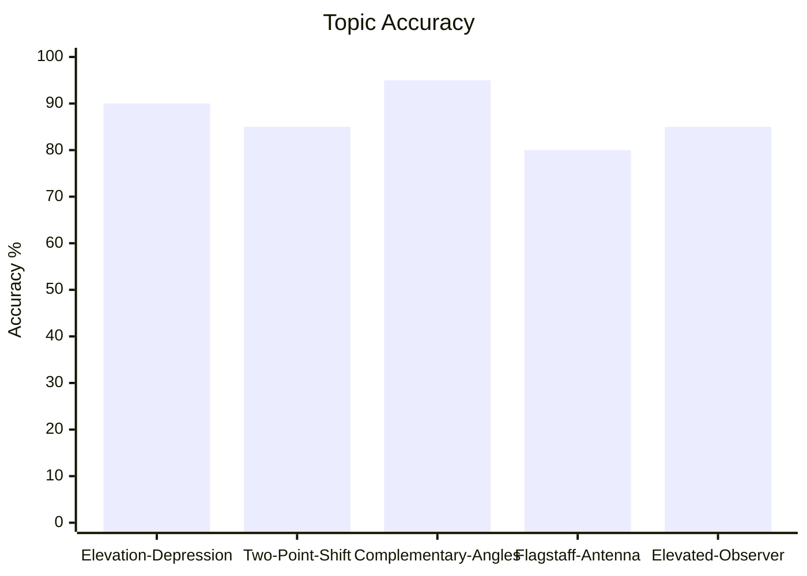
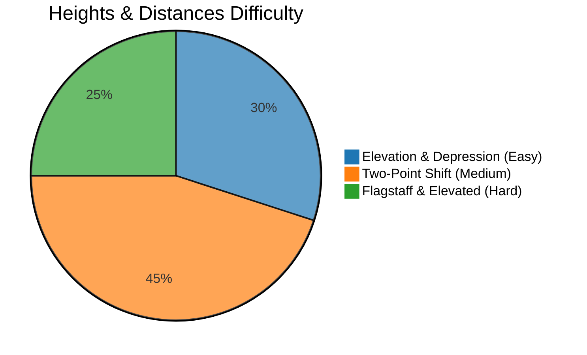

# Heights and Distances

## Theory, Intuition & Formulas

### 1. Fundamental Definitions & Geometry

- **Line of Sight**: The straight line segment connecting the observer's eye to the observed object.
- **Horizontal Line**: The straight reference line drawn parallel to ground level from the observer's eye.
- **Angle of Elevation ($\theta$)**:
  - The acute angle between the line of sight and the horizontal line when looking **upward** at an object above the horizontal level.
  - Trigonometric relation in a right triangle $\triangle ABC$ (with height $h$ and base $d$):
    $$\tan \theta = \frac{\text{Opposite Side (Height)}}{\text{Adjacent Side (Distance)}} = \frac{h}{d}$$

- **Angle of Depression ($\phi$)**:
  - The acute angle between the line of sight and the horizontal line when looking **downward** at an object below horizontal level.
  - By alternate interior angles between parallel horizontal lines, the angle of depression of object $B$ as seen from observer $A$ equals the angle of elevation of $A$ as seen from $B$.

---

### 2. Standard Structural Models & Analytical Formulas

#### Model A: Single Perpendicular Observer Shift
When observing a vertical tower of height $h$ from two points on the same horizontal line at distance $x$ apart, with angles of elevation $\alpha$ and $\beta$ ($\beta > \alpha$):
- **Distance Formula**:
  $$x = h(\cot \alpha - \cot \beta) = h \left( \frac{1}{\tan \alpha} - \frac{1}{\tan \beta} \right)$$
- **Height Formula**:
  $$h = \frac{x}{\cot \alpha - \cot \beta} = \frac{x \sin \alpha \sin \beta}{\sin(\beta - \alpha)}$$

#### Model B: Complementary Angles Theorem
If the angles of elevation of the top of a tower of height $h$ from two points on the ground at distances $a$ and $b$ ($a > b$) from its base are complementary ($\theta$ and $90^\circ - \theta$):
- In $\triangle 1$: $\tan \theta = \frac{h}{a} \implies h = a \tan \theta$
- In $\triangle 2$: $\tan (90^\circ - \theta) = \cot \theta = \frac{h}{b} \implies h = b \cot \theta$
- Multiplying the two equations:
  $$h^2 = (a \tan \theta)(b \cot \theta) = ab \implies h = \sqrt{ab}$$

#### Model C: Flagstaff / Antenna Mounted on Tower
For a flagstaff of height $p$ mounted atop a tower of height $h$, where angles of elevation to the bottom and top of the flagstaff from a ground point are $\alpha$ and $\beta$ respectively ($\beta > \alpha$):
- Height of Tower $h$:
  $$h = \frac{p \tan \alpha}{\tan \beta - \tan \alpha}$$

#### Model D: Window / Elevated Observer Model
From a window at height $h_1$ above ground, the angle of elevation of top of opposite house is $\theta$ and angle of depression of bottom is $\phi$:
- Distance across street $d$:
  $$d = h_1 \cot \phi$$
- Total Height of Opposite House $H$:
  $$H = h_1 (1 + \tan \theta \cot \phi)$$

---

## Subtopics & Specialized Questions

- [Angle of Elevation & Depression Fundamentals](/cds/math/notes/subtopics/angle_elevation_depression)
- [Two-Point Observer Shift & Shadow Length Problems](/cds/math/notes/subtopics/two_point_observer_shift)
- [Complementary Angles Theorem for Height](/cds/math/notes/subtopics/complementary_angles_height)
- [Flagstaff & Antenna Subtended Angles](/cds/math/notes/subtopics/flagstaff_antenna_tower)
- [Elevated Observer & Opposite Building Models](/cds/math/notes/subtopics/elevated_observer_window)

---

## Variations

- [Heights and Distances Master Variations](/cds/math/notes/variations/heights_variations)

---

## Performance Overview

---

## Navigation

- [Back to Elementary Mathematics Overview](/cds/math/math_overview)
- [Subject Question Database](/cds/math/question_db)
