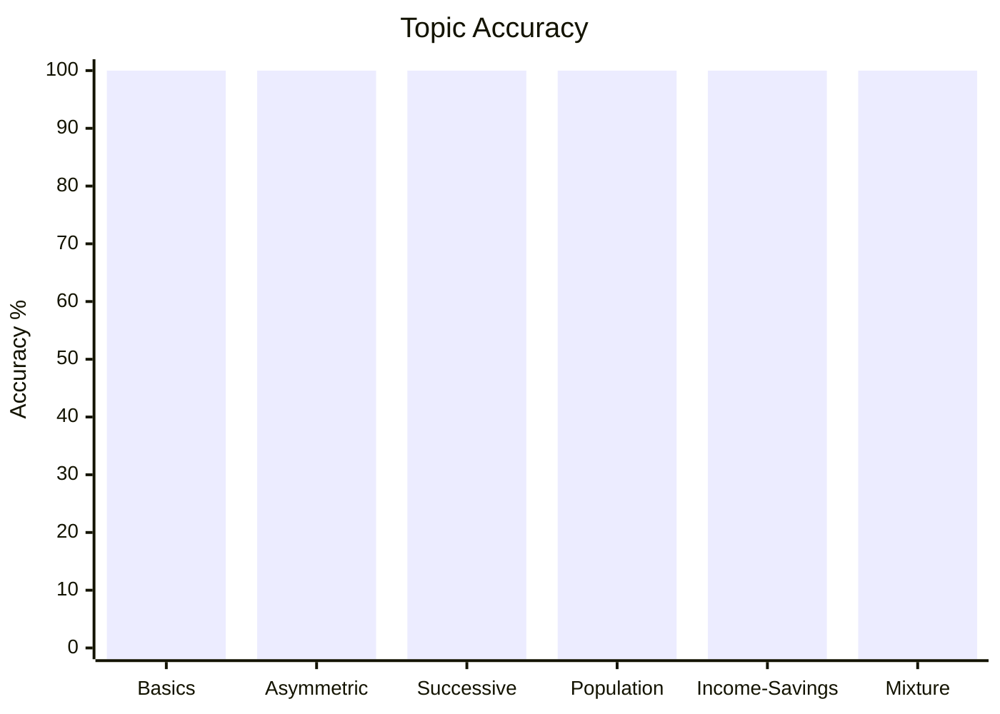
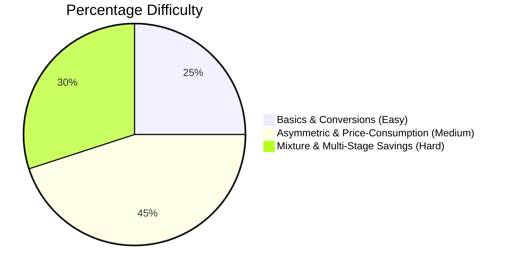

# Percentage

## Theory, Intuition & Formulas

### **Percentage Increase or Decrease**
  - When a quantity changes from initial value $V_i$ to final value $V_f$:
    $$\text{Percentage Change} = \left(\frac{|V_f - V_i|}{V_i} \times 100\right)\%$$

### 3. Asymmetric Comparison Theorems
- **If $A$ is $x\%$ more than $B$**:
  - $B$ is less than $A$ by:
    $$\left(\frac{x}{100 + x} \times 100\right)\%$$
- **If $A$ is $x\%$ less than $B$**:
  - $B$ is more than $A$ by:
    $$\left(\frac{x}{100 - x} \times 100\right)\%$$

> [!NOTE]
> **Intuition ("Base Switch Principle")**: The absolute difference $\Delta = |A - B| = x$ stays identical. But when asking "how much less/more is B than A?", the reference denominator changes from $B$ ($100$) to $A$ ($100 \pm x$). Dividing by a larger base ($100+x$) gives a smaller percentage; dividing by a smaller base ($100-x$) gives a larger percentage. See [Detailed Proof & Intuition](/cds/math/notes/subtopics/asymmetric_percentage).

### 4. Commodity Price & Consumption Inverse Balancing
- If the price of a commodity increases (or decreases) by $x\%$, then to maintain a constant expenditure budget, the consumption must decrease (or increase) by:
  $$\text{Consumption Change \%} = \left(\frac{x}{100 \pm x} \times 100\right)\%$$

### 5. Net Successive Percentage Change (Product Effect)
- If a quantity undergoes a sequential change of $a\%$ followed by $b\%$:
  $$\text{Net Percentage Change} = \left(a + b + \frac{a \cdot b}{100}\right)\%$$
  - Sign convention: Use $+a, +b$ for percentage increases and $-a, -b$ for percentage decreases.
  - If net result is positive, the overall quantity increased; if negative, it decreased.

### 6. Population & Depreciation Models
- **Constant Annual Rate ($R\%$) over $n$ years**:
  - Population / Value after $n$ years:
    $$P_n = P_0 \left(1 \pm \frac{R}{100}\right)^n$$
  - Population / Value $n$ years ago:
    $$P_{\text{past}} = \frac{P_0}{\left(1 \pm \frac{R}{100}\right)^n}$$
- **Varying Annual Rates ($R_1\%, R_2\%, R_3\%$) over 3 years**:
  - Final value after 3 years:
    $$P_{\text{final}} = P_0 \left(1 \pm \frac{R_1}{100}\right)\left(1 \pm \frac{R_2}{100}\right)\left(1 \pm \frac{R_3}{100}\right)$$

---

## Subtopics & Core Models

- [Percentage Basics & Fractional Conversion](/cds/math/notes/subtopics/percentage_basics)
- [Asymmetric Comparison & Price-Consumption Balance](/cds/math/notes/subtopics/asymmetric_percentage)
- [Successive Percentage & Net Change](/cds/math/notes/subtopics/successive_percentage)
- [Population Growth & Compound Depreciation](/cds/math/notes/subtopics/population_depreciation)
- [Income, Expenditure, and Savings Models](/cds/math/notes/subtopics/income_expenditure_savings)
- [Mixture Evaporation & Solution Adulteration](/cds/math/notes/subtopics/mixture_adulteration)

---

## Variations

- [Successive Price Increase and Decrease Net Effect](/cds/math/notes/variations/var28)
- [Price Increase with Expenditure-Consumption Compensation](/cds/math/notes/variations/var29)
- [Income Expenditure Savings Shift and Percentage Net Growth](/cds/math/notes/variations/var30)
- [Solution Evaporation and Solute Concentration Maintenance](/cds/math/notes/variations/var31)

---

## Performance Overview

---

## Navigation
- [Elementary Mathematics Overview](/cds/math/math_overview)
- [CDS Dashboard](/cds/cds_overview)
