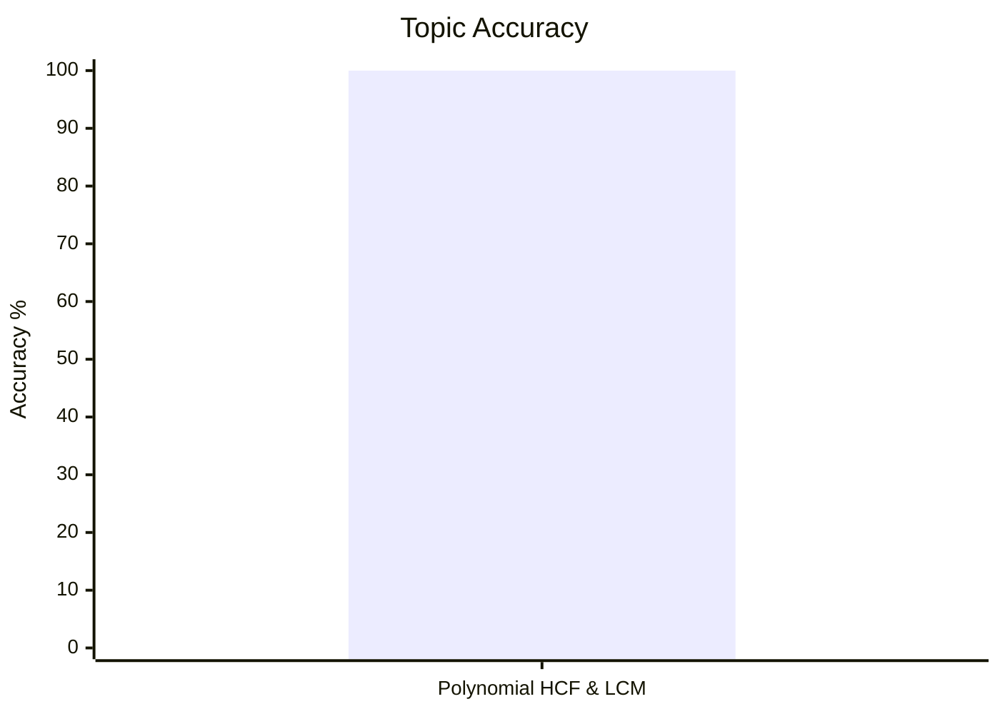
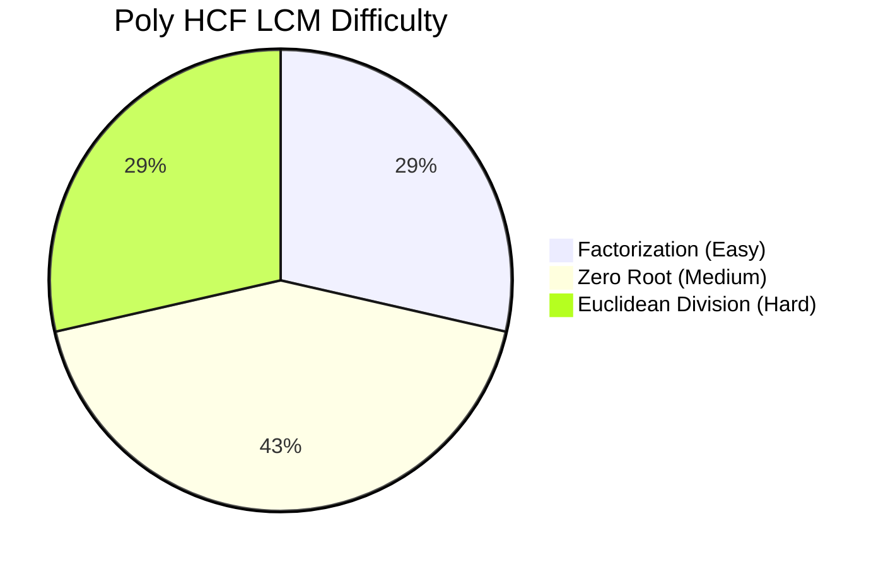
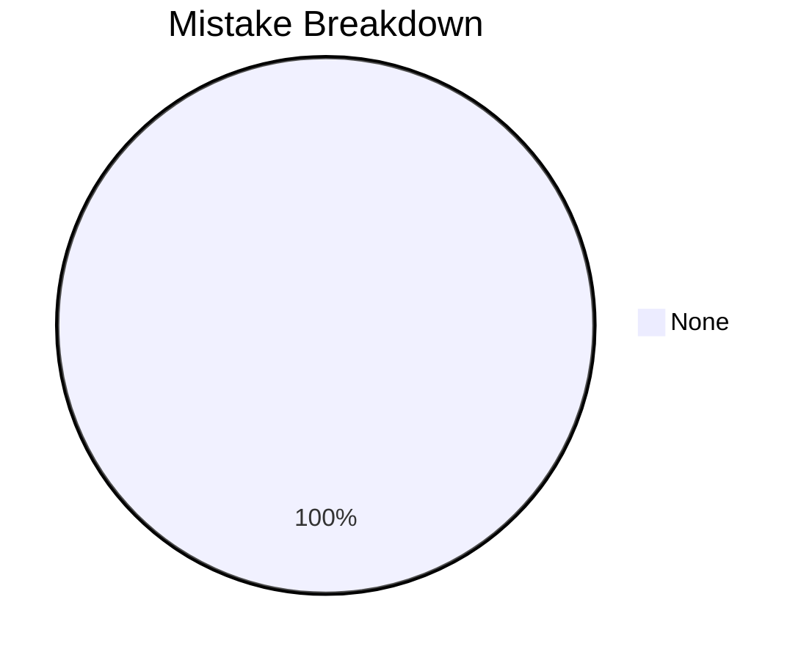

# HCF and LCM of Polynomials

## Theory, Intuition & Formulas

### 1. Fundamental Definition & Multiplicity
- **Monic Polynomial**: A single-variable polynomial whose **highest-degree term (leading coefficient) has a multiplier of exactly $1$**.
  - **Monic Examples**: $x^2 - 5x + 6$ (leading coefficient is $1$), $x^3 + 2x - 1$, $x - 4$.
  - **Non-Monic Examples**: $3x^2 + 5x - 2$ (leading coefficient is $3$), $6x^2 - 6$ (leading coefficient is $6$).
- **HCF (Greatest Common Divisor)** of polynomials $P(x)$ and $Q(x)$: The polynomial $H(x)$ of highest degree that divides both $P(x)$ and $Q(x)$ without remainder.
- **LCM (Least Common Multiple)** of polynomials $P(x)$ and $Q(x)$: The polynomial $L(x)$ of lowest degree that is divisible by both $P(x)$ and $Q(x)$ without remainder.

### 2. Fundamental Polynomial Product Identity
For any two polynomials $P(x)$ and $Q(x)$:
$$P(x) \cdot Q(x) = c \cdot \operatorname{HCF}(P(x), Q(x)) \times \operatorname{LCM}(P(x), Q(x))$$
*(where $c$ is a numerical scalar multiplier).*

#### Illustrative Example of Scalar $c$:
Consider two polynomials with non-monic leading coefficients:
- $P(x) = 6x^2 - 6 = 6(x - 1)(x + 1)$
- $Q(x) = 15x - 15 = 15(x - 1)$

**Step 1: Compute HCF & LCM**:
- Numeric HCF: $\operatorname{gcd}(6, 15) = 3$.
- Algebraic HCF: $(x - 1)$.
- $\operatorname{HCF}(P(x), Q(x)) = 3(x - 1)$.

- Numeric LCM: $\operatorname{lcm}(6, 15) = 30$.
- Algebraic LCM: $(x - 1)(x + 1)$.
- $\operatorname{LCM}(P(x), Q(x)) = 30(x - 1)(x + 1)$.

**Step 2: Compare LHS Product vs RHS Product**:
- **LHS Product**:
  $$P(x) \cdot Q(x) = (6x^2 - 6)(15x - 15) = 90(x - 1)^2(x + 1)$$
- **RHS HCF $\times$ LCM Product**:
  $$\operatorname{HCF} \times \operatorname{LCM} = [3(x - 1)] \times [30(x - 1)(x + 1)] = 90(x - 1)^2(x + 1)$$

Here, the numeric leading multiplier is $c = 1$ because the numeric HCF ($3$) and LCM ($30$) already multiply to $3 \times 30 = 90 = 6 \times 15$.

**What if monic HCF & LCM are defined without numeric multipliers?**
If monic $\operatorname{HCF} = (x - 1)$ and monic $\operatorname{LCM} = (x - 1)(x + 1)$:
$$P(x) \cdot Q(x) = 90 \cdot \operatorname{HCF}_{\text{monic}} \times \operatorname{LCM}_{\text{monic}}$$
where $c = 90 = 6 \times 15$ is the scalar multiplier reflecting the product of leading coefficients!

---

## Core Methods & Subtopic Index

1. [Polynomial Factorization HCF & LCM](/cds/math/notes/subtopics/poly_factorization)
   - Factoring via algebraic identities ($a^3 \pm b^3$, $a^4 - b^4$, Sophie Germain).
   - Numerical coefficient HCF/LCM separation.

2. [Euclidean Division Algorithm for Polynomials](/cds/math/notes/subtopics/poly_euclidean_division)
   - Successive polynomial division $P(x) = Q(x) q_1(x) + R_1(x)$.
   - Scalar factor removal from intermediate remainders.

3. [Zero Root Evaluation Method](/cds/math/notes/subtopics/poly_zero_root)
   - Factor Theorem: $(x - k) \mid P(x) \iff P(k) = 0$.
   - Linear HCF parameter formula: $k = \frac{b-q}{a-p}$ for $x^2+ax+b$ and $x^2+px+q$.
   - Simultaneous parameter systems ($P(x) \pm Q(x)$ sum and difference recovery).

---

## Linked Practice Questions

- [Q29: Factorable Polynomial LCM](/cds/math/notes/questions/q29)
- [Q30: Multi-Polynomial Numerical & Variable HCF](/cds/math/notes/questions/q30)
- [Q31: Euclidean Long Division for High-Degree Polynomials](/cds/math/notes/questions/q31)
- [Q32: Linear HCF Parameter Evaluation Formula](/cds/math/notes/questions/q32)
- [Q33: Simultaneous Dual Quadratic HCF Parameters](/cds/math/notes/questions/q33)
- [Q34: Polynomial Recovery from Sum & Difference](/cds/math/notes/questions/q34)
- [Q35: Polynomial Recovery from HCF and LCM](/cds/math/notes/questions/q35)
- [Q36: Variable Power Trap in Polynomial LCM (PYQ 2013 II)](/cds/math/notes/questions/q36)
- [Q37: Exponent HCF & Imaginary Roots Trap (PYQ 2013 II)](/cds/math/notes/questions/q37)
- [Q38: Fast HCF Option Root Testing (PYQ 2014 II)](/cds/math/notes/questions/q38)

---

## Variations

- [Variation 12: Dual Parameter Polynomial HCF](/cds/math/notes/variations/var12)
- [Variation 13: Higher Power Sophie Germain Identity HCF](/cds/math/notes/variations/var13)
- [Variation 14: Difference of Powers Divisibility Identity](/cds/math/notes/variations/var14)

---

## Performance Overview

---

## Navigation

- [Elementary Mathematics Overview](/cds/math/math_overview)
- [Question Database](/cds/math/question_db)
