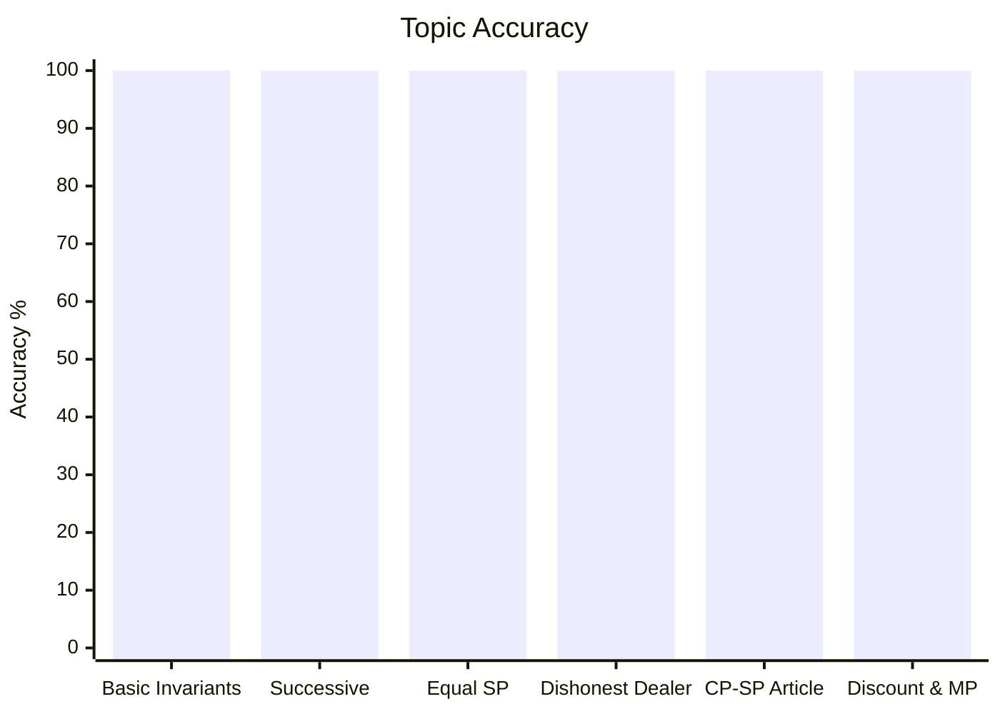
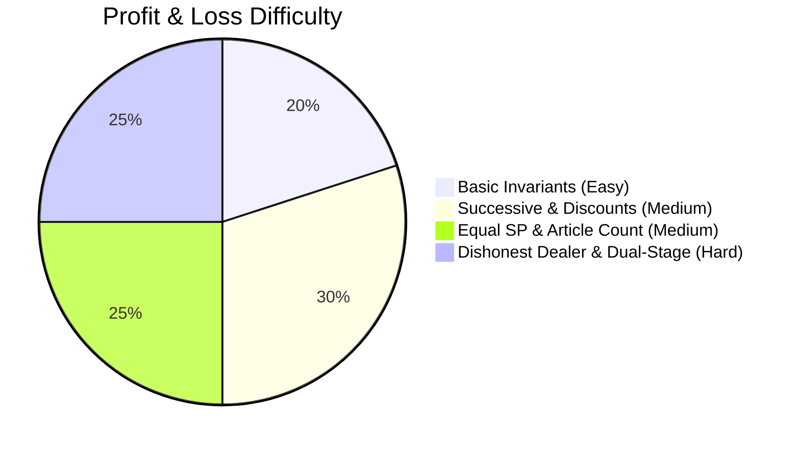

# Profit and Loss

## Theory, Intuition & Formulas

Profit and loss analysis quantifies commercial transactions, cost markups, discounts, false measurements, and revenue optimization under competitive exam settings.

### Core Mathematical Invariants

1. **Fundamental Base Reference**:
   - Profit ($P\%$) and loss ($L\%$) percentages are measured with respect to Cost Price ($\text{CP}$) as denominator:
     $$\text{SP} = \text{CP} \times \left(1 + \frac{P\%}{100}\right) \quad \text{or} \quad \text{SP} = \text{CP} \times \left(1 - \frac{L\%}{100}\right)$$

2. **Markup and Discount Linkage**:
   - Marked Price ($\text{MP}$) is derived by marking up Cost Price by $m\%$:
     $$\text{MP} = \text{CP} \times \left(1 + \frac{m}{100}\right)$$
   - Selling Price ($\text{SP}$) is derived by discounting Marked Price by $d\%$:
     $$\text{SP} = \text{MP} \times \left(1 - \frac{d}{100}\right)$$
   - Exact ratio relationship connecting $\text{MP}$, $\text{CP}$, target profit $P\%$ and discount $d\%$:
     $$\frac{\text{MP}}{\text{CP}} = \frac{100 + P\%}{100 - d\%}$$

3. **Equal Selling Price Invariant**:
   - Selling two articles at identical selling prices, gaining $x\%$ on one and losing $x\%$ on the other, **always yields a net loss**:
     $$\text{Net Loss } \% = \left(\frac{x}{10}\right)^2\%$$

4. **Dishonest Dealer Weight Ratio**:
   - Gain percentage for false weight $W_{\text{false}}$ used in place of $W_{\text{true}}$ at cost price:
     $$\text{Gain } \% = \left( \frac{W_{\text{true}} - W_{\text{false}}}{W_{\text{false}}} \right) \times 100\%$$

---

## Subtopics & Specialized Questions

- [Basic Profit and Loss Invariants](/cds/math/notes/subtopics/profit_loss_basics)
- [Successive Profit and Loss Compounding](/cds/math/notes/subtopics/successive_profit_loss)
- [Equal Selling Price Dual Transactions](/cds/math/notes/subtopics/equal_sp_transactions)
- [Dishonest Dealer and False Weights](/cds/math/notes/subtopics/dishonest_dealer)
- [Article Count CP-SP Equivalence](/cds/math/notes/subtopics/cp_sp_article_equality)
- [Marked Price, Discount and Markup](/cds/math/notes/subtopics/discount_marked_price)

### Linked Practice Questions
- [Q11.1: Cost Price Determination from Fractional Profit](/cds/math/notes/questions/q11_1)
- [Q11.2: Selling Price Adjustment for Target Profit](/cds/math/notes/questions/q11_2)
- [Q11.3: Resale Chain between Sequential Traders](/cds/math/notes/questions/q11_3)
- [Q11.4: Dual Vehicle Sale with Symmetric Profit/Loss](/cds/math/notes/questions/q11_4)
- [Q11.5: Asymmetric Dual Sale with Constant Selling Price](/cds/math/notes/questions/q11_5)
- [Q11.6: Dishonest Dealer Weight Calculation from Target Profit](/cds/math/notes/questions/q11_6)
- [Q11.7: Article Count Equality Profit Percentage](/cds/math/notes/questions/q11_7)
- [Q11.8: Target Profit Markup and Discount Relation](/cds/math/notes/questions/q11_8)
- [Q11.9: Equivalent Single Discount Series Calculation](/cds/math/notes/questions/q11_9)

---

## Variations

- [Variation 30: Dual-Stage False Weight & Markup Compounding](/cds/math/notes/variations/var30)
- [Variation 31: Multi-Article Mixed SP Invariants & Parity Reversal](/cds/math/notes/variations/var31)

---

## Performance Overview

---

## Navigation
- [Subject Dashboard](/cds/math/math_overview)
- [CDS Master Dashboard](/cds/cds_overview)
