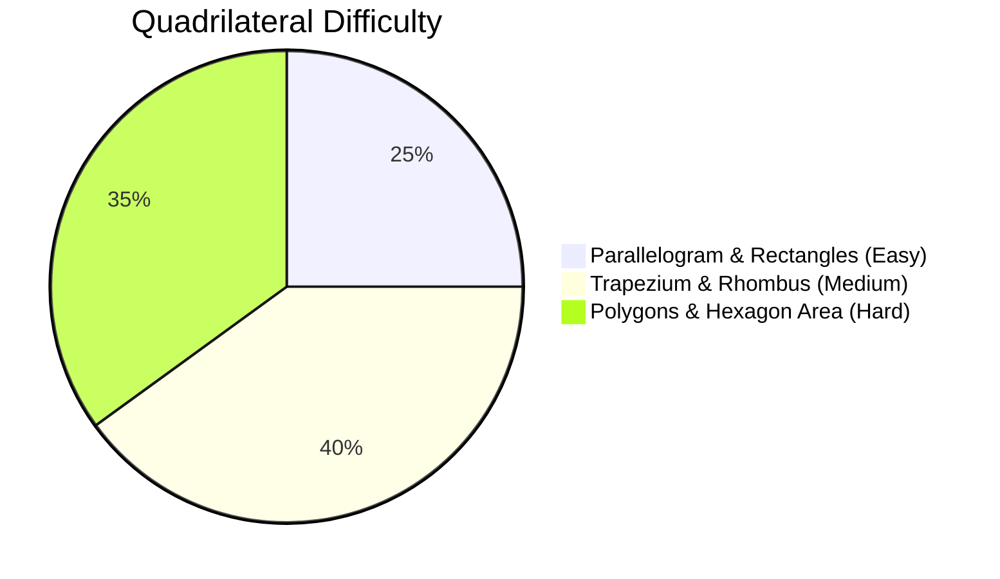

# Quadrilateral and Polygon

## 1. Overview & Core Definitions

A quadrilateral is a 4-sided closed polygon whose four interior angles sum up to $360^\circ$.
A polygon is a closed plane figure bounded by $n$ straight line segments ($n \ge 3$).

### Key Properties & Classification Overview
- **Parallelogram**: Quadrilateral with opposite sides parallel and equal. Diagonals bisect each other.
- **Rectangle**: Parallelogram with all interior angles equal to $90^\circ$. Diagonals are equal ($AC = BD$).
- **Rhombus**: Parallelogram with all 4 sides equal. Diagonals bisect each other at right angles ($90^\circ$).
- **Square**: Parallelogram with 4 equal sides and 4 right angles. Diagonals are equal and bisect at right angles.
- **Trapezium**: Quadrilateral with at least one pair of parallel sides. Diagonals divide each other proportionally.
- **Regular Polygon**: Polygon with all $n$ sides equal and all $n$ interior angles equal.

---

## 2. Subtopics

- [Parallelogram Properties & Centroids](/cds/math/notes/subtopics/parallelogram)
- [Rectangle, Rhombus & Square](/cds/math/notes/subtopics/special_parallelograms)
- [Trapezium & Isosceles Trapezium](/cds/math/notes/subtopics/trapezium)
- [Polygons & Regular Polygon Formulas](/cds/math/notes/subtopics/polygons)

---

## 3. Key Formulas & Identities

| Figure / Concept | Key Formula / Relation | Context / Remarks |
| :--- | :--- | :--- |
| **Parallelogram Area** | $\text{Area} = \text{Base} \times \text{Height} = a b \sin \theta$ | Adjacent sides $a, b$ |
| **Parallelogram Law** | $AC^2 + BD^2 = 2(a^2 + b^2)$ | Diagonals $AC, BD$, sides $a, b$ |
| **Rhombus Area** | $\text{Area} = \frac{1}{2} d_1 d_2$ | Diagonals $d_1, d_2$ |
| **Rhombus Side** | $4a^2 = d_1^2 + d_2^2$ | Perpendicular diagonal bisectors |
| **Rectangle Diagonals** | $d = \sqrt{L^2 + B^2}$ | $AC = BD$ |
| **British Flag Theorem** | $OA^2 + OC^2 = OB^2 + OD^2$ | Interior point $O$ in rectangle |
| **Trapezium Area** | $\text{Area} = \frac{1}{2} (a + b) \cdot h$ | Parallel sides $a, b$, height $h$ |
| **Euler Trapezium Rule** | $AC^2 + BD^2 = AD^2 + BC^2 + 2ab$ | $AB \parallel CD$ ($a=AB, b=CD$) |
| **Polygon Angles Sum** | $S_{\text{int}} = (n-2) \times 180^\circ$ | $n$-sided convex polygon |
| **Polygon Diagonals** | $D = \frac{n(n-3)}{2}$ | $n$ vertices |
| **Regular Hexagon Area** | $\text{Area} = \frac{3\sqrt{3}}{2} a^2$ | 6 equilateral triangles |
| **Regular Octagon Area** | $\text{Area} = 2(1 + \sqrt{2}) a^2$ | Side $a$ |

---

## 4. Linked Practice & PYQ Questions

- [Q1: Trapezium Diagonal Length Identity (Euler Identity)](/cds/math/notes/questions/q1_quad)
- [Q2: British Flag Theorem in Rectangle](/cds/math/notes/questions/q2_quad)
- [Q3: Regular Hexagon Area and Sub-Triangle Ratio](/cds/math/notes/questions/q3_quad)

---

## 5. Variations

- [Variation 21: Trapezium Diagonal Intersection & Area Split Formula](/cds/math/notes/variations/var23)
- [Variation 22: Midpoint Quadrilateral Area & Perimeter Bounds](/cds/math/notes/variations/var23)
- [Variation 23: Regular n-gon Diagonal Intersection Count](/cds/math/notes/variations/var23)

---

## 6. Performance Overview

---

## 7. Navigation
- [Elementary Mathematics Overview](/cds/math/math_overview)
