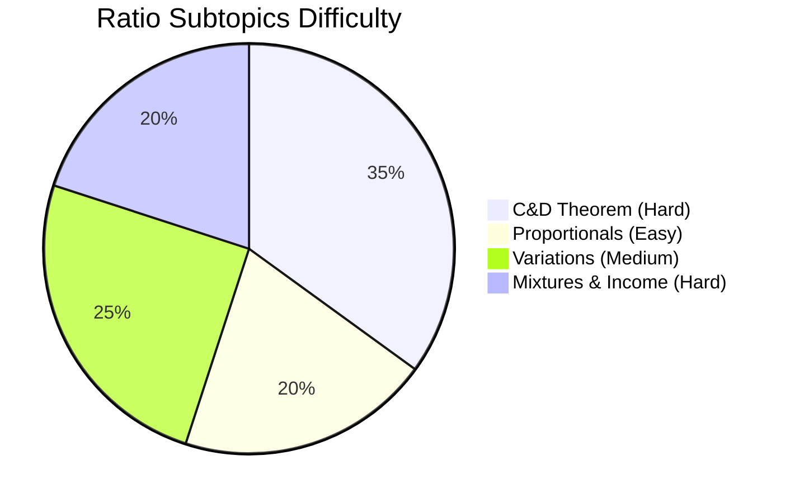

# Ratio and Proportion

## Theory, Intuition & Formulas

### 1. Fundamentals of Ratio
A **ratio** is a linear comparison of two homogeneous quantities $a$ and $b$ (measured in identical units) via division, denoted as $a : b$ or $\frac{a}{b}$.
- The term $a$ is called the **antecedent**, and $b$ is called the **consequent**.
- **Scale Invariance**: Multiplying or dividing both terms of a ratio by a non-zero constant $k$ yields an equivalent ratio:
  $$\frac{a}{b} = \frac{k \cdot a}{k \cdot b}$$

### 2. Taxonomy of Ratio Types
- **Compound Ratio**: The product of multiple independent ratios. For ratios $\frac{a}{b}, \frac{c}{d}, \frac{e}{f}$, the compound ratio is:
  $$\text{Compound Ratio} = \frac{a \cdot c \cdot e}{b \cdot d \cdot f}$$
- **Duplicate & Triplicate Ratios**:
  - Duplicate Ratio of $a:b$ is $a^2 : b^2$.
  - Triplicate Ratio of $a:b$ is $a^3 : b^3$.
- **Subduplicate & Subtriplicate Ratios**:
  - Subduplicate Ratio of $a:b$ is $\sqrt{a} : \sqrt{b}$.
  - Subtriplicate Ratio of $a:b$ is $\sqrt[3]{a} : \sqrt[3]{b}$.
- **Reciprocal (Inverse) Ratio**: The ratio of the reciprocals $\frac{1}{a} : \frac{1}{b} = b : a$.

### 3. Proportion & Derived Theorems
An equality between two ratios $\frac{a}{b} = \frac{c}{d}$ constitutes a **proportion**, written as $a : b :: c : d$.
- Terms $a, d$ are **extremes**; terms $b, c$ are **means**.
- **Fundamental Rule of Extremes and Means**:
  $$a \cdot d = b \cdot c$$

#### Specialized Proportion Types
- **Third Proportional**: If $a, b, c$ are in continuous proportion ($a : b :: b : c$), then $c$ is the third proportional to $a$ and $b$:
  $$c = \frac{b^2}{a}$$
- **Mean Proportional (Geometric Mean)**: The value $b$ between $a$ and $c$ such that:
  $$b = \sqrt{a \cdot c}$$
- **Fourth Proportional**: For $a : b :: c : d$, the value $d$ is:
  $$d = \frac{b \cdot c}{a}$$

#### Componendo & Dividendo Algebraic Properties
For any valid proportion $\frac{a}{b} = \frac{c}{d}$:
1. **Componendo**:
   $$\frac{a + b}{b} = \frac{c + d}{d}$$
2. **Dividendo**:
   $$\frac{a - b}{b} = \frac{c - d}{d}$$
3. **Componendo & Dividendo (C&D)**:
   $$\frac{a + b}{a - b} = \frac{c + d}{c - d}$$
4. **Addendo Property**: If $\frac{a}{b} = \frac{c}{d} = \frac{e}{f} = k$, then:
   $$\frac{a + c + e}{b + d + f} = k$$

---

## Subtopics & Specialized Questions

- [Componendo and Dividendo Theorem & Algebraic Invariants](/cds/math/notes/subtopics/cd_property)
- [Mean, Third, and Fourth Proportionals](/cds/math/notes/subtopics/mean_proportional)
- [Direct, Inverse, and Joint Variation](/cds/math/notes/subtopics/variation_proportionality)
- [Mixtures, Replacement Ratios, and Income-Expenditure Systems](/cds/math/notes/subtopics/mixture_replacement)

---

## Variations

- [Nested Componendo-Dividendo Higher Algebraic Invariant](/cds/math/notes/variations/var_ratio1)
- [Multi-Stage Iterative Mixture Replacement Formula](/cds/math/notes/variations/var_ratio2)

---

## Performance Overview

---

## Navigation

- Back to [Subject Overview](/cds/math/math_overview)
- Central [Question Database](/cds/math/question_db)
