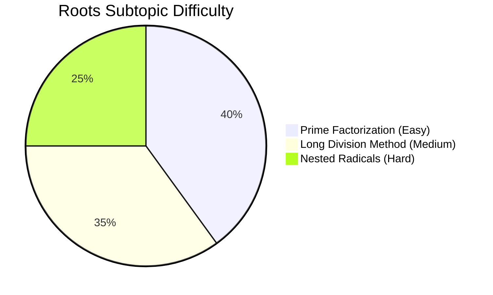

# Square Roots and Cube Roots

## Theory, Intuition & Formulas

Square roots and cube roots form the foundational tools for numerical evaluation, radical simplification, quadratic equation solving, and algebraic manipulation.

### Key Conceptual Pillars

- **Perfect Square Identification**: A number is a perfect square if all exponents in its prime factorization are even integers.
- **Unit Digit Analysis**:
  - Digits $2, 3, 7, 8$ **never** appear at the unit position of a perfect square.
  - Unit digits of squares: $0^2=0$, $1^2=1$, $2^2=4$, $3^2=9$, $4^2=6$, $5^2=5$, $6^2=6$, $7^2=9$, $8^2=4$, $9^2=1$.
- **Consecutive Integer Properties**:
  - $n(n+1)(n+2)(n+3) + 1 = (n^2 + 3n + 1)^2$
  - $(n+1)^2 - n^2 = 2n + 1$

---

## Subtopics & Specialized Questions

- [Prime Factorization & Division Method](/cds/math/notes/subtopics/roots_methods)
- [Long Division Method Proof & Intuition](/cds/math/notes/subtopics/long_division_method)

---

## Variations

- [Ch 5 Variations (Nested Infinite Radicals & Consecutive Product Squares)](/cds/math/notes/variations/var5)

---

## Performance Overview

---

## Navigation

- [Subject Overview](/cds/math/math_overview)
- [CDS Dashboard](/cds/cds_overview)
