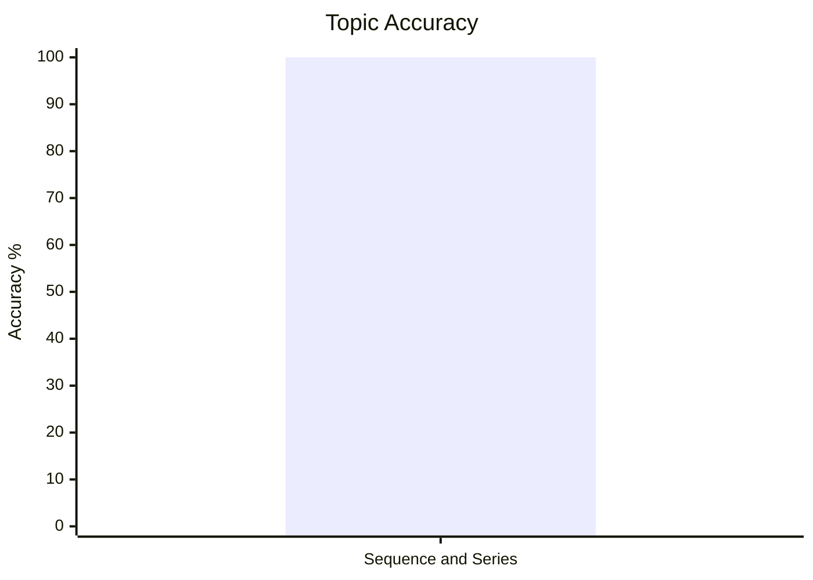
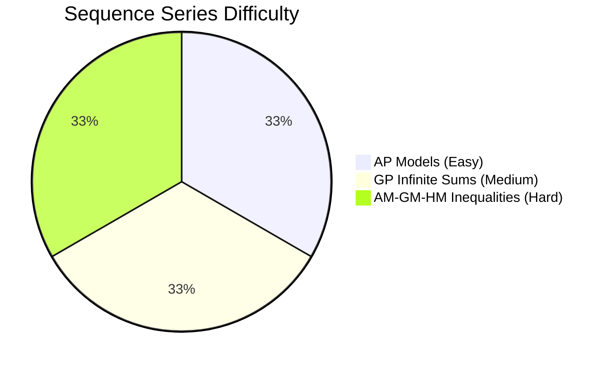
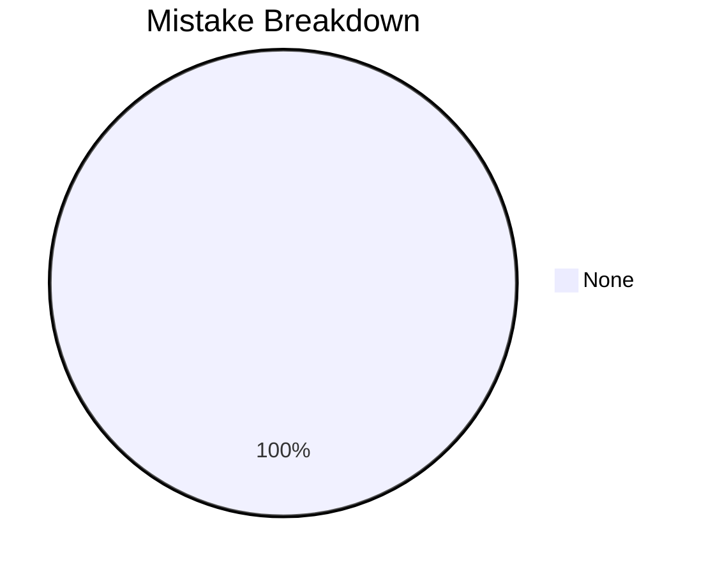

# Sequence and Series

## Theory, Intuition & Formulas

### 1. Fundamentals of Sequences, Series and Progressions
- **Sequence**: An ordered set of numbers $a_1, a_2, a_3, \dots, a_n$ defined according to a specific deterministic rule.
- **Series**: The sum of terms of a sequence, expressed as $S_n = a_1 + a_2 + a_3 + \dots + a_n$.
- **Progression**: A sequence whose terms follow uniform arithmetic, geometric, or harmonic patterns.

### 2. Arithmetic Progression (AP)
A sequence where the difference between any term and its preceding term is constant ($d = a_{k} - a_{k-1}$).
- **General Form**: $a, a+d, a+2d, \dots, a+(n-1)d$.
- **General $n$-th Term ($T_n$)**:
  $$T_n = a + (n-1)d$$
- **Sum of First $n$ Terms ($S_n$)**:
  $$S_n = \frac{n}{2} [2a + (n-1)d] = \frac{n}{2} [a + l]$$
  where $l = T_n$ is the last term.
- **Arithmetic Mean (AM)**:
  If $a, M, b$ are in AP, then $M$ is the Arithmetic Mean:
  $$M = \frac{a + b}{2}$$

### 3. Geometric Progression (GP)
A sequence of non-zero terms where each term is obtained by multiplying the preceding term by a constant ratio $r = \frac{a_k}{a_{k-1}}$.
- **General Form**: $a, ar, ar^2, \dots, ar^{n-1}$.
- **General $n$-th Term ($T_n$)**:
  $$T_n = a \cdot r^{n-1}$$
- **Sum of First $n$ Terms ($S_n$)**:
  $$S_n = \frac{a(r^n - 1)}{r - 1} \quad (r > 1) \qquad \text{or} \qquad S_n = \frac{a(1 - r^n)}{1 - r} \quad (r < 1)$$
- **Sum of Infinite Geometric Series ($S_\infty$)**:
  For $|r| < 1$:
  $$S_\infty = \frac{a}{1 - r}$$
- **Geometric Mean (GM)**:
  If $a, G, b$ are positive numbers in GP, then $G$ is the Geometric Mean:
  $$G = \sqrt{a b}$$

### 4. Harmonic Progression (HP)
A sequence $a_1, a_2, \dots, a_n$ is in HP if their reciprocals $\frac{1}{a_1}, \frac{1}{a_2}, \dots, \frac{1}{a_n}$ form an Arithmetic Progression.
- **General $n$-th Term ($T_n$)**:
  $$T_n = \frac{1}{\frac{1}{a} + (n-1)D}$$
- **Harmonic Mean (HM)**:
  If $a, H, b$ are positive numbers in HP, then $H$ is the Harmonic Mean:
  $$H = \frac{2ab}{a + b}$$

### 5. Special Series Sums & Visual Geometric Intuitions

#### A. Sum of First $n$ Natural Numbers
$$\sum n = 1 + 2 + 3 + \dots + n = \frac{n(n+1)}{2}$$

> [!NOTE] Visual Intuition (Staircase / Triangle)
> Arrange dots in a staircase: 1 dot in row 1, 2 dots in row 2, ..., $n$ dots in row $n$.
> Duplicate this staircase, rotate it upside down, and fit it together with the first staircase.
> It forms a rectangle of dimensions $n \times (n+1)$.
> Since we used two identical staircases, one staircase has area $= \frac{n(n+1)}{2}$.

---

#### B. Sum of First $n$ ODD Natural Numbers
$$1 + 3 + 5 + \dots + (2n-1) = n^2$$

> [!NOTE] Visual Intuition (L-Shaped Layers / Gnonom)
> Start with 1 dot ($1^2$). Wrap a 3-dot L-shape around it $\rightarrow 2 \times 2 = 2^2$.
> Wrap a 5-dot L-shape around that $\rightarrow 3 \times 3 = 3^2$.
> Each layer of odd numbers $(2n-1)$ completes a perfect $n \times n$ square!

---

#### C. Sum of Cubes of First $n$ Natural Numbers
$$\sum n^3 = 1^3 + 2^3 + 3^3 + \dots + n^3 = \left[ \frac{n(n+1)}{2} \right]^2 = (\sum n)^2$$

> [!NOTE] Visual Intuition (Nicomachus's Theorem)
> Every cube $k^3$ is the sum of $k$ consecutive odd numbers:
> - $1^3 = 1$
> - $2^3 = 3 + 5 = 8$
> - $3^3 = 7 + 9 + 11 = 27$
> - $4^3 = 13 + 15 + 17 + 19 = 64$
>
> Summing $1^3 + 2^3 + \dots + n^3$ gives the unbroken sum of all consecutive odd numbers up to $N = 1 + 2 + \dots + n = \sum n$ terms.
> From B above, the sum of the first $N$ odd numbers is $N^2 = (\sum n)^2$!

---

#### D. Sum of Squares of First $n$ Natural Numbers (The 2D Triangular Grid Trick)
$$\sum n^2 = 1^2 + 2^2 + 3^2 + \dots + n^2 = \frac{n(n+1)(2n+1)}{6}$$

> [!NOTE] Visual Intuition (2D Flat Number Triangle Rotations)
> Expand $k^2$ as $k$ copies of the number $k$ arranged in a flat triangle:
> ```text
>       1
>     2   2
>   3   3   3
> 4   4   4   4
> ```
> Sum of all numbers in this triangle $= S = 1^2 + 2^2 + 3^2 + \dots + n^2$.
>
> **The Rotation Trick**: Take **3 identical copies** of this flat number triangle rotated at $0^\circ$, $120^\circ$, and $240^\circ$:
> 1. Total spots in a triangle of height $n$ is $\sum n = \frac{n(n+1)}{2}$.
> 2. When adding the 3 rotated triangles position-by-position, **every single spot adds up to exactly $(2n+1)$**! (e.g. For $n=4$, top corner $= 1 + 4 + 4 = 9 = 2(4)+1$).
> 3. Total sum of 3 triangles: $3S = \frac{n(n+1)}{2} \times (2n+1)$.
> 4. Dividing by 3 gives:
>    $$\sum n^2 = \frac{n(n+1)(2n+1)}{6}$$

#### E. Sum of Products of 2 Consecutive Integers
$$1 \cdot 2 + 2 \cdot 3 + 3 \cdot 4 + \dots + n(n+1) = \frac{n(n+1)(n+2)}{3}$$

> [!NOTE] Intuition (Combinatorics / Choosing 3 items out of $n+2$)
> Think of choosing 3 numbers out of the set $\{1, 2, 3, \dots, n+2\}$.
> The number of ways to choose 3 numbers is $\binom{n+2}{3} = \frac{(n+2)(n+1)n}{3 \cdot 2 \cdot 1} = \frac{n(n+1)(n+2)}{6}$.
>
> Now count the choices by fixing the **middle number** $k$:
> - If the middle number is $k$ (where $k$ ranges from $2$ to $n+1$):
>   - The smallest number can be chosen in $(k-1)$ ways (from $1, \dots, k-1$).
>   - The largest number can be chosen in $(n+2 - k)$ ways (from $k+1, \dots, n+2$).
>
> Summing these choices for all $k$ gives the identity directly:
> $$\sum_{k=1}^n k(k+1) = \frac{n(n+1)(n+2)}{3}$$
>
> **The General Extension Rule**:
> - Sum of single terms $\sum k = \frac{n(n+1)}{2}$ (2 factors in numerator, divide by 2)
> - Sum of 2 consecutive terms $\sum k(k+1) = \frac{n(n+1)(n+2)}{3}$ (3 factors in numerator, divide by 3)
> - Sum of 3 consecutive terms $\sum k(k+1)(k+2) = \frac{n(n+1)(n+2)(n+3)}{4}$ (4 factors in numerator, divide by 4)

---

### 6. Derived Speed Results (From First Principles)
- **Sum of EVEN Numbers**: $2(1 + 2 + \dots + n) = 2 \times \frac{n(n+1)}{2} = \mathbf{n(n+1)}$
- **Sum of Squares of EVEN Numbers**: $4(1^2 + 2^2 + \dots + n^2) = 4 \times \frac{n(n+1)(2n+1)}{6} = \mathbf{\frac{2n(n+1)(2n+1)}{3}}$
- **Sum of Squares of ODD Numbers**: $\sum_{k=1}^{2n} k^2 - \text{Evens}^2 = \mathbf{\frac{n(2n-1)(2n+1)}{3}}$
- **Product of Consecutive Integers**: $1 \cdot 2 + 2 \cdot 3 + \dots + n(n+1) = \mathbf{\frac{n(n+1)(n+2)}{3}}$
- **Alternate Signs Squares ($n$ is even)**: $1^2 - 2^2 + 3^2 - 4^2 + \dots - n^2 = \mathbf{-\frac{n(n+1)}{2}}$

### 7. Inequalities & Fundamental Relation Between Means
For any two positive real numbers $a$ and $b$:
1. **Fundamental Inequality**:
   $$A \ge G \ge H$$
   where equality $A = G = H$ holds if and only if $a = b$.
2. **Geometric Mean Square Identity**:
   $$G^2 = A \times H$$
   *(The Geometric Mean $G$ is the Geometric Mean between $A$ and $H$!)*

---

---

## Subtopics & Core Models

- [AP General Terms, Sums & Arithmetic Means](/cds/math/notes/subtopics/ap_properties)
- [GP Infinite Sums & Geometric Means](/cds/math/notes/subtopics/gp_properties)
- [HP Properties & AM-GM-HM Fundamental Inequalities](/cds/math/notes/subtopics/hp_am_gm_hm)

---

## Variations

- [Ch 2 Sequence and Series Variations](/cds/math/notes/variations/vars)

---

## Performance Overview







---

## Navigation

- [Elementary Mathematics Overview](/cds/math/math_overview)
- [Question Database](/cds/math/question_db)
