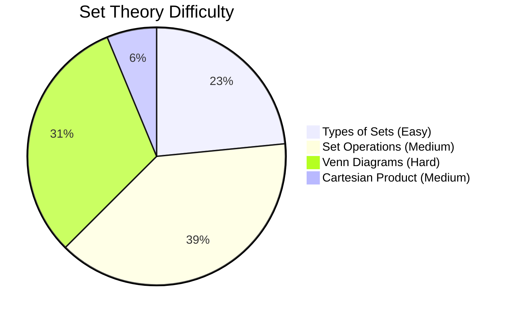

# Set Theory

## Theory, Intuition & Formulas

Set Theory forms the fundamental language of modern mathematics. In competitive exams like CDS, questions test foundational set definitions, algebraic identities, Venn diagram representations, power set cardinalities, and Inclusion-Exclusion word problems.

### Core Concepts & Formulas
- **Power Set Cardinality**: $n(\mathcal{P}(A)) = 2^n$. Non-empty proper subsets $= 2^n - 2$.
- **De-Morgan's Laws**: $(A \cup B)' = A' \cap B'$ and $(A \cap B)' = A' \cup B'$.
- **Difference Identity**: $A - B = A \cap B'$.
- **Symmetric Difference**: $A \Delta B = (A - B) \cup (B - A) = (A \cup B) - (A \cap B)$.
- **Two-Set Inclusion-Exclusion**: $n(A \cup B) = n(A) + n(B) - n(A \cap B)$.
- **Three-Set Inclusion-Exclusion**: $n(A \cup B \cup C) = n(A) + n(B) + n(C) - n(A \cap B) - n(B \cap C) - n(C \cap A) + n(A \cap B \cap C)$.

---

## Subtopics & Specialized Questions

- [Types of Sets & Subsets](/cds/math/notes/subtopics/types_of_sets)
- [Set Operations & Algebraic Laws](/cds/math/notes/subtopics/set_operations)
- [Venn Diagrams & Inclusion-Exclusion](/cds/math/notes/subtopics/venn_and_cardinality)
- [Cartesian Product & Ordered Pairs](/cds/math/notes/subtopics/cartesian_product)

---

## Variations

- [Variation 1: Power Set Element vs Subset Trap](/cds/math/notes/variations/vars#variation-1-power-set-element-vs-subset-trap)
- [Variation 2: Algebraic Simplification of Complex Set Expressions](/cds/math/notes/variations/vars#variation-2-algebraic-simplification-of-complex-set-expressions)
- [Variation 3: Bounded Optimisation in 3-Variable Venn Diagrams](/cds/math/notes/variations/vars#variation-3-bounded-optimisation-in-3-variable-venn-diagrams)

---

## Performance Overview

---

## Navigation
- [Elementary Mathematics](/cds/math/math_overview)
- [CDS Dashboard](/cds/cds_overview)
