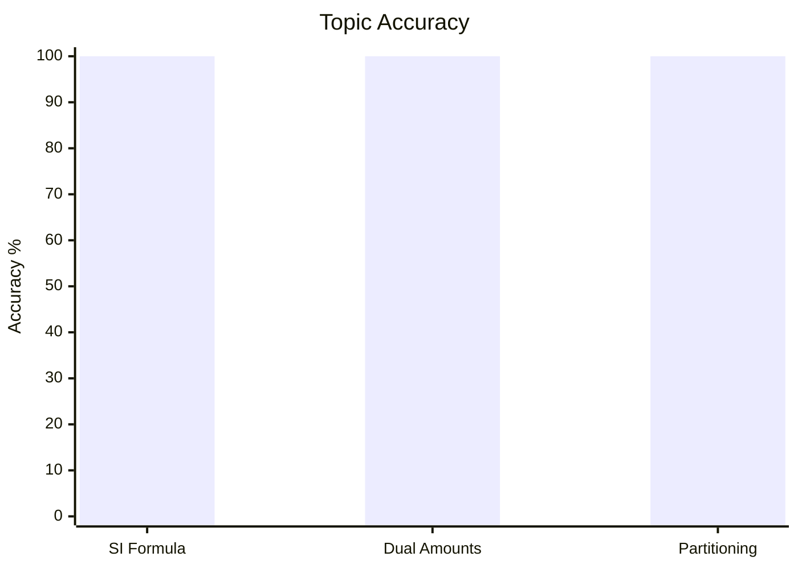
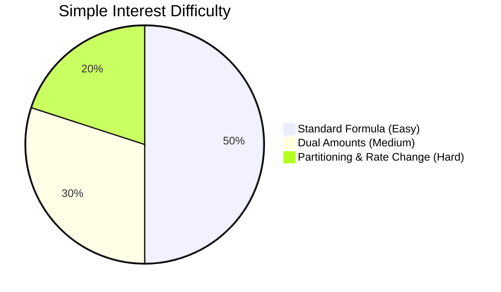

# Simple Interest

## Theory, Intuition & Formulas

Simple Interest ($SI$) represents linear compensation charged on the principal amount ($P$) borrowed over a period ($T$) at a specified rate ($R\%$) per annum.

### Core Axioms & Invariants

1. **Linear Interest Dynamics**:
   Simple Interest is accrued purely on the initial principal sum $P$ without compounding:
   $$SI = \frac{P \cdot R \cdot T}{100}$$

2. **Maturity Accumulation**:
   Total amount $A$ returned after $T$ years:
   $$A = P + SI = P \left(1 + \frac{R \cdot T}{100}\right)$$

3. **Rate Differential Invariant**:
   If interest rate increases by $\Delta R\%$ over time $T$, the incremental interest gained is linearly proportional:
   $$\Delta SI = \frac{P \cdot \Delta R \cdot T}{100}$$

---

## Subtopics & Specialized Questions

- [Fundamental SI & Rate Laws](/cds/math/notes/subtopics/si_formula_rate)
- [Multiple Amounts System](/cds/math/notes/subtopics/si_dual_amounts)
- [Equated Simple Interest Partitioning](/cds/math/notes/subtopics/si_equated_partition)

### Linked Practice Questions
- [Q44: Monthly Interest Principal Calculation](/cds/math/notes/questions/q44)
- [Q45: Doubling Period Rate Percentage](/cds/math/notes/questions/q45)
- [Q46: Dual Maturity Amount Rate & Principal Extraction](/cds/math/notes/questions/q46)
- [Q47: Equated Interest Multi-Part Allocation](/cds/math/notes/questions/q47)

---

## Variations

- [Variation 30: Variable Step-Rate Capital Allocation & Floating Rate Invariant](/cds/math/notes/variations/var30)

---

## Performance Overview

---

## Navigation
- [Subject Dashboard](/cds/math/math_overview)
- [CDS Master Dashboard](/cds/cds_overview)
