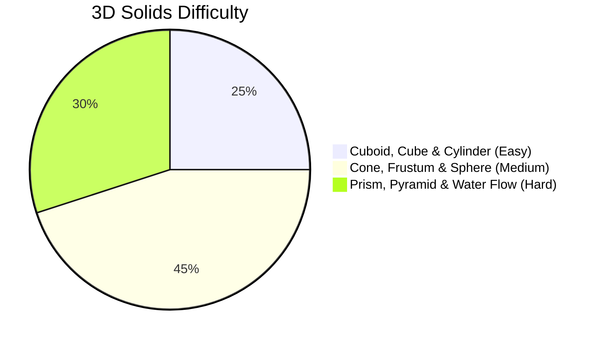

# Surface Area and Volume of Solids

## 1. Overview & Core Definitions

3D Mensuration deals with solid figures occupying space across three dimensions. A solid figure has surface area (measured in square units) and volume (measured in cubic units).
- **Curved / Lateral Surface Area ($\text{CSA}$ / $\text{LSA}$)**: Area of side surfaces excluding top and bottom bases (or area of 4 walls for rooms).
- **Total Surface Area ($\text{TSA}$)**: Combined area of all bounding surfaces (including top and bottom bases).
- **Volume ($V$)**: Measure of 3D space enclosed within the solid.

---

## 2. Subtopics

- [Cuboid & Cube](/cds/math/notes/subtopics/cuboid_cube)
- [Right Circular Cylinder, Cone & Frustum](/cds/math/notes/subtopics/cylinder_cone)
- [Sphere, Hemisphere & Spherical Shell](/cds/math/notes/subtopics/sphere_hemisphere)
- [Right Prism, Right Pyramid & Regular Tetrahedron](/cds/math/notes/subtopics/prism_pyramid)

---

## 3. Key Formulas & Identities

| Solid / Figure | Volume ($V$) | Curved / Lateral Area ($\text{CSA}$/$\text{LSA}$) | Total Surface Area ($\text{TSA}$) | Key Parametric Identity |
| :--- | :--- | :--- | :--- | :--- |
| **Cuboid** | $l b h$ | $2(l+b)h$ | $2(lb+bh+lh)$ | Space diagonal $d = \sqrt{l^2+b^2+h^2}$; $V = \sqrt{xyz}$ |
| **Cube** | $a^3$ | $4a^2$ | $6a^2$ | Space diagonal $d = a\sqrt{3}$ |
| **Cylinder** | $\pi r^2 h$ | $2\pi rh$ | $2\pi r(r+h)$ | Base area $A = \pi r^2$ |
| **Cone** | $\frac{1}{3}\pi r^2 h$ | $\pi r l$ | $\pi r (r+l)$ | Slant height $l = \sqrt{r^2+h^2}$ |
| **Frustum of Cone** | $\frac{1}{3}\pi h (R^2+r^2+Rr)$ | $\pi (R+r)L$ | $\pi(R+r)L + \pi R^2 + \pi r^2$ | Slant height $L = \sqrt{h^2+(R-r)^2}$ |
| **Sphere** | $\frac{4}{3}\pi r^3$ | $4\pi r^2$ | $4\pi r^2$ | Surface area ratio on melting $N^{1/3}$ |
| **Hemisphere** | $\frac{2}{3}\pi r^3$ | $2\pi r^2$ | $3\pi r^2$ | Base area $\pi r^2$ |
| **Spherical Shell** | $\frac{4}{3}\pi(R^3-r^3)$ | $4\pi R^2$ | $4\pi(R^2+r^2)$ | Thickness $t = R - r$ |
| **Right Prism** | $\text{Base Area} \times h$ | $\text{Base Perimeter} \times h$ | $\text{LSA} + 2 \times \text{Base Area}$ | Base can be triangle/polygon |
| **Right Pyramid** | $\frac{1}{3} \times \text{Base Area} \times h$ | $\frac{1}{2} \times \text{Base Perimeter} \times l$ | $\text{LSA} + \text{Base Area}$ | Apex centered over base centroid |
| **Tetrahedron** | $\frac{a^3}{6\sqrt{2}}$ | $\frac{3\sqrt{3}}{4}a^2$ | $\sqrt{3}a^2$ | Height $h = a\sqrt{\frac{2}{3}}$, slant height $l = \frac{\sqrt{3}}{2}a$ |

---

## 4. Key Variations & High-Yield Traps

- [Variation 1: Water Flow Rate through Pipe into Tank](/cds/math/notes/variations/var27#variation-1-rate-of-liquid-flow-through-pipe-into-cylindricalrectangular-tank)
- [Variation 2: Submersion of Solid Spheres into Cylindrical Vessel](/cds/math/notes/variations/var27#variation-2-submersion-of-solid-spheres-into-cylindrical-vessel)
- [Variation 3: Parallel Slices of Right Circular Cone](/cds/math/notes/variations/var27#variation-3-solid-cone-cut-into-three-equal-volume-slices)
- [Variation 4: Inscribed Sphere in Right Circular Cone](/cds/math/notes/variations/var27#variation-4-inscribed-sphere-inside-a-right-circular-cone)

---

## 5. Performance Overview

---

## 6. Navigation
- [Elementary Mathematics Overview](/cds/math/math_overview)
