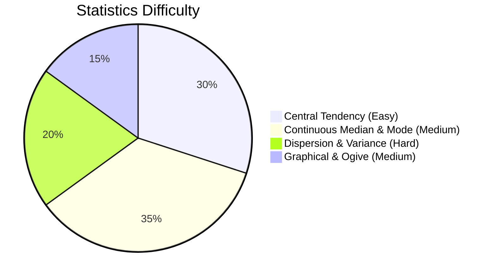

# Statistics

## Theory, Intuition & Formulas

Statistics is the mathematical branch dealing with the collection, organization, presentation, analysis, and interpretation of numerical data. In CDS Elementary Mathematics, Statistics typically carries **10 to 13 questions** per exam, making it one of the highest-yield chapters.

### 1. Data Classification & Frequency Distribution
- **Primary Data**: First-hand data collected directly by the investigator.
- **Secondary Data**: Data compiled or retrieved from secondary/published sources.
- **Class Mark**: Mid-point of a class interval $[L, U]$:
  $$x_i = \frac{\text{Lower limit} + \text{Upper limit}}{2}$$
- **Class Size / Range**: $h = \text{Upper limit} - \text{Lower limit}$.
- **Continuous Adjustment**: For inclusive intervals $[L_1, U_1], [L_2, U_2]$ with gap $d = L_2 - U_1$:
  $$\text{Adjusted Interval} = \left[L - \frac{d}{2}, U + \frac{d}{2}\right]$$

---

### 2. Measures of Central Tendency

#### A. Arithmetic Mean ($\bar{x}$)
- **Direct Method**:
  $$\bar{x} = \frac{\sum f_i x_i}{\sum f_i}$$
- **Assumed Mean Method**:
  $$\bar{x} = A + \frac{\sum f_i d_i}{\sum f_i} \quad \text{where } d_i = x_i - A$$
- **Step-Deviation Method**:
  $$\bar{x} = A + \left( \frac{\sum f_i u_i}{\sum f_i} \right) \cdot h \quad \text{where } u_i = \frac{x_i - A}{h}$$
- **Weighted Arithmetic Mean**:
  $$\bar{x}_w = \frac{\sum w_i x_i}{\sum w_i}$$
- **Combined Mean**:
  $$\bar{x}_{12} = \frac{n_1 \bar{x}_1 + n_2 \bar{x}_2}{n_1 + n_2}$$
- **Properties of Mean**:
  - Linear transformation: If $y_i = a x_i + b$, then $\bar{y} = a \bar{x} + b$.
  - Algebraic sum of deviations from mean is zero: $\sum (x_i - \bar{x}) = 0$.

#### B. Geometric Mean ($GM$) & Harmonic Mean ($HM$)
- **Geometric Mean**:
  $$GM = (x_1 \cdot x_2 \cdot \dots \cdot x_n)^{1/n}$$
  If any observation is $0$, $GM = 0$.
- **Harmonic Mean**:
  $$HM = \frac{n}{\sum \frac{1}{x_i}}$$
- **Pythagorean Relation**: For positive numbers:
  $$HM \le GM \le \bar{x}$$

#### C. Median ($M_e$)
- **Ungrouped Data**: Arranged in ascending order:
  - If $n$ is odd: $M_e = \text{Value of } \left(\frac{n+1}{2}\right)\text{th observation}$.
  - If $n$ is even: $M_e = \frac{1}{2} \left[ \text{Value of } \left(\frac{n}{2}\right)\text{th} + \text{Value of } \left(\frac{n}{2} + 1\right)\text{th} \right]$.
- **Grouped Continuous Data**:
  $$M_e = l + \left( \frac{\frac{N}{2} - c}{f} \right) \cdot h$$
  where $l$ is the lower limit of the median class (first class where $cf \ge N/2$), $c$ is cumulative frequency of preceding class, $f$ is frequency of median class, and $h$ is class width.

#### D. Mode ($M_o$)
- **Ungrouped / Discrete Data**: Observation occurring with maximum frequency.
- **Grouped Continuous Data**:
  $$M_o = l + \left( \frac{f_1 - f_0}{2f_1 - f_0 - f_2} \right) \cdot h$$
  where $l$ is lower limit of modal class (class with max frequency $f_1$), $f_0$ is frequency of preceding class, and $f_2$ is frequency of succeeding class.

#### E. Empirical Relationship
For moderately skewed distributions:
$$\text{Mode} = 3(\text{Median}) - 2(\text{Mean})$$
If $\text{Mean} = \text{Median} = \text{Mode}$, the distribution is perfectly **symmetric**.

---

### 3. Measures of Dispersion & Variance
- **Mean Deviation ($MD$)**:
  $$MD = \frac{\sum f_i |x_i - \bar{x}|}{\sum f_i}$$
- **Variance ($\sigma^2$)**:
  $$\sigma^2 = \frac{\sum f_i (x_i - \bar{x})^2}{\sum f_i} = \frac{\sum f_i x_i^2}{N} - (\bar{x})^2$$
- **Standard Deviation ($\sigma$)**:
  $$\sigma = \sqrt{\text{Variance}}$$
- **Coefficient of Variation ($CV$)**:
  $$CV = \frac{\sigma}{\bar{x}} \times 100\%$$

---

### 4. Graphical Representation of Data
1. **Histogram**: Set of adjacent rectangles over class intervals. Total area of histogram equals $N \cdot h$.
2. **Frequency Polygon**: Line graph joining mid-points of histogram tops or direct $(x_i, f_i)$ points.
3. **Ogive (Cumulative Frequency Curve)**:
   - **Less-than Ogive**: Plots $(\text{Upper Class Limit}, cf)$ — rising curve.
   - **More-than Ogive**: Plots $(\text{Lower Class Limit}, cf)$ — falling curve.
   - **Median Determination**: The $x$-coordinate of the intersection point of less-than and more-than ogives gives the **Median**.
4. **Pie Chart**: Circular representation where central angle for frequency $f_i$ is:
   $$\theta_i = \left( \frac{f_i}{\sum f_i} \right) \times 360^\circ$$

---

## Subtopics & Specialized Questions

- [Measures of Central Tendency](/cds/math/notes/subtopics/stat_measures_central_tendency)
- [Continuous Median & Mode Formulas](/cds/math/notes/subtopics/stat_median_mode_continuous)
- [Empirical Relation & Skewness](/cds/math/notes/subtopics/stat_empirical_relation)
- [Dispersion & Variance](/cds/math/notes/subtopics/stat_variance_dispersion)
- [Graphical Representation & Ogive Median](/cds/math/notes/subtopics/stat_graphical_ogive_pie)

---

## Variations

- [Variation 1: Ogive Intersection & Median Extraction](/cds/math/notes/variations/var28#variation-1-ogive-intersection-and-median-extraction)
- [Variation 2: Weighted Natural Number Power Means](/cds/math/notes/variations/var28#variation-2-weighted-natural-number-power-means)
- [Variation 3: Combined Mean & Subgroup Variance Reconstruction](/cds/math/notes/variations/var28#variation-3-combined-mean-and-subgroup-variance-reconstruction)

---

## Performance Overview

---

## Navigation
- [Elementary Mathematics](/cds/math/math_overview)
- [CDS Dashboard](/cds/cds_overview)
