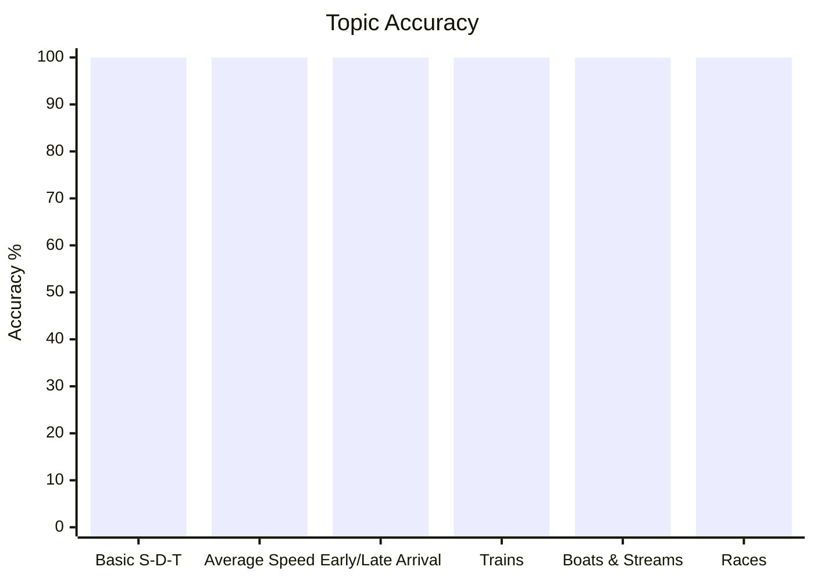
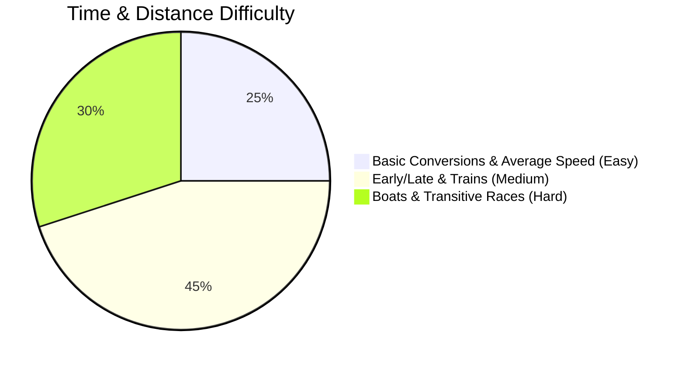

# Time and Distance

## Theory, Intuition & Formulas

Time and distance problems deal with measuring rate of motion, relative speeds, crossing times for moving objects, and fluid flow dynamics.

### Core Axioms & Invariants

1. **Fundamental Motion Relation**:
   - Speed $S$, Distance $D$, and Time $T$ are linked by:
     $$S = \frac{D}{T} \iff D = S \cdot T \iff T = \frac{D}{S}$$

2. **Unit Conversion Constant**:
   - To convert $\text{km/h}$ to $\text{m/s}$: Multiply by $\frac{5}{18}$
   - To convert $\text{m/s}$ to $\text{km/h}$: Multiply by $\frac{18}{5}$

3. **Average Speed & Harmonic Mean**:
   - For general journeys: $S_{\text{avg}} = \frac{\text{Total Distance}}{\text{Total Time}}$
   - For two equal distance segments covered at speeds $x$ and $y$:
     $$S_{\text{avg}} = \frac{2xy}{x + y}$$
   - For three equal distance segments covered at speeds $x, y, z$:
     $$S_{\text{avg}} = \frac{3xyz}{xy + yz + zx}$$

4. **Relative Speed Principle**:
   - Moving in **opposite directions**: $S_{\text{rel}} = x + y$
   - Moving in **same direction**: $S_{\text{rel}} = |x - y|$

5. **Train Crossing Invariants**:
   - Distance covered crossing a point object (pole, standing man): $D = L_{\text{train}}$
   - Distance covered crossing an extended object (platform, bridge, tunnel, another train): $D = L_{\text{train}} + L_{\text{object}}$
   - Post-crossing time ratio theorem: $\frac{S_1}{S_2} = \sqrt{\frac{t_2}{t_1}}$

6. **Boats and Streams Mechanics**:
   - Downstream Speed: $S_d = u + v$
   - Upstream Speed: $S_u = u - v$
   - Boat in Still Water: $u = \frac{S_d + S_u}{2}$
   - Stream Velocity: $v = \frac{S_d - S_u}{2}$

---

## Subtopics & Core Models

- [Basic Speed Distance Time & Unit Conversions](/cds/math/notes/subtopics/basic_speed_distance)
- [Average Speed & Equal Distance Harmonics](/cds/math/notes/subtopics/average_speed_harmonic)
- [Relative Speed & Early Late Arrival Theorems](/cds/math/notes/subtopics/relative_speed_early_late)
- [Train Problems & Crossing Point/Platform Invariants](/cds/math/notes/subtopics/trains_crossing_invariants)
- [Boats, Streams & Upstream-Downstream Motion](/cds/math/notes/subtopics/boats_and_streams)
- [Linear & Circular Races, Head Starts & Distance Deficits](/cds/math/notes/subtopics/races_and_circular_tracks)

---

## Linked Practice Questions

- [Q53: Constant Distance Speed-Time Scaling](/cds/math/notes/questions/q53_td)
- [Q54: Round Trip Equal Distance Average Speed](/cds/math/notes/questions/q54_td)
- [Q55: Early & Late Arrival Distance Calculation](/cds/math/notes/questions/q55_td)
- [Q56: Boat Upstream & Downstream Velocity Isolation](/cds/math/notes/questions/q56_td)
- [Q57: Three-Runner Transitive Race Deficit](/cds/math/notes/questions/q57_td)

---

## Variations

- [Variation 32: Transitive Distance Deficit in Three-Runner Races](/cds/math/notes/variations/var32)
- [Variation 33: Round-Trip River Navigation & Still Water Speed Invariant](/cds/math/notes/variations/var32_boat)

---

## Performance Overview

---

## Navigation
- [Elementary Mathematics Overview](/cds/math/math_overview)
- [CDS Dashboard](/cds/cds_overview)
