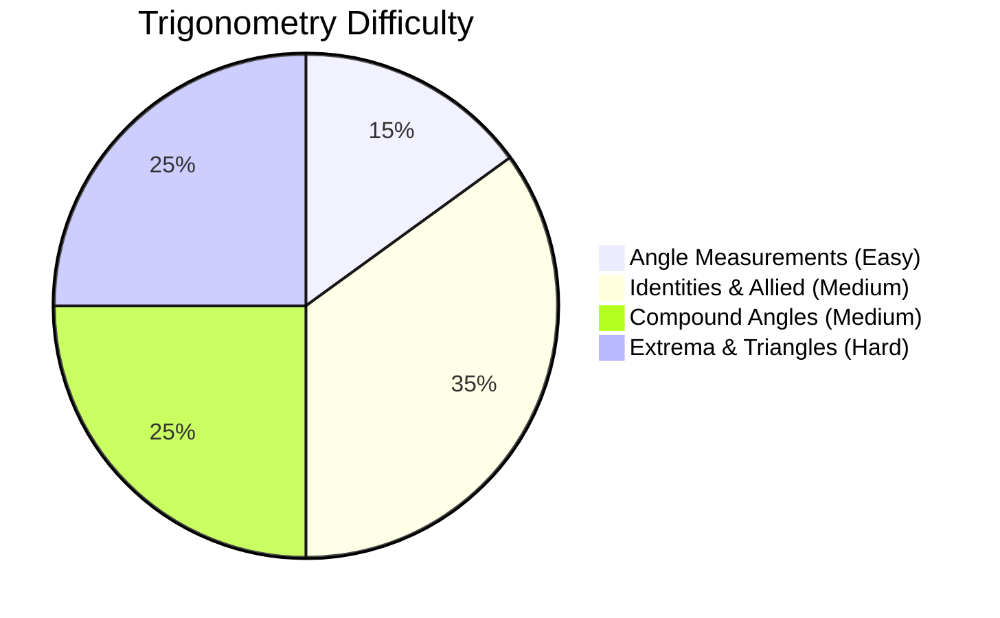

# Trigonometry

## Theory, Intuition & Formulas

Trigonometry is one of the highest-weightage topics in the CDS Elementary Mathematics examination. It covers angle systems, trigonometric ratios of standard and allied angles, compound/multiple angle expansions, extremum values, and properties of triangles.

### Key Theorems & Identities
- **Degree to Radian**: $\pi \text{ rad} = 180^\circ$, Arc length $l = r\theta$, Sector Area $A = \frac{1}{2}r^2\theta$.
- **Clock Relative Speed**: Hour hand $= 0.5^\circ/\text{min}$, Minute hand $= 6^\circ/\text{min}$, Relative $= 5.5^\circ/\text{min}$.
- **Conjugate Reciprocal Pair**: $\sec\theta - \tan\theta = \frac{1}{\sec\theta + \tan\theta}$.
- **Quotient Identity**: $\frac{\cos\theta + \sin\theta}{\cos\theta - \sin\theta} = \tan(45^\circ + \theta)$.
- **Amplitude Extrema**: $-\sqrt{a^2+b^2} \le a\cos\theta + b\sin\theta \le \sqrt{a^2+b^2}$.
- **Sine Rule**: $\frac{a}{\sin A} = \frac{b}{\sin B} = \frac{c}{\sin C} = 2R$.

---

## Subtopics & Specialized Questions

- [Angle Measurements & Clocks](/cds/math/notes/subtopics/angle_measurements)
- [Fundamental Identities & Ratios](/cds/math/notes/subtopics/trig_identities)
- [Compound & Multiple Angles](/cds/math/notes/subtopics/compound_angles)
- [Extrema & Triangle Properties](/cds/math/notes/subtopics/trig_extrema)

---

## Variations

- [Variation 1: Clock Hand Overlap & Perpendicularity Times](/cds/math/notes/variations/var19#variation-1-clock-hand-overlap--perpendicularity-times)
- [Variation 3: Secant-Tangent Conjugate Reciprocal System](/cds/math/notes/variations/var19#variation-3-secant-tangent-conjugate-reciprocal-system)
- [Variation 7: Cauchy-Schwarz & AM-GM Bound Optimization](/cds/math/notes/variations/var19#variation-7-cauchy-schwarz-and-am-gm-bound-optimization)
- [Variation 8: Circumradius Substitution in Triangle Side Expressions](/cds/math/notes/variations/var19#variation-8-circumradius-substitution-in-side-sum-expressions)

---

## Performance Overview

---

## Navigation
- [Elementary Mathematics](/cds/math/math_overview)
- [CDS Dashboard](/cds/cds_overview)
