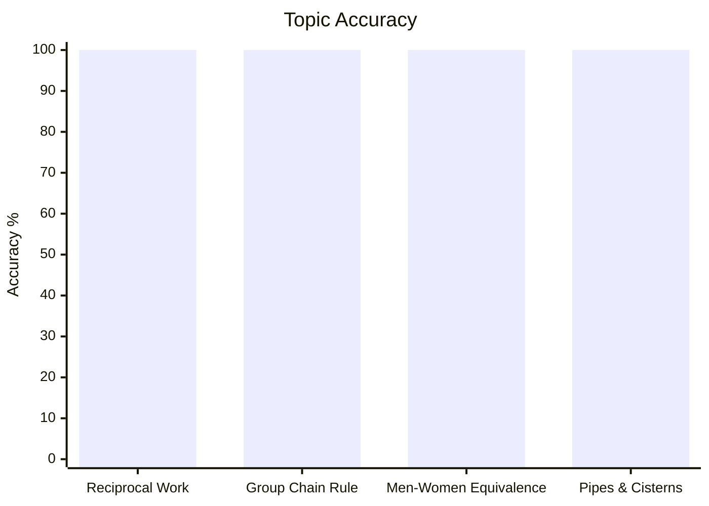
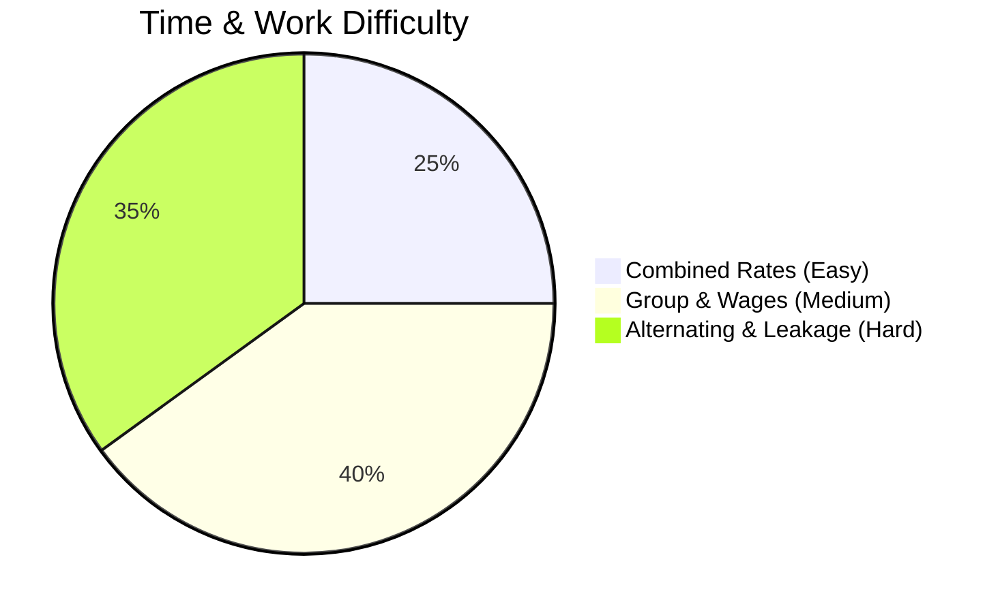

# Time and Work

## Theory, Intuition & Formulas

Time and work problems deal with the rate of performance of work by individuals or groups and the time taken to complete a given task.

### Core Axioms & Invariants

1. **Reciprocal Property of Work Rate**:
   - If a person completes a total work $W$ in $D$ days, then their rate of work per day (efficiency) is:
     $$E = \frac{W}{D}$$
   - If total work is normalized to $W = 1$, then 1 day's work is:
     $$E = \frac{1}{D}$$
   - Conversely, if a person completes $\frac{1}{D}$ part of work in 1 day, the time required to complete the whole work is $D$ days.

2. **Additive Work Rates (Combined Work)**:
   - When multiple entities work together, their individual daily work rates add up linearly assuming no efficiency interference:
     $$E_{\text{total}} = E_1 + E_2 + E_3 + \dots + E_n$$
   - For two individuals $A$ (taking $x$ days) and $B$ (taking $y$ days):
     $$E_{A+B} = \frac{1}{x} + \frac{1}{y} = \frac{x + y}{xy}$$
   - Time taken together:
     $$D_{A+B} = \frac{xy}{x + y}$$

3. **Fundamental Chain Rule (Group Efficiency)**:
   - If $M$ workers with individual efficiency $E$ work for $D$ days, $T$ hours per day, earning total wages $R$ to produce output/work $W$:
     $$\frac{M_1 \cdot D_1 \cdot T_1 \cdot E_1}{W_1 \cdot R_1} = \frac{M_2 \cdot D_2 \cdot T_2 \cdot E_2}{W_2 \cdot R_2}$$

---

## Subtopics & Specialized Questions

- [Work Rate & Combined Efficiency Theorem](/cds/math/notes/subtopics/work_efficiency_reciprocal)
- [Group Work & Chain Rule Fundamental Formula](/cds/math/notes/subtopics/group_chain_rule)
- [Men-Women Equivalence & Or-And Conversion Rule](/cds/math/notes/subtopics/men_women_equivalence)
- [Pipes, Cisterns & Outlet Leakage Invariants](/cds/math/notes/subtopics/pipes_cisterns_leakage)

### Linked Practice Questions
- [Q17: Men & Boys Equivalence System](/cds/math/notes/questions/q17)
- [Q21: Alternating Work Cycle & Clock Completion](/cds/math/notes/questions/q21)
- [Q38: Relative Efficiency & Difference in Days](/cds/math/notes/questions/q38)
- [Q39: Multi-Worker Wages Ratio Distribution](/cds/math/notes/questions/q39)
- [Q43: Three Pipes Fill and Outlet Empty System](/cds/math/notes/questions/q43)

---

## Variations

- [Variation 24: Dynamic Non-Linear Fatigue & Variable Efficiency Cycle](/cds/math/notes/variations/var24)
- [Variation 25: Staggered Group Arrival with Wage Penalty Function](/cds/math/notes/variations/var25)
- [Variation 26: Variable Rate Cistern Filling with Altitude Leakage Threshold](/cds/math/notes/variations/var26)

---

## Performance Overview

---

## Navigation
- [Subject Dashboard](/cds/math/math_overview)
- [CDS Master Dashboard](/cds/cds_overview)
