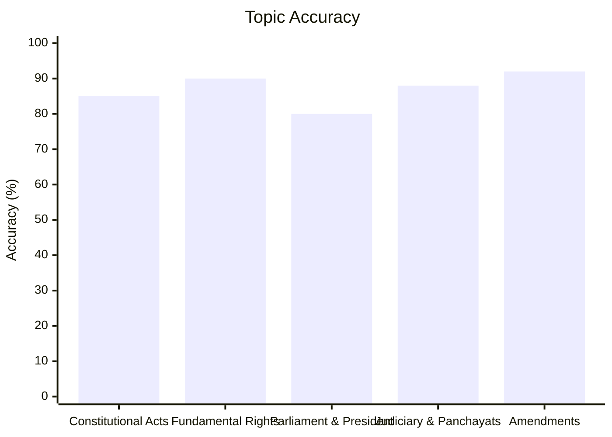
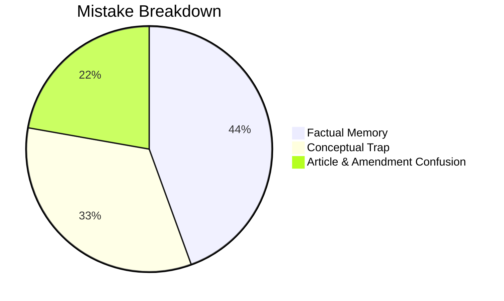

# Indian Polity

## Topics & Notes
- [Indian Polity Cheat Sheet (Acts, Committees, Amendments, Articles, Names & Events)](/cds/polity/notes/polity_cheatsheet)

## Performance Overview

## Navigation
- [CDS Overview Dashboard](/cds/cds_overview)
